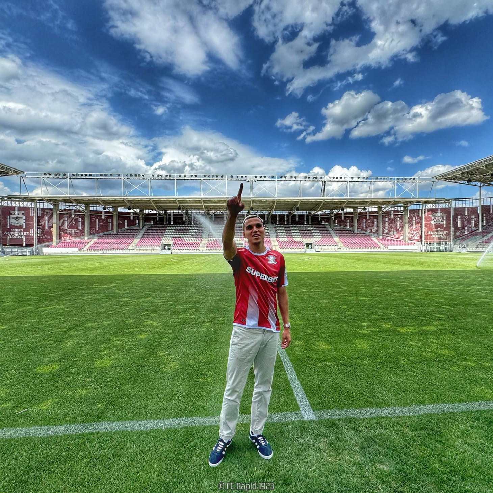

Sezonul trecut, Rapid a avut multe probleme. 

Postul de fundaș dreapta nu a fost însă una dintre ele.

Prin urmare, anunțul că Manea a semnat cu echipa antrenată de Neil Lennon naște o întrebare firească: **de ce l-au adus?**

Mai ales că-n momentul instalării sale, Viorel Moldovan a respins varianta venirii lui Manea la Rapid tocmai cu ajutorul argumentului că giuleștenii sunt acoperiți în această poziție.

## Varianta “s-a accidentat Onea, iar Braun va juca în locul lui Borza”

Cel mai la-ndemână răspuns ar fi că s-a accidentat Onea și e posibil să lipsească o perioadă prea lungă de timp ca să te poți baza doar pe Braun.

Și cum Rapid are din nou pretenții să conteze în noul sezon, probabil că vor să se asigure că au dubluri pe post. Dar Onea va reveni, iar asta va înseamn că vor avea 3 fundași dreapta în lot.

Prin urmare, a doua speculație este că Braun va fi folosit poate fundaș stânga, în locul lui Borza. Personal, nu cred în asta din două motive. E de așteptat ca Borza să fie un fotbalist care să-și crească nivelul sezonul viitor sau să se mențină la nivelul celor câtorva evoluții bune din cel trecut.

Acesta este firescul pentru un fotbalist de 19 ani care a fost folosit constant și care va avea un antrenor cu un istoric bun în ceea ce privește folosirea fotbaliștilor tineri.

În al doilea rând, Borza a costat 800.000 Euro, ceea ce-nseamnă că-ntotdeauna vor exista mai multe șanse pentru el și mai multă acceptare din partea clubului decât pentru un fotbalist trecut de 30 ani, cum este Braun.

## Varianta “Onea nu e de fapt rezervă pentru Braun”

Desigur că ambii joacă fundaș dreapta și ambii au avut evoluții măcar bune dacă nu foarte bune când au fost folosiți.

Doar că Rapid are un antrenor care s-ar putea să dorească un alt fel de fotbal decât oferă Onea. Îmi dau seama că este o forțare în condițiile în care Onea pare genul de fundaș care ar juca în orice echipă de Liga 1 fără ca profilul său să fie o problemă.

Poate Dan Petrescu să prefere un fotbalist cu fizic mai puternic.

Dar asta nu mă oprește pe mine să iau în calcul posibilitatea ca profilul de fundaș dreapta pe care-l vrea Lennon să fie unul c-un fizic mai bun și cu un joc aerian respectabil.

Iar Manea are aceste calități. De altfel, la nivel de Liga 1 a fost folosit inclusiv fundaș central, ceea ce nu cred că se va întâmpla la Rapid (între timp, a fost folosit în această poziție în meciurile de pregătire...), dar va crește siguranța defensivei.

Desigur, o subvariantă ar fi și că de fapt Braun nu mai e o variantă de-ncredere pentru Rapid după ce-n finalul sezonului trecut a avut unele probleme de comportament în relație cu antrenorul.

## Varianta “ne place Manea pur și simplu”

Această variantă se-nrudește parțial cu varianta anterioară, care lua în calcul profilul de fundaș dreapta a lui Manea, dar îi adaugă câteva elemente importante: performanțele concrete ale fotbalistului și experiența sa.

Din anumite puncte de vedere, venirea lui Manea la Rapid este mai importantă decât transferul lui Ștefănescu la FCSB. Nu din perspectiva sumei de transfer pentru că Manea a venit liber de contract.

Și nici din perspectiva perspectivei, chiar dacă între cei doi e o diferență de vârstă de doar un an. Ștefănescu este totuși teoretic un fotbalist cu o marjă de creștere mai mare pentru că abia acum ajunge la o echipă care ar trebui să-l ajute să facă pasul următor în ceea ce privește nivelul său.

Manea joacă însă dintotdeauna. Te aștepți să te uiți pe CV-ul său și să vezi 32 în dreptul vârstei. Dar are doar 26. Și apoi, ochii îți alunecă pe ce a obținut până la această vârstă - 5 titluri de campion și meciuri importante în cupele europene sunt cele mai importante repere.

Asta înseamnă o experiență într-un moment în care biologic e în floarea vârstei fotbalistice. Ceea ce nu e ușor de găsit.

De aici și ideea mea că ar fi un fotbalist mai important decât Ștefănescu. Desigur, unii nu pot înțelege greutatea unui CV în contextul în care Manea nu e nici în vârstă, nici venit după o serie cruntă de accidentări precum alții care au mai apărut cu numele prin Liga 1.

Plus că e o comparație într-un fundaș și un jucător de atac.

Dar totuși, e un jucător mai important decât Ștefănescu după părerea mea. 

## Pericolul legat de adaptarea lui Manea la Rapid

După ce a fost antrenat Dan Petrescu, mă-ndoiesc să existe pericolul ca Manea să nu facă față unor eventuale cerințe stricte venite din partea lui Lennon.

Mai degrabă, marele pericol provine dintr-o altă fațetă a unui avantaj menționat mai sus.

Manea a debutat la 16 ani în echipa națională și a avut până la cei 26 ani actuali ocazia să trăiască fotbalul, dar și să fie trăit de fotbal.

Ce-nseamnă asta?

Înseamnă că nu mi-e clar dacă experiența la Rapid este un refugiu pentru că nu și-a găsit ceva afară, unde susținea că vrea să meargă tocmai pentru că-n România nu ar mai reuși să găsească motivația necesară să continue.

De asemenea, este un fotbalist care a ratat în ultima clipă lotul pentru Euro și asta poate să conteze. Nu știu, nu-l cunosc, doar iau în calcul ce ar putea să influențeze adaptarea sa în Giulești.

În fine, Manea a semnat pentru 3 ani cu Rapid. Mă gândesc că e genul de acord fără clauze neserioase din categoria “mă lăsați să plec dacă am ceva de afară”, iar asta spune că Rapid l-a vrut pe Manea la modul cel mai serios.

Suficient de serios încât Daniel Sandu și Viorel Moldovan să considere că de fapt au adus prima variantă de titular al postului de fundaș dreapta pentru Lennon?

Asta o decide antrenorul, dar eu cred că da.
