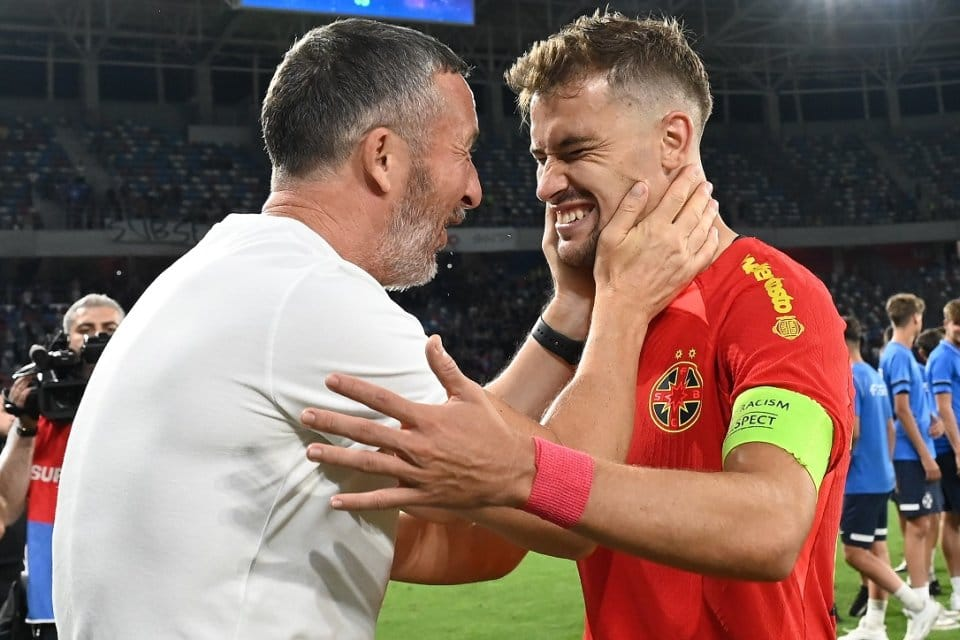

Puține lucruri sunt mai amuzante decât eforturile FCSB de-a-și vinde fotbaliștii cu ajutorul echipei naționale.

Practica este foarte veche.

De exemplu, episodul meu preferat este cel legat de Bogdan Stancu, fotbalist în cazul căruia Becali avea pretenția comică să fie titularizat la echipa națională în locul lui Mutu.

Da, în locul acelui Mutu, unul dintre cei mai buni fotbaliști români din toate timpurile.

Asta până când Steaua l-a vândut pe Stancu la Galatasaray.

Din acel moment, nicio vorbuliță dinspre Steaua și Becali despre cât de bun e Stancu sau măcar bunăvoința de-a-i lua vag apărarea când valuri întregi de suporteri și ziariști mai puțin capabili să-nțeleagă fotbalul îl contestau pe fotbalist.

Liniște totală.

Absolută.

Nimic-nimic.

## Marketingul super direct al domnului Becali

În fine, între timp, lucrurile s-au schimbat parțial. 

Adică, Becali e-n continuare super fixat pe obiectivele sale:

> *“Nu mă uit la națională decât dacă joacă jucătorii mei. Altfel, nu mă interesează. Ce să văd eu acolo?”*

Ce vrea să spună autorul?

În mare, spune că-l interesează doar banii săi, nu și banii altora.

Dar ar mai fi ceva.

Când domnul Becali își exprimă o nemulțumire în mod public, n-o face doar pentru a-și spune oful. El știe cât cântăresc vorbele sale mai ales în relație cu un antrenor precum Edward Iordănescu.

Mai ții minte cum a fost povestea demiterii sale de la FCSB?

Iordănescu ar fi trebuit să încaseze 500.000 Euro pentru încetarea contractului înainte de termen, prin voia clubului. Doar că Becali nu se consideră nebun ca să plătească asemenea sumă pentru un antrenor.

Așa că a făcut ce-a putut ca să-l determine pe actualul selecționer [să cedeze psihic la presiunile sale publice](https://www.digisport.ro/fotbal/liga-1/fac-ceva-pe-contractul-ala-imi-inchide-mie-gura-vreodata-gigi-becali-o-noua-reactie-in-forta-la-fcsb-1364137) și să renunțe la banii respectivi.

Lucru care s-a întâmplat.

De altfel, dacă ar fi să identific o problemă din trecutul său de antrenor, asta mi s-a părut - tendința de-a ceda când apar anumite tipuri de presiuni, cum au fost cele produse de Varga sau de Becali.

Revenind, patronul FCSB știe cu cine are de-a face așa că insistă pe calea aceasta. De exemplu, ia uite ce a obținut după ce a făcut scandal că Iordănescu l-a lăsat pe Olaru în afara lotului la meciul cu Andorra.

> *„Nu, mă bucur că m-a sunat Edi și m-a convins, după câteva cuvinte, după tonul lui mi-am dat seama că nu minte și spune adevărul.Mi-a zis «Nea Gigi, e adevărat, pot să greșesc, greșește orice om, dar niciodată nici în dușmănie, nici în răzbunare nu am avut cu dumneata». Și a vrut să mai zică, dar i-am zis «Gata, nu îmi mai spune, m-ai convins, după tonul tău m-ai convins că așa e, că nu e răutate și nu e dușmănie. Puteai să îmi dai telefon înainte și nu se mai întâmplau astea».*

Auuuzi, cum ar zice domnul Becali, selecționerul să-i dea telefon patronului unei echipe pentru a-i oferi explicații în legătură cu selecția!

## Becali ca Becali, dar Mihai Stoica e la cu totul alt nivel

Dacă Becali pare un clasic al marketingului direct care are o ofertă și bombardează o listă de posibili clienți cu mesajele sale, [Mihai Stoica e cu totul altceva](https://www.cameravar.ro/mihai-stoica/).

Aș zice că seamănă în abordări cu un vrăjitor din zona MLM.

Ce-i MLM-ul?

Multi Level Marketing sau network marketing (marketing de rețea) sau pyramid selling (vânzări piramidale) este o formă de marketing în care veniturile vânzătorului se obțin mai ales ca urmare a recrutării unor așa-ziși “sub-vânzători” care la rândul lor recrutează alți sub-vânzător și tot așa până când vânzările produsele / serviciile companiei mamă ajung să fie susținute de o uriașă forță de vânzare.

În cazul Mihai Stoica, acesta își folosește discursul din emisiuni ca să convingă pe cei care-l ascultă să se alăture cauzei pe care el o susține după propriile puteri.

Cine-l ascultă și cum se poate alătura cauzelor susținute de Stoica?

Păi, îl ascultă suporterii și se pot alătura prin ceea ce comentează în special pe rețelele sociale.

Îl ascultă ziariștii și se pot alătura prin ceea ce comentează la rândul lor în emisiuni sau în articolele pe care le scriu. De obicei, nu de-o manieră atât de directă ca suporterii, dar mai sunt și cazuri de ziariști care sunt înainte de orice suporteri.

În ascultă alți oameni din fotbal care se alătură cauzei lui Stoica nu din vreo simpatie deosebită, ci mai ales de teamă că ar putea intra în gura plină de argumente a acestuia.

Și-n fine, ajunge să-l asculte selecționerul, care are o toleranță scăzută la acte de presiune publică, toleranță care oricum este supra saturată de insistența lui Mihai Rotaru de-a-i vedea pe Mitriță sau Ivan la “națională”.

Astfel, suporterii ajung să facă gălăgie că unuia sau mai multor jucători de la FCSB li se face o nedreptate când nu sunt luați la lot sau nu sunt titularizați.

Ziariștii ajung să considere reflex că orice omitere de la lot a unor jucători pe care Becali și Stoica vor să-i vândă reprezintă un subiect de prim plan (ceea ce și devine).

Oamenii din fotbal se oftică-n privat că FCSB iar are o grămadă de jucători la lot și că vinde mai bine inclusiv datorită acestui aspect.

Ce face Iordănescu?

## Iordănescu ajunge să-și pună perna în cap ca să nu-i mai audă pe Becali, Stoica și afiliații lor

Ce-nseamnă că-și pune perna în cap?

Depinde.

Poate să fie o metaforică pernă reprezentată de capacitatea de-a ignora gălăgia publică legată de convocarea și titularizarea unor fotbaliști de la FCSB.

Sau poate să fie o metaforică pernă nu foarte plină cu pene care ar însemna doar convocarea liniștitoare a unor jucători pentru a mai tăia din elanul gălăgios.

Doar că asta e suficient când îl iei pe Șut la Euro după ce l-ai ignorat total în ultimii doi ani. Da, Becali și Stoica au fost mulțumiți pentru asta.

Doar că la Olaru lucrurile sunt mai complicate.

Îl vor titular.

Nu convocat, nu jucat câteva minute.

Titular.

Că trebuie să-l vândă pe bani mulți.

Și au nevoie să fie titular.

E limpede?

Nu?

OK...

TITULAR!!!

## Ce trebuie să facă Iordănescu pentru ca Olaru să fie titular la națională

Trebuie să facă mici modificări în echipă.

Nu știe care-s modificările?

L-a ajutat Mihai Stoica aseară, în emisiunea de la Prima Sport. Discret, a remarcat o realitate - că Stanciu n-a făcut un turneu final pe măsura așteptărilor. Care Stanciu joacă la arabi și pe postul lui Olaru.

Apoi, cu mult mai multă energie, a spus că Marius Marin e slab. Că e slab și la națională, că e șters și la echipa de club care se află în a doua divizie de fotbal italiană.

Că după ce a greșit la primul gol, a avut apoi o reușită, dar riscantă și a gesticulat ca și când ar fi marcat.

Deci e slab, șters și neadaptat realității de vreme ce asta se-ntâmpla la un scor favorabil Olandei.

Deci, Iordănescu ar trebui să-l scoată pe Marius Marin din echipă și să-l bage direct pe Șut, care are relații foarte bune de joc cu Olaru.

Sau, în caz excepțional, să gândească o nouă formulă a liniei de mijloc din care să facă parte și Darius Olaru.

Care Darius Olaru aleargă foarte mult (fără ironie asta), a dat niște super pase sezonul trecut (și asta tot fără ironie asta), și joacă la FCSB în prima ligă românească.

La campioană.

E o diferență, nu?

Vezi ce-nseamnă că l-am ascultat pe Mihai Stoica?

Deja m-am subordonat ca un minion MLM scopului său.

Dar nu atât de mult încât să nu râd un pic de abilitatea aproape ipocrită manifestată recent de Mihai Stoica.

## Mai ții minte cât de amabil a fost Mihai Stoica în relație cu Iordănescu până s-a anunțat lotul pentru Euro? 

Posibil să nu ții minte chiar dacă n-a trecut prea mult timp de atunci.

Dar eu țin minte.

N-am văzut atâta apreciere în aprecieri.

Sau măcar atâta cumpătare când aprecierile erau legate de chestiuni în care probabil că Mihai Stoica avea o părere diferită. Cum puneau ei la dispoziție baza să se pregătească fotbaliștii care erau convocați, dar își terminaseră sezonul pe la arabi.

Cum așteptau ei doar un semn de la Edi pentru orice.

Cât de înțelegător era când Olaru a fost lăsat în afara lotului la meciul cu Andorra (4-0) și când Iordănescu a avut o discuție privată liniștitoare se pare cu Gigi Becali. Din acel moment, totul a fost bine:

> *E totul OK, dacă va fi chemat va da totul. Chiar e OK. Pe poziția lui Olaru a jucat Stanciu. Poate să fie în formă, îl iubesc pe Olaru, dar e posibil ca Stanciu să fie un jucător mai important indiferent de formă. Dacă e să discutăm cu cărțile pe masă, fără să se supere nimeni. Orice jucător de la noi va merge la națională și va fi trimis în tribună, acceptăm. Așa e normal! Chiar nu e problemă, înseamnă că așa gândește selecționerul”*

Auzi, acceptăm să fie în tribună 😅

Cum se bucurau când Șut era în sfârșit luat la națională și se rupea astfel blestemul acelui blocaj de neînțeles. 

Până la urmă, și Șut joacă la FCSB. Și el trebuie vândut.

Prin urmare, cel mai bine ar fi ca Iordănescu să rămână la lot că știe deja ce se așteaptă de la el din partea FCSB.

Dacă prin absurd vine vreun antrenor străin, să vezi jale și eforturi de convingere a nepriceputului în legătură cu cine e bun și cine nu e așa bun când vine vorba de selecție. 

În fine, cel mai spectaculos lucru în toată prestația lui Stoica este abilitatea incredibilă, real incredibilă, de-a amesteca idei super argumentate cu PR-ul deșănțat pentru fotbaliștii FCSB. 

Nu există om în fotbalul nostru capabil să dea mai multă credibilitate spuselor sale prin această metodă. Și nu există presiune mai mare asupra selecționerilor decât convocare și titularizarea fotbaliștilor de la FCSB.

Chiar și rezultatele pot pica uneori pe locul 2. 
