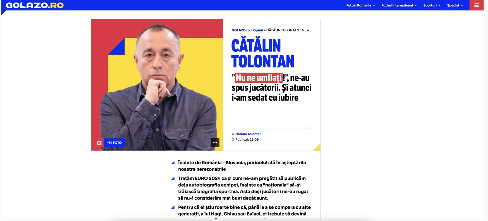

[Golazo.ro](https://golazo.ro/) este un nou site de sport / fotbal lansat de o parte a echipei care a plecat recent de la Gazetă împreună cu Cătălin Tolontan.

Da, unii au plecat, nu toți au fost dați afară.

Dar mai mult de atât, Golazo este o sursă de curiozitate pentru mine - vor deveni o voce importantă a presei sportive? Vor deveni profitabili în condițiile speciale în care vor încerca să fie profitabili?

Adică fără banii industriei pariurilor.

Dintr-o margine de exterior, remarc câteva lucruri legate de ceea ce ar putea să le stea în cale, dar și ceea ce reprezintă avantaje reale chiar în comparație cu uriașii domeniului - digisport.ro, gsp.ro, prosport.ro

## Problemele cu care se va confrunta Golazo.ro

Marile obstacole cu care se confruntă noul site sunt evidente. Atât de evidente încât inclusiv dușmanul celor care îndrăznesc să reclame dificultăți, Dan Șucu, ar avea o oarecare înțelegere.

### 1. Fără bani de la casele de pariuri

Cel puțin în acest moment, nu văd reclame la vreuna dintre casele de pariuri pe site. Cel puțin pentru moment, probabil că există o politică în acest sens, altfel nu s-ar explica situația.

Ca simplă apreciere, e o eroare. O spun deși eu însumi aproape că fac un titlu de glorie din faptul că nu am contract cu cineva din respectiva industrie și consider respectivă sursă de finanțare + relaționare [o formă de diabet pentru media sportive](https://www.cameravar.ro/cancerul-presei-sportive-casele-de-pariuri/).

Pe de altă parte, contextul plecării lor de la Gazetă i-ar face probabil să se rușineze în eventualitatea în carea ar deveni permeabili pentru contractele de gen. Desigur, caracatița industriei, Superbet, are reclamă pe HotNews, principalul site al grupului din care face parte și Golazo.

Dacă vor ceda, m-aștept ca explicația să fie una bla-bla-istă:

> Nu putem condamna întreaga industrie pentru comportamentele anumitor jucători. Există case pariuri cu practici oneste, care înțeleg că doar jurnaliștii pot să facă munca jurnaliștilor.

### 2. Fără o televiziune sau un trust mare de presă în spate

Asta poate să pară o necesitate a trecutului, dar cred că e și a prezentului măcar parțial. Mai ales într-o industrie în care plimbarea publicului de pe un site prieten pe un alt site prieten este o practică generală.

Plus că TV-ul încă are momentele sale de forță majoră, așa că prezența oamenilor tăi și promovarea site-ului tău în emisiuni de specialitate poate încă să conteze.

Normal, HotNews este online un nume greu, iar relațiile lui Tolontan cu alți indivizi grei din lumea presei vor conta.

Plus abilitatea acestuia de-a atrage oameni cu expunere care să scrie texte de opinie.

Plus abilitatea lui de-a strecura nevinovat laude care îndatorează pe termen lung și foarte lung diverse personaje care apoi reflex își vor plăti datoria morală.

Și totuși, nu cred că le va fi ușor fără o companie precum Ringier în spate sau fără o televiziune care să fie obligată inclusiv de interese comerciale directe să-i susțină.

### 3. Site-urile mari de sport sunt foarte mari, iar cele de plan secund sunt din inerție mari

Marile site-uri de sport menționate deja mai sus au un trafic imens, iar site-uri de plan secund precum sport.ro continuă din inerție să aibă un număr impresionant de unici.

Apoi, Fanatik.ro este într-o continuă creștere / dezvoltare și nu mai este nici pe departe ceea ce era acum 10 ani. Și o spun real apreciativ.

În fine, un alt site de sport apărut recent, iAM Sport este un exemplu grăitor în privința dificultății cu care se înaintează în această industrie, chiar dacă faci o grămadă de lucruri bune și foarte bune jurnalistic vorbind.

Repet, există un soi de inerție de consum care-i favorizează în mod natural pe cei deja consacrați și nu le oferă foarte multe șanse celor care încearcă să vină din urmă.

Iar când le oferă totuși șanse, munca necesară pentru a profita de ele în lipsa unei finanțări majore este uriașă.

## Ce avantaje are Golazo față de o bună parte dintre competitorii săi

Din punctul meu de vedere, atuurile pe care le are Golazo.ro în calitatea sa de site nou apărut sunt unele suficient de avantajoase încât să compenseze presiunea sufocantă a problemelor.

### 1. Au luat-o de la zero din aproape toate punctele de vedere

Acesta este un avantaj uriaș. Într-un fel, Tolontan și colegii săi trăiesc la Golazo ceea ce trăiește o echipă de dezvoltatori care au făcut o aplicație într-un loc și pleacă în altă parte pentru a dezvolta o nouă aplicație în aceeași nișă / domeniu.

Adică, au de partea lor toată cunoașterea legată de ceea ce nu a mers bine și toată libertatea de-a implementa pe curat ceea ce știu c-a funcționat. Fără balast rămas de pe urma unor încercări eșuate, fără dificultăți în ceea ce privește implementarea unor idei care fi implicat altfel schimbări dificile.

Inclusiv din punct de vedere tehnic, un site nou are șansa de-a fi mai puțin încărcat inutil, cu mai puține reziduuri care să-l afecteze din perspectiva SEO.

Site-ul în sine este ceva nou pentru piața noastră. Nu știu cine le-a fost inspirația, dar strict din perspectiva usability e un site un site pentru public tânăr, scrollatoro-cititor. Îmi place mult gsp.ro, dar cred că Golazo.ro are o simplitate deșteaptă, care-l face ușor de citit într-o lume în care puține site-uri par preocupate de așa ceva.

Și tot în zona acesta a luatului de la zero, e posibil ca moralul oamenilor care au făcut trecerea la Golazo să fie unul ridicat, așa cum este de multe ori moralul unor oameni care se confruntă cu o nouă provocare după ani buni în care n-au avut parte de așa ceva.

### 2. Sportul este pentru presa de specialitate precum seceta pentru vânzătorii de apă minerală

În 2007, a existat o problemă legată de aprovizionarea cu apă minerală a marilor lanțuri de magazine. Concret, era o vară extrem de călduroasă, veniturile oamenilor crescuseră și cererea de apă îmbuteliată devenise uriașă.

Doar că majoritatea companiilor de îmbuteliere a apei au fost luate prin surprindere și nu au făcut față noii realități. Mai mult, unii credeau că n-are rost să facă investiții în capacități noi de producție pentru ceva ce credeau ei că va fi o problemă de trecătoare precum anotimpul cald.

În paralel însă, alții au profitat de penuria de apă de la rafturi ca să se lanseze în premieră sau să-și lanseze noi branduri - ex. Romaqua, compania-mamă a Borsec a lansat atunci brandul Aquatique. Iar simpla prezență la raft într-un moment cu cerere uriașă a ajutat enorm respectiva apă să devină cunoscută și consumată.

Golazo.ro s-a lansat în așa fel încât să profite de turneul final al CE, competiție la care România a fost prezentă din nou. Adică, au fost prezenți la raft într-un moment în care oamenii au avut sete de fotbal și au consumat mai mult decât consumă în mod normal acest produs.

După CE, urmează să-nceapă Liga 1. Care [Liga 1 a înregistrat sezonul trecut un record de audiență pe stadioane](https://www.gsp.ro/fotbal/liga-1/un-numar-total-de-peste-2-milioane-spectatori-au-fost-prezenti-pe-stadioanele-din-romania-742954.html). Interesul pentru competiție este în creștere, iar asta permite să-și facă loc oricine va reuși să ofere ceea ce alții nu oferă.

### 3. Nu a migrat toată lumea de la Gazetă

Spre deosebire de situații din trecut, când echipa condusă de Ovidiu Ioanițoaia și Cătălin Tolontan au migrat în bloc de la Sportul Românesc la încă neapărutul ProSport sau de la ProSport la Gazeta Sporturilor, acum un număr mult mai redus de oameni au făcut trecerea.

Și asta reprezintă un avantaj în opinia mea pentru că ar fi fost real dificil financiar vorbind ca un număr mare de ziariști să fie absorbiți de un nou proiect.

Mai mult, ca-n fotbal, când un antrenor pleacă de la o echipă la alta, ar lua după el anumiți jucători, dar nu pe toți. Pentru că nu toți cei pe care i-a antrenat în trecut sunt ceea ce și-ar dori el să fie.

Desigur, nu-i ia nici pe toți cei pe care și i-ar dori. Remus Răureanu a rămas la Fanatik și mă gândesc că și l-ar fi dorit. La fel, Costin Ștucan a rămas la iAM Sport și mă gândesc că și l-ar fi dorit și pe el, chiar mai mult decât pe Remus având în vedere că expunerea lui Costin este una mai mare.

Dar una peste alta, cred că au luat de la Gazetă cam ceea ce-și doreau în mare să ia.

### 4. Au oameni cu vizibilitate foarte bună în zona de TV

Deși nu au o televiziune în spate, au în redacție și printre colaboratori suficienți oameni cu o prezență foarte bună în emisiunile de specialitate.

Dan Udrea va continua să modereze emisiuni, iar acum o va face la singura televiziune de sport prezentă în toate rețelele de cablu - Prima Sport.

Radu Naum moderează emisiuni la Digi Sport, iar în paralel scrie texte de opinie pentru Golazo.

Cristi Geambașu este invitat permanent în emisiunile lui Radu și scrie la rândul său texte de opinie pentru Golazo.

Cătălin Țepelin este solicitat la emisiuni de specialitate.

Le lipsesc doar Ștucan și Răureanu, cum spuneam. Dar sunt convins că din perspectiva unui site fără televiziune în spate, vor avea parte de prezență continuă în zona de TV.

### 5. Îl au pe Cătălin Tolontan

Acum aproape 20 ani, înainte de meciul dinte Steaua - Middlesbrough, eram într-o mașină care se-ntorcea de la sediul Realitatea TV la sediul Gazetei Sporturilor.

Participasem alături de Tolontan, Ștucan și Manolo Terzian la un soi de ședință cu șefii respectivei televiziuni ca să ne coordonăm editorial în ceea ce privește super evenimentul reprezentat de acel meci.

Realitatea, care cred că era condusă atunci de Sergiu Toader și de Sorin Enache, urma să dea meciul tur, de la București. Cumva ei aveau impresia zdravăn alimentată de Tolontan că au nevoie de noi ca să facă o audiență pe măsura așteptărilor.

Așa că ne promovam unii pe alții cu beneficii uriașe mai ales pentru Gazetă.

Asta în timp ce la Antena 1, televiziunea patronului Gazetei, clocoteau nervii firești ai colegilor de trust care nu înțelegeau cum putem face asta în relație cu o stație concurentă.

Ideea este că-ntr-un fel sau altul, Tolontan a fost mereu capabil să creeze avantaje incredibile redacției pe care a condus-o și sunt convins că atât cât se va mai putea în zilele noastre, o va face-n continuare.

De asemenea, dincolo de ce poate face în viitor, contează mult ce-a făcut în trecut. 

Astfel, indiferent cât de implicat ar fi astăzi în ceea ce privește Golazo, oamenii din redacție sunt formați și masiv influențați profesional de el. Cu greu vei găsi oameni de presă scrisă care să fie în același timp mai tineri și mai experimentați decât sunt Țepelin, Udrea, Cristina Negrilă, Ioana Mihalcea sau Theo Jumătate.

Prin urmare, deși Golazo e mic la ora actuală, chiar cred că-n viitorul apropiat vor conta în acord cu numele pe care-l poartă.

**PS**: faptul că le văd un viitor foarte bun înseamnă că le voi acorda atenție. Iar atenția mea înseamnă că voi remarca în scris "derapajele" pe care le vor comite. 

Și le vor comite, desigur.

Abia aștept prima lor reclamă la o casă de pariuri...
