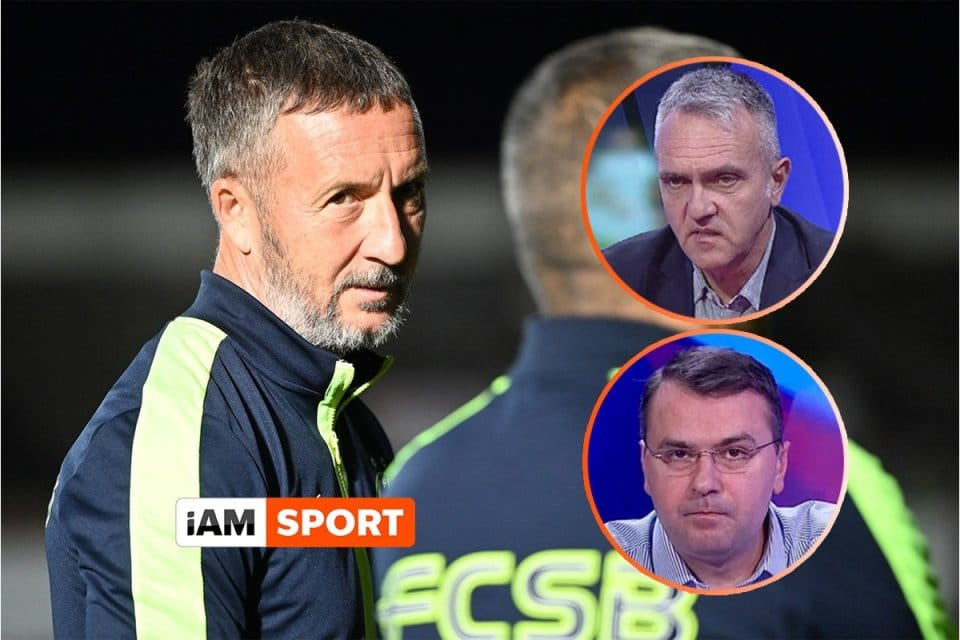

Declarație reală, dar totuși inventată a lui Mihai Stoica: "Ziariștii mei preferați sunt Vali Moraru și Decebal Rădulescu. De ce? Pentru că Biblia spune să ne iubim aproapele, iar ei doi sunt tot timpul în cârca noastră".

În mare, s-a spus ceea ce se spune și când te uiți. 

Dar asta implică un farmec aparte. E plăcut să știi că cel care vorbește urmează să spună ceea ce știi că va spune. Dacă toți și-ar schimba discursul, te-ai simți înstrăinat de ceea ce urmărești. Și ai avea impresia că nici tu nu mai ești tu. 

Desigur, exagerez.

Încerc să explic de-o manieră pozitivă o realitate în privința căreia nimeni nu poate face ceva. 

Nici măcar autorii acestei realități. 

### Vali Moraru, privind direct în cameră, prin ea, în sufletul deja chinuit de remușcări al unui partener de discuție

> “Hai să-mi faceți dumneavostră emisiunea! Hai să ne spuneți ce putem și ce nu putem să spunem! Eventual, să ne învățați ce întrebări sunt în regulă ca să nu deranjăm prea tare înaintea dificilei confruntări de la Botoșani! Perturbăm ciclul săptămânal pentru că îndrăznim să întrebăm dacă fotbalistul dumneavoastră are drept de joc cu FCSB sau e doar răcit cum răcesc fotbaliștii când se dau loviți... OK, mulțumesc, publicitate! Revenim”.

### Radu Naum, nevoit să-și controleze debitul amazonian al vocabularului

> “Acesta nu este un antrenor de fotbal, acesta este o personalitate. Și nu o personalitate care trăiește în niște limite ale anticipării umane, ci una care se-ntinde dincolo de ceea ce putem noi desena în emisiunile noastre de analiză. Desigur, noi ne facem datoria și încercăm, iar oamenii văd faptele și trag concluziile. Și dacă tot vorbeam de forța strivitoare a concretului, vom lua o pauză publicitară”.

### Ilie Dumitrescu, după ce-și scoate ochelarii și-i așează fără grabă pe pupitru

>  “Cine face ciclul săptămânal? Spune-mi cine face ciclul săptămânal și eu îți spun cine este antrenorul în această speță!”

### Ion Crăciunescu, cu o revoltă-n crescendo pe măsură ce se apropie de rostirea numelui șefului CCA

> “OK, dar este vorba de Hagi. Nu-mi spuneți dumneavoastră că Hagi și Popescu nu au voie să-și spună și ei părerea! Acum, ce facem? Așteptăm să ne spună domnul Vassaras ce avem voie și ce nu avem voie să gândim?!”.

### Viorel Grigoroiu, după ce a 104-a oară se întâmplă ce urăște să se-ntâmple

> “Când acești oameni au ceva de spus, te caută ei să spună. Te sună, te asaltează cu mesaje, se cer în emisiune. Când ai tu nevoie să spună ceva în emisiunea pe care o păstorești, ia-i de unde nu-s! Gata, închid telefonul. Asta zice mai mult despre cum sunt ei, nu despre cum e presa sportivă!”

### Cristi Geambașu, cu o aplecare blândă spre crucificarea celor care cred că o faptă bună salvează o carieră proastă

> “OK, înțeleg, dar totuși ce mare realizare e asta? Chiar nu mai avem repere? Câștigăm un meci și gata, nu mai e voie să remarci ce e în neregulă acolo? Poate unii nu știu, dar datoria unui ziarist nu este să perie firele rebele ale unora sau altora, ci din contră, să critice când e de criticat. Și, să mă ierte cei în cauză, cam e de criticat. Nu cu huiduieli ca la Coldplay, dar oricum...”.

### Remus Răureanu, încercând și aproape reușind să spună ceva de bine despre un club de fotbal din Liga 1

> "Dacă te uiți la ce s-a întâmplat în acest sezon, salvarea de la retrogradare a lui Dinamo echivalează cu câștigarea unui titlu. Cred că a fost mai greu să se salveze Dinamo decât să câștige Viitorul campionatul sezonul trecut. Și Nicolescu are un merit... Pe de altă parte, cine i-a adus în situația asta? Vom plânge mereu că Negoiță a fost zgârcit sau că spaniolul Cortacero nu a știut pe ce lume este? Bine, ei au avut greaua moștenire, dar nu poți să le spui suporterilor la nesfârșit că înainte a fost greu și de aia este greu astăzi. Deja a trecut ceva timp de atunci și deciziile pe care ei le iau sunt de amatori în multe situații". 

### Decebal Rădulecu, printre ultimii ziariști care se mai pot lăuda cu exclusivități reale sau atât de aproape de realitate încât e păcat să nu fie date

> Uite, Vali, am o informație... Să o dau după pauză? O dau după pauză dacă așa e... OK, pe scurt e o informație pe care mi-a dat-o cineva care a avut legătură cu FCSB în trecut și acum mai ține legătura acolo... Se pare că ieri a fost o delegație a jucătorilor la Palat să discute cu domnul Becali despre situația antrenorului. Că nu-l mai vor. Da, da, cei mai importanți jucători, nu doar cei care nu prindeau echipa. Și că domnul Becali le-ar fi spus că nu știe cine sunt. Că el nu vede decât până la locul 5, că mai jos de locul 5 nu vede că are și el o vârstă și nu mai vede așa departe... Nu știu, cică așa le-a zis... Eu spun ce-am aflat, îmi cer scuze dacă greșesc cu ceva. FCSB sunt pe 4? OK, o fi spus că vede până la locul 3, nu contează..."

### Ionuț Badea, sperând ca măcar un conducător de club se va uita la emisiune și va înțelege ce greu e să fii antrenor

> “E foarte important ce vor reuși ei să facă în acel vestiar. Pentru că nu mă refer doar la antrenorul principal, care are în accepțiunea publică și nu numai toată responsabilitatea. Contează staff-ul în ansamblul său. Antrenoratul e o muncă dificilă, sunt atât de multe nuanțe care trebuie luate în calcul și care determină rezultatul final al muncii tale. Cu cât învăț mai mult, cu atât simt că mi-am ales o meserie mai complicată decât poate să pară vreodată din exterior... Dar da, i-aș acorda credit lui Lennon”.

### Horia Ivanovici, acceptând că-n afară de Ovidiu Ioanițoaia, e singurul ziarist care a făcut cu adevărat bani în presa sportivă

> ... așa cum v-am obișnuit la Fanatik, avem mereu cei mai tari invitați și cele tari intervenții în direct... Vă citesc imediat ce mi-a scris domnul Varga, în exclusivitate pentru Fanatik, pentru că domnul Șucu nu mai dialoghează cum dialoga... Oricum, așa cum v-am obișnuit cu exclusivități până acum, vom avea grijă să păstrăm linia și-n continuare. Robert, te rog un pic! Te plătesc nu doar să vorbești, dar și să asculți. Sponsorul premium al emisiunii, Superbet. Sponsorul super premium Aqua Carpatica. Așa, domnul Varga spune așa: "Nu am avut și nu vom avea vreodată dorința să ținem la Cluj jucători care nu vor să rămână... Deci omul spune direct că dragoste cu sila nu se face... Da, Robert, dragostea cu sila e viol... Și continuă... Dar dacă domnii fotbaliști... Atenție cum le spune! Dooomnii fotbaliști! Deci Neluțu Varga e un super domn, dar dacă ajungi să îl superi nu e a bună...".

### Silviu Tudor Samuilă, mai bucuros să fie la muncă decât în unele vacanțe

> “Am fost în Germania la niște prieteni și am observat o chestie. Și vreau să văd cum vedeți și voi situația aceasta. Deci nemții au obiceiul acesta de a te privi în ochi când îți spun ceva și așteaptă apoi liniștiți să le răspunzi. Fără să se grăbească, așteaptă. Și tu, OK, ești oaspete acolo, dar ești în vacanță totuși. Ca român, ce faci? Ca român care le știe cultura, le știe limba, felul... Ce faci? Meme? Pandi? Desigur, te gândești c-ar fi trebuit să te duci în Italia, dar n-ai mers și ești acolo... Meme? Pandi?” 

### Dan Udrea, care își răsplătește urmăritorii chinuindu-și invitații

> “Bună seara prieteni, suntem la o nouă ediție a Minutului 91... Mulțumesc tuturor celor care ne urmăresc și online, care sunt din ce în ce mai mulți. Asta ne onorează și ne face să ne dăm silința să continuăm ceea ce facem. Bun, astăzi avem un joc nou pentru invitații noștri, Basarab Panduru și Mihai Stoica. Vom afișa echipele-tip probabile în opinia noastră pentru principalele candidate la titlu și rezervele, iar dumneavoastră va trebui să faceți ce modificări considerați de cuviință...

### Basarab Panduru, sătul să spună lucruri care apoi vor fi preluate deformat pe diverse site-uri de sport

> “Cine ar trebui să joace acolo? În poziția aia? Doar dintre ei doi sau mai sunt și alte variante? Bine, mă, acum mă pui pe mine să aleg, orice aș zice se vor supăra ăialalți. Oricum îi enervez pe mulți, mă faci să-i enervez și des. Hai că răspund după ce răspunde Costel cu zona gri ca să fie lucrurile mai limpezi când le spun eu. Da, Costel? Sau nu, tu nu răspunzi ca să fie așteptările de la mine și mai mari! 

### Mihai Stoica, dispus să facă oricâte dușuri reci, dar indispus să nu i se recunoască instant capacitățile, experiența și flerul

>  “Zic că am și eu niște ani de experiență în spate, am lucrat cu niște antrenori, cu niște jucători... Niciodată nu poate un fotbalist venit de la un contract mare de afară să joace la Galați cu determinarea cu care a jucat înainte să plece. Nu poate. E o întindere a limitelor umane... Da, se antrenează și această capacitate așa cum îți poți antrena multe capacități. Eu m-am apucat să fac dușuri cu apă rece - rece... Dar nu poți. Psihic este imposibil. Nu vreau să spun acum, dar vom vedea. OK, uite că nu voiam să o fac, dar acum o voi face... El este 18 mai 1989, ca Chipciu...

### Constantin Zotta, bucuros că zona gri concurează  strălucirea fantei de lumină

> Eu știu mai bine ce-nseamnă să fii arbitru și la meciuri de genul acesta, când ambele echipe vor să te spânzure dacă nu câștigă. Și oricum ai da-o, nu se poate să câștige amândouă. Uite, inclusiv când România și Slovacia s-au calificat mai departe, s-au bucurat pentru un egal... Ideea este că dacă ești conducător de club și știi ce vrei, te miști foarte repede în astfel de situații. Nu aștepți să vină ceilalți după tine și să pună mâna... OK, am fugit atunci la propriu, nu la figurat. Mă ajuta și pregătirea de arbitru, iar Gino era ca fotbalistul român - avea dorință, dar nu și putință să alerge.

### Bogdan Cosmescu, neintimidat de posibilitatea ca ceea ce spune să nu se întâmple, dar dornic să dea lovitura în caz că iese cum a spus

> "Eu nu văd nimic... Mă scuzați, dar dacă voi vedeți ceva vă rog să-mi spuneți să-mi pun ochelarii... Îi iau de la Costel sau de la Meme, ce dioptrii aveți? Deci nu văd nimic în jocul FCSB și nu văd nimic în jocul CFR-ului. Mi-e teamă că se întâlnesc duminică și pierd amândouă. La scor. Serios, aceste două echipe nu au cum să termine în primele 4 sezonul acesta. Trebuie să se întâmple ceva catastrofal la Rapid, să nu mai aibă nimeni voie să taie pădurile ca să facem mobilă. Craiova nu a început bine, dar uite că Gâlcă pare să se fi echilibrat acum. A început să câștige, nu știu, eu nu le văd pe FCSB și CFR Cluj..."

### Costin Ștucan, nevoit să se sacrifice din nou pe altarul angajamentelor pe care nimeni nu și le ia și a întrebărilor pe care nimeni nu le adresează

>  “Înainte de orice vreau să îmi asum că am greșit când am spus despre ei că nu au nicio șansă să facă asta. Am fost luat de val, dar cred că nimeni nu se gândea că pot face asta. Acum, uite, suntem aici și putem discuta... Tu ai jucat la pariuri, nu? Nu acum, în trecut, când nu aveai contract în fotbal. Sau aveai? Poți spune că oricum s-a prescris... Stai un pic, uite de ce te întreb: Reghecampf când era la Chiajna se pare că avea obiceiul acesta de-a se întâlni în fiecare joi cu...”

### Mihai Rotaru, marcat de lecturi recente și ușor mirat că doar el citește ceea ce citește

> “... nu, nu... e o carte scrisă de un economist francez, de fapt, e mai mult filosof al economiei pentru că el teoretizează ceea ce alții încearcă să pună-n practică. Și el spune că nu poți obține astăzi rezultate fără să fi făcut ieri pașii necesari ca rezultatele de astăzi să apară. Da, da, Markovici are pasul mare, el a fost la un moment dat înaintea celorlalți colegi de generație. Nu, nu a făcut pași mari pe o cale greșită, așa a fost soarta, nu poți controla structura intimă a organismului uman, cum se prind între ele...”

### Ștefan Beldie, nemulțumit evident că doar el însuși este impresionat de previziunile sale scrise pe CameraVAR.ro

> Aud diverși spunând că nimeni nu-și imagina că echipa națională va avea aceste rezultate în calificări... Păi, [eu am scris clar](__GHOST_URL__/ne-calificam-la-euro/), înainte de primul meci din acea grupă, nu doar că ne vom califica la Euro, dar că avem și șanse foarte bune să terminăm pe primul loc în grupă. Sau mulți spun că nu se aștepta nimeni ca Rapidul să aibă acea cădere după meciul cu Steaua... Pardon, FCSB. [Tot eu am scris](https://www.cameravar.ro/anticipare-declin-rapid/) că acel rezultat îi păcălește pe cei care nu se uită atent la fotbal, cum mă uit eu, care văd toate meciurile posibile din Liga 1 și din Liga a 2-a... OK, numai puțin să-mi termin ideea... Deci unii au impresia că pot vorbi despre fotbal fără să se uite la meciuri, ci doar la rezultate. Acela e jucat la pariuri, nu urmărit de meciuri. [Iar pariurile sunt diabetul presei sportive!](https://www.cameravar.ro/cancerul-presei-sportive-casele-de-pariuri/)
