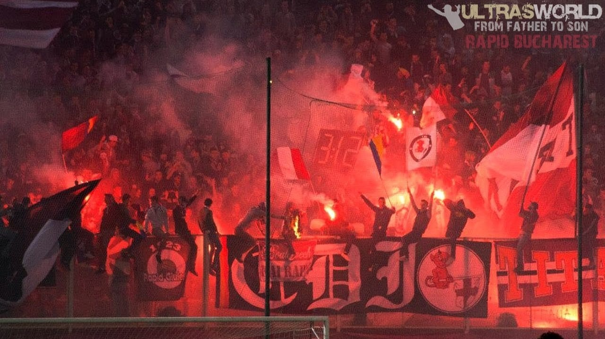
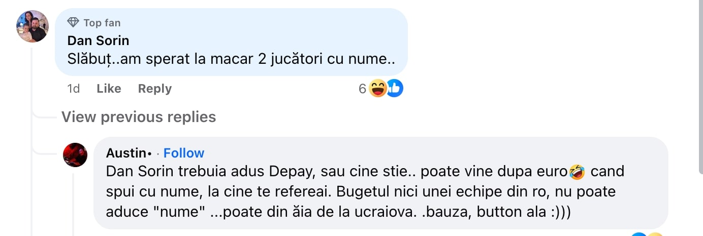
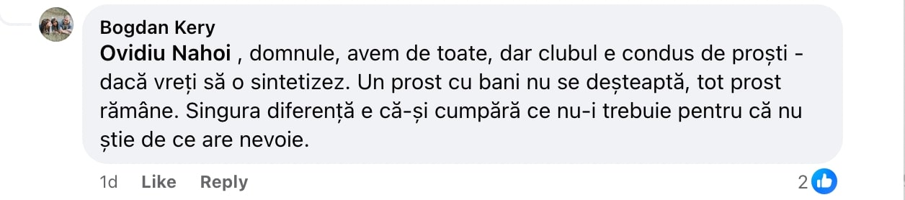

Dacă urmărești pagina oficială de Facebook a clubului sau [pagina celui mai important influencer giuleștean](https://www.facebook.com/tudor.bogdan.338), vei observa destul de rapid ceva interesat și interesant în același timp.

Există o împărțire clară între cei mai vocali suporteri ai giuleștenilor. 

O tabără este format din cei care simt aparent continuu că ceva se-ntâmplă greșit la club (am să le spun “vișiniii”), iar cealaltă tabără se arată încântată de direcția în care merge clubul și norocul care a dat peste Rapid prin venirea lui Dan Șucu (am să le spun “albii”).

Această diferență majoră de percepție dintre albi și vișinii ar putea să fie o chestiune absolut sănătoasă, așa cum sunt aproape toate situațiile în care există diferențe de opinie în interiorul unor grupuri / categorii.

Doar că atât vișiniii care se manifestă des critic față de deciziile sau ideile lui Dan Șucu, cât și albii care-i oferă acestuia un cec, cum altfel?, în alb sunt profund iritați de cealaltă tabără.

## Vișiniilor nu le place nimic, albilor le place totul, mai puțin gălăgia vișiniilor

Dacă vișiniii reclamă că nu s-au făcut transferuri potrivite, albii le atrag atenția că nu au apucat să vadă ce-i de capul respectivilor jucători sau le ironizează capacitățile de scouteri / antrenori.

Dacă vișiniii reclamă că abonamentele sunt prea scumpe, albii vin atât cu argumente care să susțină acea creștere de preț, dar și cu ironii legate de aplecarea spre mocăciune sau ieftineală a acestora.

Dacă vișiniii ar fi preferat un alt antrenor,[ inclusiv Șumudică](https://www.cameravar.ro/de-ce-nu-sumudica/), albii se arată indignați ca și când Lennon poate fi judecat că-i bun doar de cei care l-au angajat, dar nu poate fi bănuit că-i nepotrivit de cei care ar fi avut altă preferință.

În fine, lucrurile se desfășoară exact cum se desfășoară-n general disputele online - uneori cu logică, alteori doar cu dorința de-a avea dreptate.

## Cum cred că s-au născut albii

Nu-ți închipui acum că monitorizez o imensă maternitate la care se nasc doar suporteri rapidiști bucuroși că Șucu a decis să investească în Giulești și dornici să-l susțină până-n cearșafurile lor albe.

Dar pot specula în legătură cu efectul pe care diverse întâmplări din istoricul recent al Rapidului îl pot avea asupra motivațiilor albilor.

De exemplu, cu ocazia falimentului, Rapid a avut un foarte scurt moment în care n-a mai existat decât în amintirile suporterilor. Apoi, a început să existe faptic, dar plătind prețul revenirii corecte, de la zero absolut.

Iar asta i-a marcat pe albi.

Conștient sau nu, probabil că-și aduc aminte cum niște vișinii au contribuit decisiv la plecarea lui Copos - [vezi scena colivei de la Înalta Curte de Casație și Justiție](https://www.digisport.ro/fotbal/liga-1/video-surpriza-la-iccj-fanii-au-venit-cu-coliva-si-au-cerut-inchisoare-pentru-copos-53258?ref=cameravar.ro) și au aruncat astfel echipa în cea mai neagră perioadă din existența sa.

Și tot albii țin minte cum se bucurau vișiniii stupid că a plecat omul care deținea hotelul Hilton și venea în locul lui omul care deținea Hanul Vlăsia. Recunosc, mereu mă pufnește râsul când îmi amintesc acele momente de naivitate supremă.

Prin urmare, dacă ar fi să super simplific, reacția albilor este o reacție clasică de supraviețuire - nu-l supăra pe cel care ne hrănește pentru că s-ar putea să murim cu toții de foame.

## Cum cred că s-au născut vișiniii

Vișiniii au existat dintotdeauna. Originea lor nu vine din teama pentru viitor, ci mai degrabă din genunile lui “singuri împotriva tuturor”.

Iar teama lor e legată mai ales de prezent.

De exemplu, în contextul actual, când Rapid se află după mulți ani din nou în postura de echipă care contează în campionatul nostru, nerăbdarea vișiniilor a înflorit.

Mai mult, sezonul trecut i-a agitat suplimentar pentru că-n ciuda faptului că Rapid a terminat abia pe locul 6, [de fapt sunt singura formație care poate spune că a pierdut titlul în fața FCSB](https://www.cameravar.ro/rapid-a-pierdut-titlul/).

Celelalte formații care au avut șanse reale când a început play off-ul au fost prea puțin amenințătoare pentru forța campioanei. Singurii capabili să șteargă pe jos până aproape de concret cu echipa lui Becali au fost giuleștenii, iar neputința ulterioară i-a înnebunit pe vișinii.

În fine, vișiniii sunt dornici să fie invidiați pe tăcute de fanii rivalelor nu doar pentru că Șucu e atât de diferit de Becali sau pentru că spre deosebire de cei de la Dinamo are bani, nu doar “know-how, hau-hau”.

Vor să fie invidiați pentru rezultate.

Pentru cea mai înaltă poziție.

## 3 lucruri care vor alimenta în continuare acest conflict

Unii se pot gândi că dacă Rapid va avea rezultate, toată lumea va uita de această dispută și vor sărbători împreună cu echipa victoriile de etapă sau de campionat.

Poate că va fi așa.

Dar până atunci, există măcar 3 lucruri care vor alimenta în continuare acest conflict. Unul dintre ele este nerezolvabil din punctul meu de vedere. Îți vei da seama la care mă refer.

### Galeria nu are lider

Acest lucru nu alimentează conflictul dintre albi și vișinii pentru că nu există o mână forte care să regleze lucrurile. De altfel, conflictul respectiv este unul care există în primul rând pe rețelele sociale.

Când spun că galeria nu are lider mă refer la subiect în sine ca un pretext pentru ca fiecare tabără să aibă o opinie despre orice se agață de lipsa liderului.

Vișiniii se vor teme că va fi ales cineva care va face sluj în fața lui Șucu, iar albii se vor teme că va fi ales cineva care va pune clubul din nou în situația de-a plăti cu amenzi și etape de suspendare a terenului.

Și-și vor comenta temerile inclusiv după ce va exista un lider pentru că lipsa acestuia e doar un pretext nimerit de manifestare a conflictului dintre albi și vișinii.

### Percepția profund diferită față de oamenii cu bani

În general, vișiniii se-ncadrează mai degrabă în larga categorie a suporterului de fotbal care consideră că [patronul trebuie doar să plătească și să nu facă bani din fotbal](https://iamsport.ro/editorial/stefan-beldie-de-ce-ar-trebui-sa-te-bucuri-pentru-profitul-din-fotbal-al-lui-sucu-becali-si-al-altora-ca-ei-id3714.html). 

Ideal, să nu iasă pe zero.

Să piardă un pic pentru că are de unde.

De asemenea, tot cei cu astfel de concepții sunt convinși că oamenii cu bani sunt doar niște proști norocoși sau niște profitori de contexte politice / securistice.

Cum spuneam, bogații sunt doar niște proști cu bani

În schimb, albii par să aibă o deschidere ceva mai mare față de ideea de capitalism și de bani făcuți prin muncă și inspirație. Nu i-aș bănui că nu au și ei clasica invidie față de omul cu bani, dar în contextul acesta preferă mai degrabă să se alăture lui Șucu în cruciade de genul “al nostru are bani și e civilizat, al vostru e un cioban”.

### Presa sportivă e presă sportivă, iar suporterii sunt suporteri

Știi deja că am cea mai bună părere pe care cineva o poate avea despre presa sportivă. Adică, o consider [cea mai valoroasă formă de jurnalism practicat în România](https://www.cameravar.ro/suprematia-presei-sportive/).

Doar că...

Doar că asta nu înseamnă că am o părere bună despre presă în general. Și aici nu mă rezum la doar la presa românescă, mă refer la felul în care arată presa clasică la nivel global.

O meserie nobilă parazitată de hoarde nesfârșite de activiști de toate felurile și pentru toate cauzele, mai puțin față de ideea de obiectivitate și imparțialitate.

Adică față de ideea de jurnalism.

În fine, trebuie să mă calmez...

Ideea este că presa sportivă are obiceiul de-a băga bățul prin gard în goana disperată după click-uri. Nimic nu scade nivelul intelectual al celui care scrie și a celui care citește decât click bait-ul.

Poate doar perversitatea unora dintre ziariștii care încearcă să-și rezolve diverse frustrări omenești cu ajutorul muncii de redacție.

Trist, dar adevărat.

De partea cealaltă a ecranului se află publicul, deci inclusiv suporterii. Care suporteri sunt mereu inteligenți și frumoși. [Ceea ce reprezintă o generalizare penibilă.](https://www.cameravar.ro/gazeta-sporturilor-articole-femei-goale/)

Nu toți suporterii sunt inteligenți.

Unii cad ușor în capcanele întinse reflex de ziariști și ajung să gândească comic în relație cu orice-i înconjoară. De aici și incapacitatea de-a avea simț critic față de tot felul de situații.

Inclusiv în situația în care vor simți nevoia să aleagă o tabără în acest conflict dintre albi și vișinii.

**PS 1**: am observat ceva pe pagina de Facebook a clubului - prea multe "conturi anonime" sar instant în apărarea lui Șucu.  Eram obișnuit ca  mai degrabă cei care acuză să fie dornici să-și ascundă indentitatea decât cei care apără o cauză. 

**PS 2**: unii vor crede că textul de față este o încercare de-a-nvrăjbi lucrurile într-un moment în care Rapidul merge bine și [presa se teme că are interese murdare](https://www.cameravar.ro/relatii-ziaristi-oameni-din-fotbal/). Există situații în care atitudinile paranoice pot fi sănătoase, dar nu și prostia. 
