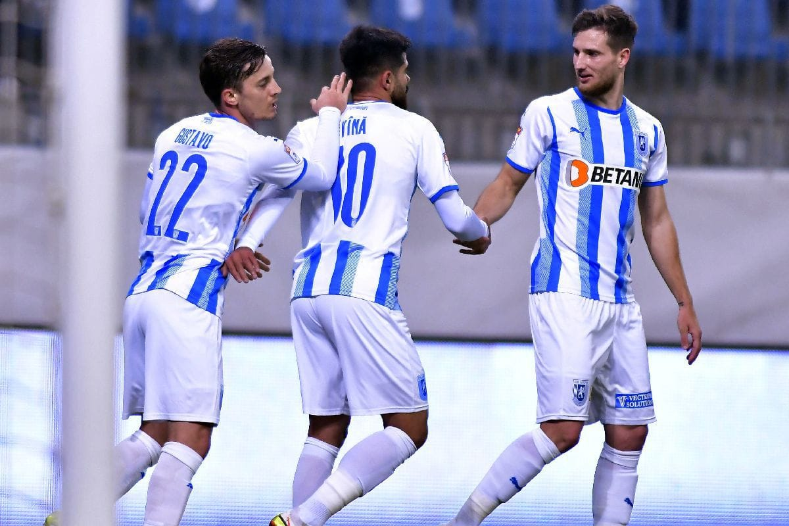

Am văzut în ultimele zile mai multe articole legate de [cunoștințele lui Mihai Căpățână despre istoria Universității Craiova](https://orangesport.ro/video-mihai-capatana-este-campion-in-istoria-craiovei-a-trecut-cu-brio-testul-de-cultura-generala-iubesc-echipa-21672155).

Aparent, nu e mare lucru să știi astfel de informații despre una dintre cele mai mari echipe ale fotbalului nostru. 

Și totuși,  te asigur că-i mare lucru mai ales când deținătorul acelei cunoașteri este un fotbalist. Nu-n sensul alimentării stereotipei că fotbaliștii sunt niște fraieri care aleargă după o minge, ci-n sensul că există din ce în ce mai puțin o conexiune reală între fotbaliști și cluburi.

De altfel, mulți fac tot felul de confuzii când văd atașamentul unui jucător față de culorile echipei pentru care joacă. Nu întotdeauna acel atașament este alimentat de surse "elevate". Psihologic vorbind, un fotbalist poate să simtă și să demonstreze dragoste față de club din tot felul de motive.

## Pot banii să determine dragostea unui fotbalist față de echipa pentru care joacă?

De exemplu, poate fi motivația financiară suficientă ca un fotbalist să iubească echipa pentru care joacă?

Da, poate fi.

Popular, cei care iubesc pe bani sunt numiți drăgăstos-sexual "curve" sau mai clasic în fotbal, "mecenari". Și totuși, asta e o formă superficială de-a vedea lucrurile.

Banii nu sunt doar o simbolistică pentru putere, ci pot fi în anumite situații o simbolistică pentru supraviețuire. Prin urmare, un fotbalist cu o copilărie necăjită s-ar putea să dezvolte un uriaș atașament față de clubul care-i oferă primul său contract care-l face să nu-i mai fie frică de propria sa viață.

Și asta chiar în condițiile în care fotbalistul respectiv își merită fără niciun dubiu respectivul salariu.

## Poate galeria unui club să facă un fotbalist să-și iubească echipa ca pe nimic altceva?

Da, se poate. 

Fotbaliști care aterizează ca simpli mercenari în curtea unui club pot dezvolta o relație aparte cu suporterii acelui club și automat să vadă relația cu echipa ca fiind ceva cu totul aparte.

Mercenarul se poate transforma într-un soldat credincios al clubului în cauză.

De ce?

Nu pentru că e impresionat de spectacolul pirotehnic sau de scandări sau mai știu de ce. Și aceste lucruri contează, dar ceea ce transmite o masă uriașă de suporteri care au un obiectiv super clar așa cum îl au galeriile multor cluburi îi poate face pe fotbaliști să se simtă parte din ceva mai mare decât ei înșiși.

Iar unii dintre ei poate n-au fost parte din nimic până atunci. Și brusc, simt ceva nou, ceva ce pare să-i fericească și să le elimine golul pe care l-au simți o bună parte din cariera lor.

Este iarăși o formă de obținere a atașamentului prin apelarea la sensibilități primare ale oamenilor, sensibilități care țin de sentimentul de siguranță pe care-l ai când ești inclus în ceva cu adevărat mare, important. 

## Ce este special la cazul Mihai Căpățână

Situația lui Mihai Căpățână este parțial diferit.

Desigur, echipa sa plătește bine.

Dar atașamentul lui Căpățână pare mai sofisticat tocmai pentru că nu este alimentat doar la nivelul subconștientului de siguranța financiară și cea produsă de apartenența la ceva superior, ci și de contactul cu cultura fotbalistică a Craiovei.

De asta am spus că e vorba de ceva mai elevat în cazul său.

Ca fotbalist, să ai habar în mod real despre istoria unui fenomen așa cum e Craiova Maxima înseamnă că tu însuți ești un individ civilizat, dar și un individ capabil să civilizeze mediul în care exiști sau interacțiunile la care participi.

Sigur, niciodată nu vor conta lucrurile acestea mai mult decât evoluțiile concrete ale jucătorilor pe teren, dar Căpățână este deja un fotbalist bun. Ceea ce vedem în cazul său este doar un uriaș bonus de respect față de el însuși și față de suporterii pentru care joacă.

În fine, orice club are enorm de câștigat când reușește să aibă în curtea sa astfel de jucători pentru că cei ca Mihai Căpățână au capacitatea de-a înțelege că misiunea de-a jucat fotbal este ceva simplu, ceva frumos, dar și ceva cu adevărat important.

Și când jucătorii simt că participă la ceva important, cresc șansele să fie fotbaliști.
