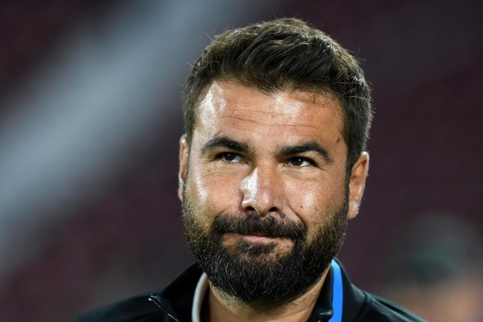

În ultimii 2 ani, am stat de vorbă cu mai mulți antrenori români care au o reticență majoră să accepte ofertele pe care le primesc de la diverse cluburi în ciuda faptului că refuzul lor înseamnă să prelungească perioada de stat pe margine, fără contract.

Și e vorba de antrenori în general tineri sau foarte tineri care primesc în general oferte de la liga secundă sau de la liga a 3-a, dar și antrenori care au refuzat oferte de la formații de primă ligă. 

Absolut toți sunt cumva ghidați de aceeași idee:

> “Nu mă mai pot duce oriunde. Nu mai pot psihic să mă duc undeva unde lucrurile stau total anapoda față de felul în care ar trebui să stea”.

Când am scris cuvintele acestea, m-am gândit la un antrenor anume.

Ionuț Badea.

Care Ionuț Badea crede despre el că trebuie să se respecte suficient de mult încât să pună real în balanță ce-nseamnă oportunitatea de-a antrena și ce-nseamnă “oportunitatea” de-a nu avea condiții normale să-ți faci meseria.

Dar dincolo de Ionuț Badea, sunt și alții.

Unii sunt atât de demoralizați de ceea ce ajung să trăiască la anumite echipe încât spun că dacă nu ar fi pasionați de real de ideea de-a antrena, ar renunța în totalitate la această variantă de a activa în fotbal.

> “Ajungi uneori să stai de vorbă cu unii oameni care pur și simplu nu doar că nu au habar care-i rolul unui antrenor, dar n-au habar nici care-i rolul unui conducător în relație cu un antrenor. Și ignoranța e doar o parte a problemei. Bun, nu știi, dar totuși conduci clubul pentru că a fost decizia unor politicieni locali. Dar de unde agresivitatea și dorința de-a te impune în ciuda lipsurilor pe care le ai?”.

Deci nu e vorba numai de proști, e vorba și de proști agresivi.

## Poți antrena echipe serioase fără să treci înainte prin chinul antrenării echipelor neserioase?

În concluzie, vorbesc despre antrenori care au acceptat de mai multe ori să preia echipe aflate în situații dificile. Și după ce le-au preluat, au descoperit că situațiile acelea grele nu erau doar efectul unui lot slab, cum te-ai aștepta să fie lucrurile când nu sunt rezultate sportive.

Cluburile în cauză erau conduse / administrate de indivizi atât de slabi profesional încât automat că și echipa ajungea să fie victima deciziilor acestora.

Prin urmare, îi înțeleg.

Mai ales că sunt absolut convins că [cea mai slabă verigă din fotbalul românesc sunt conducătorii de club](https://www.cameravar.ro/cea-mai-slaba-veriga-fotbalul-romanesc/), abia apoi se poate vorbi de antrenori insuficient pregătiți.

Și totuși, cum pot acei antrenori să antreneze dacă nu antrenează?

Nu prea se poate.

Normal, fiecare om are rațiunile sale când acceptă sau nu acceptă o ofertă.

Dar repet: poți antrena dacă nu antrenezi?

Este antrenoratul în condiții evident grele doar o formă de-a te îmbolnăvi nervos sau e și o formă de a crește ca antrenor chiar dacă deja ai o experiență reală la nivel înalt (cazul lui Badea)?

Greu de spus.

## Dacă te duci prea jos în subsolul fotbalului riști să nu te mai ridici la nivelul pe care-l țintești?

Ianis Zicu, unul dintre cei mai inteligenți oameni care vorbesc despre fotbal în emisiunile de analiză, a avut la un moment dat posibilitatea să preia o echipă de la liga a 3-a, după ce avusese experiențe la liga a 2-a, iar Hagi și l-a dorit secund la Farul.

A fost pe punctul să o accepte tocmai din dorința de-a antrena.

Și a refuzat în ultimul moment pentru că un antrenor cu experiență, parcă Ion Marin, i-a zis că se duce prea jos și asta i-ar putea dăuna tocmai pentru că la acel nivel e foarte greu să poți să-ți faci meseria de-o manieră profesionistă.

Deci credința mea că-i mai bine să antrenezi, chiar și-n condiții grele, este contrazisă de unii cu mult mai multă înțelegere a meseriei decât aș putea să o am eu din exterior, ca ziarist.

Nu încerc cu orice preț să duc verdictul spre credința mea conform căreia practica în condiții dificile e mai bună decât așteptarea în condiții plăcute, mai ales că nu antrenez eu ca să pot simți pe-ndelete tot ce simte un antrenor care se confruntă cu problemele din fotbalul nostru. 

Dar insist: e mai bine să stai pe margine decât să antrenezi? Ai șanse mai mari să te dezvolți ca antrenor documentându-te în perioadele de pauză decât lucrând în condiții dificile la echipe dezorganizate din fotbalul nostru?

## Ceva ce mi-a plăcut la Mutu după ce fusesem dezamăgit de plecarea de la CFR Cluj

Când a demisionat de la CFR Cluj ca urmare a înfrângerii cu 4-0 în Cupa României, în fața Corvinului, mi s-a părut că Mutu nu mai este Mutu.

În fotbalul nostru, [antrenorii n-ar trebui să-și dea demisia](https://www.cameravar.ro/fara-demisie-antrenori/) pentru că onoarea lor este prea des de fapt la dispoziția unora fără onoare. În plus, Mutu în sine este un simbol de încăpățânare și tărie în fața unor provocări uriașe. 

Chiar dacă multe dintre aceste încercări au fost produse de el însuși.

Recent însă am văzut ceva ce mi-a plăcut foarte mult chiar dacă nu este direct vorba de a semna cu o echipă care nu oferă condiții normale de muncă, dar totuși o echipă care nu oferă antrenorului o situație ideală de-a munci.

Este vorba despre poziția lui Adrian Mutu față de ideea de-a prelua o formație după ce campionatul a început. Adică, fără să fi făcut tu lotul, fără să fi făcut tu pregătirea:

> “Cel mai ușor este să iei o echipă înainte să înceapă campionatul, să mergi în cantonament și să ai două luni înainte să te familiarizezi cu tot ceea ce înseamnă echipa respectivă. Dacă intri pe parcurs după un nume mare sau după o perioadă în care obiectivele sunt îndeplinite e greu. Dar eu de aia m-am făcut antrenor. Să fiu responsabil, curajos și să dau dovadă de leadership. Dacă vorbești de o echipă care a avut un proiect de la A la Z, de la înființare, cu academie și câștigarea campionatului, e doar Farul în ultimul timp”. (Adrian Mutu la Fanatik Show)

Nu spun că Mutu are curaj, iar ceilalți se tem.

Mai ales că Mutu a avut condiții foarte bune să-și facă meseria de când a intrat în antrenorat, nu se poate plânge nici pe departe.

Doar că e reconfortant să vezi genul acesta de atitudine după ce a făcut eroarea de-a-și da demisia de la CFR Cluj, chestie care nu m-aș fi gândit că-i poate fi caracteristică într-un fotbal în care antrenorii ajung să accepte că sunt niște victime ale unui sistem întradevăr plin de putregaiuri. 
