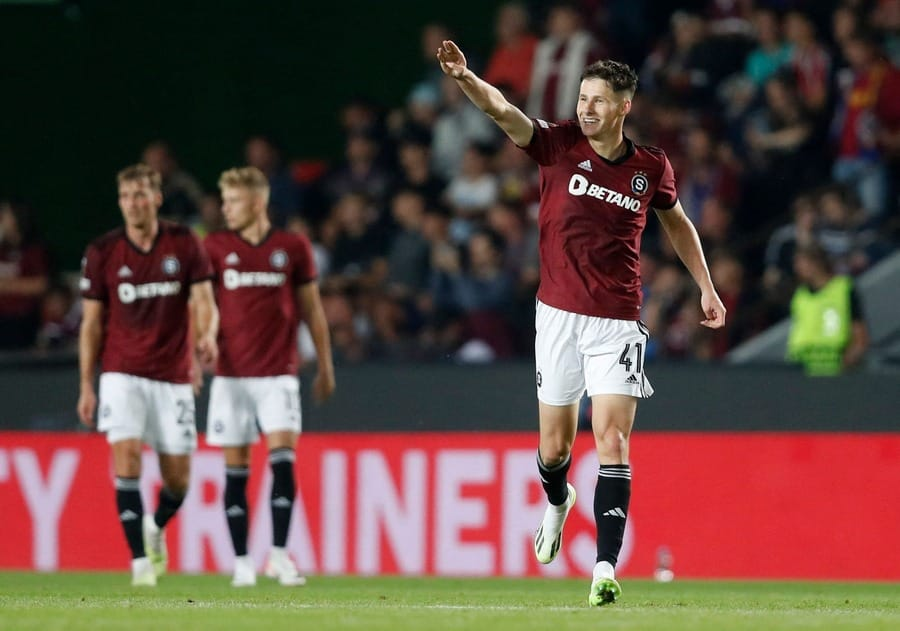

Am vrut să spun că-n ciuda unor erori, mi-a plăcut mult Martin Vitik. Apoi, m-am uitat pe Transfer Markt și am văzut că e evaluat la 12 milioane Euro, deci n-am descoperit eu vreo apă caldă. Așa că nu mai spun nimic despre asta, ci despre altceva...

Cel puțin 3 lucruri care ar putea să-i facă pe fanii FCSB să creadă că echipa lor e favorită la calificare după meciul tur cu cehii.

**În primul rând, maniera de joc.**

FCSB a făcut un meci excelent, pe care ar fi meritat chiar să-l câștige. Ghinionul lor a fost Târnovanu. Plus alegerile greșite ale lui Băluță sau Șut în situații de joc în care puteau să finalizeze diferit față de cum au făcut-o.

**În al doilea rând, **scorul și faptul că returul este la București de asemenea fac din FCSB o aparentă favorită la calificare. Oricum ai lua lucrurile, să joci acasă după ce-n tur ai făcut egal chiar e un avantaj serios.

**În fine, al 3-lea motiv** pentru care mulți fani ai FCSB cred că echipa lor e favorită ține de un amestec între lipsa de obiectivitate caracteristică multor suporteri și pedigree-ul european al FCSB. Adică, amestecă ce și-ar dori cu ceea ce au văzut că istoric echipa lor e capabilă să obțină. De altfel, doar două echipe românești au această capacitate de-a obține mult cu puțin în Europa - CFR Cluj și FCSB.

Restul formațiilor noastre se cam împiedică reflex de tot felul de glume de brand fotbalistic din țări cu importanță minoră în fenomen.

Și totuși...

## Ce o face pe Sparta Praga favorită pentru retur

Eu cred că Sparta Praga e o echipă superioară FCSB.

Desigur, e o apreciere subiectivă ca orice apreciere de gen, mai ales că e alimentată inclusiv pe tendința mea de-a favoriza jocul cât mai direct și cu mare implicare fizică în duelurile 1 la 1. 

Deși FCSB este o echipă care se descurcă bine în ceea ce privește partea fizică a meciurilor, mi s-au părut cehii peste ei. 

Și când spun asta, te rog să nu te limitezi doar la faptul că Dawa și Ngezana sunt excelenți din acest punct de vedere, dar fotbalul se joacă 11 la 11. Ceilalți fotbaliști ai FCSB aleargă mult, dar din perspectiva capacității de-a câștiga duelurile fizice, mingea a doua, cehii sunt mai buni. 

Mai mult, Dawa va lipsi, iar asta va fi o problemă uriașă dacă înlocuitorul său - probabil Chiricheș - nu va prinde o zi excelentă la retur. 

În fine, foarte important - spre deosebire de alte echipe cu stil de joc atât de direct, cehii nu au naivități tactice. Adică, au capacitatea aceea danpetresciană de-a aștepta dacă e nevoie să aștepte. 

Eu cred că la retur nu se vor arunca peste noi decât dacă au simțit la meciul tur că ne sunt net superiori. Și am o veste pentru tine: modul în care s-au comportat cehii pe teren a indicat tot timpul că ei s-au simțit mai buni. Nu te lua după ce-ai simțit tu, după nivelul tău de încântare. Cehii nu au arătat vreun moment ca o echipă debusolată, surprinsă de ceea ce am jucat noi, ci frustrați doar că eforturile lor nu se finalizau așa cum și-au dorit.

Repet, la nivel de încredere în sine, cehii stau excelent. Dacă aș putea să intru în mintea fotbaliștilor FCSB și să scot de acolo ceea ce gândesc aceștia despre adversarii lor, eu cred că ar fi o grămadă de dovezi că cehii sunt percepuți ca o echipă foarte greu de eliminat în retur. 

## Ce o poate ajuta pe FCSB să se califice

Dacă FCSB repetă meciul din tur, atunci șansele de-a se califica vor fi egale.

Cu o condiție.

Ca și cehii să aibă o evoluție precum cea din tur.

Întrebarea care se naște în aceste condiții este dacă cehii au făcut un meci sub așteptările lor pentru că au prins o zi slabă sau pentru că FCSB a determinat acea zi slabă?

Probabil că e câte un pic din ambele.

De asemenea, FCSB are câțiva jucători capabili să producă ceea ce eu numesc "fotbal neanticipabil". Adică, execuții neașteptate, driblinguri, capacitate speculativă excelentă.

Aici mă gândesc în special la Ștefănescu și Băluță, dar și la Olaru și chiar la Miculescu sau Popa. 

De asemenea, FCSB mi se pare o echipă excelentă în ceea ce privește specularea momentelor în care recuperează mingea și dezvoltă contraatacuri chiar și după plecarea lui Coman.

În fine, oricât de ciudat ar suna, FCSB are și un soi de noroc aproape proverbial în ceea ce privește meciurile europene, noroc pe care de cele mai multe ori și-l determină chiar ei înșiși.

Vom vedea returul și sper ca această convingere că cehii sunt mai buni și se vor califica va fi contrazisă zdravăn.

Doar că nu prea obișnuiesc să mă-nșel în astfel de privințe. 
