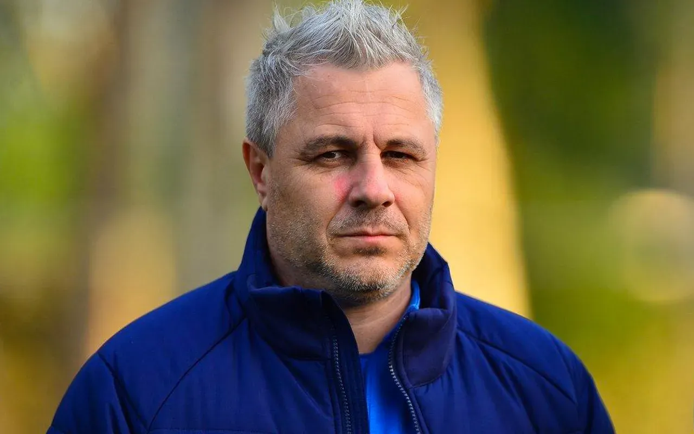

Când în finalul sezonului trecut l-a demis pe Bergodi și l-a numit pe Lobonț interimar, Dan Șucu a părut că ia o decizie de capul său așa cum mulți finanțatori din fotbal iau.

Adică, omul de afaceri a considerat că un om cu școala de antrenorat al lui Lobonț este soluția să iasă din criza în care se afla alături de Rapid.

N-a ieșit.

Dar asta nu l-a făcut să renunțe la ceea ce credea el, astfel că a continuat să producă schimbări în toate departamentele clubului pentru a-l face să arate așa cum și-ar dori el.

Prin urmare, când cel mai probabil noul director sportiv Daniel Sandu i l-a propus pe Neil Lennon ca antrenor, Șucu s-a arătat încântat de varianta respectivă. Antrenor cu CV bogat, care venea dintr-un fotbal mai bine cotat decât al nostru.

## Șucu nu este doar dezamăgit, este mai ales dezorientat

Din exterior, a părut că Victor Angelescu nu e încântat de alegerea acționarului majoritar. Mai mult, probabil că de data aceasta nici măcar n-a fost implicat real în decizia finală.

Ceea ce e neobișnuit din două puncte de vedere: Angelescu nu doar că are tot interesul din lume ca lucrurile să meargă bine pentru că are propriii bani băgați la Rapid, dar probabil este singurul finanțator din fotbalul nostru care are o pricepere concretă la acest fenomen.

Nu-l bag aici pe Hagi pentru că el reprezintă în sine o categorie aparte.

Prin urmare, Șucu a acționat după propriul instinct și după propria înțelegere în aceste ultime luni și a ajuns în postura de-a-și privi echipa jucând doar bucăți de meciuri, niciodată un meci întreg.

De aici și rezultatele mult sub așteptări, dar nu mult sub ceea ce putea fi anticipat de oricine înțelege un pic ce-nseamnă fotbalul.

Iar în condițiile acestea, Șucu este nu doar dezamăgit, ci mai ales total dezorientat. Atât de dezorientat încât a cedat presiunii continue emanate de o parte a suporterilor, de o parte a presei în frunte cu Horia Ivanovici, de acei antrenori români ofticați că un străin are un super contrat și de Șumudică însuși.

Șucu nu va recunoaște probabil vreodată că cedarea sa este una mai ales emoțională, va spune ce a auzit în jur că se spune:

> “Jocul nu dădea speranțe, nu oferea perspective!”.

sau

> “La ce investiții s-au făcut, Rapid e un dezastru de echipă”

sau

> “Lennon nu se potrivește, cum să pui un antrenor anglo-saxon la o echipă din România?”

## Dezorientarea lui Șucu a dus la numirea lui Șumudică

Atenție, eu nu spun aici că Lennon era de nedemis.

E ușor pentru mine, care nu bag bani la Rapid și care doar analizeze ce se-ntâmplă în Liga 1 să spun că ar fi trebuit lăsat în continuare pentru că 6 etape sunt mult prea puține.

Sau să spun că, de fapt, Rapid a avut un singur meci cu adevărat rușinos, egalul cu Sepsi. În rest, în fiecare joc a avut bucăți decente de partidă, iar cu Petrolul nu ar fi meritat să piardă.

Eu spun altceva: că eroare majoră nu este să-l demiți pe Lennon, ci să-l demiți ca să-l pui pe Șumudică.

Nu pentru că Șumudică n-ar fi un antrenor foarte bun.

E foarte, foarte bun.

[Doar că are un comportament de clovn.](https://www.cameravar.ro/sumudica/)

Prin urmare, de asta spun că Șucu este total dezorientat și a cedat presiunilor - a numit un antrenor al cărui comportament public intră în totală contradicție cu tot ceea ce a clamat acționarul majoritar al Rapidului că dorește să implementeze în Giulești.

Și nu doar că a clamat, dar a și făcut.

Șucu este atât de bulversat încât a-nceput să creadă că într-o lume cu zeci de mii de antrenori, doar Șumudică este o soluție pentru Rapid.

Penibil.

Asta doar pentru că un antrenor străin s-a dovedit “incompatibil” cu Giuleștiul.

## De ce ideea că Moldovan l-a sfătuit să-l aducă pe Șumudică nu schimbă ceea ce am spus

Unii ar putea crede că Șucu a luat decizia să-l demită pe Lennon pentru că Viorel Moldovan ar fi putut să-l convingă în această direcție.

Adică omul care a jucat fotbal la nivel înalt și care a antrenat la un nivel mai mult decât decent ar fi putut să judece întreaga situație și să fi înclinat balanța în favoarea schimbării nord-irlandezului și a aducerii lui Șumudică.

Poate.

Doar că Moldovan a demonstrat la rândul său un amestec de labilitate și inabilitate în ceea ce privește atitudinea sa față de situația de la Rapid.

Ideea de-a cere public antrenorului să schimbe sistemul a fost o gafă majoră pe care un om pus în poziția de-a conduce un club n-ar trebui să o facă nici măcar dacă are ca intenție să demită respectivul antrenor.

Lennon nu avea nevoie să spună Moldovan în emisiuni că trebuie să schimbe sistemul ca să-l schimbe. Din contră, o discuție privată l-ar fi influențat mai mult chiar în respectiva direcție.

Cine a avut însă nevoie de această mișcare publică?

Moldovan însuși, care n-a făcut față presiunii resimțite la nivelul clubului de lipsa rezultatelor.

Ce spune asta?

Spune că omul cu merite imense în calificarea Rapidului în dubla cu Hamburg tocmai pentru că-n meciul din deplasare a intrat în teren spre finalul jocului și a reușit să-și mobilizeze colegii în clipe de maximă dificultate prin curajul său a clacat acum în povestea Lennon.

Și a făcut ceea ce nu te-ai fi așteptat de la el: să spună public că Lennon a făcut o alegere greșită de sistem, deci că nu cunoaște jucătorii sau că e un antrenor slab.

Sau amândouă.

Zero beneficiu pentru club.

## Ce se va întâmpla în continuare la Rapid

Cel mai probabil, Rapid va avea rezultate mai bune cu Șumudică decât a avut cu Lennon.

De altfel, sunt absolut convins că și Lennon dacă ar fi rămas, ar fi avut în continuare rezultate mai bune decât a obținut în primele etape.

Dar asta nu mai contează.

Contează că Săpunaru va reveni în echipă dacă va fi sănătos, posibil chiar într-un sistem cu 3 fundași centrali, sistem care este pe placul lui Șumudică.

Desigur, noul antrenor nu va avea vreo urmă de jenă față de fotbaliștii pe care i-a făcut praf la Fanatik, mai ales că victimele au fost străini și e posibil să nu fi ajuns la ei ce spunea acesta.

În fine, Șumudică însuși va avea un comportament ceva mai decent decât obișnuiește să aibă. Nu pentru că se va schimba, ci pentru că pe lângă faptul că e un antrenor foarte bun, este un individ inteligent.

Și știe că tot chinul său din ultimele luni a fost produs doar de el însuși. Comportamentul specific unor circari a fost singurul impediment în calea numirii sale la Rapid și, cred eu, singurul motiv pentru care ideea ca el să fie noul selecționer al României să fie una neluată în calcul.

Și ar mai fi ceva: Șumudică este susținut de o mare parte a fanilor Rapidului, dar este nedorit de o altă parte. Mă refer exact la cei deranjați de comportamentul său public, la cei care consideră că imaginea sa este în dezacord cu clubul pe care-l susțin.

Mai contează acești oameni în acest context?

Nu.

Vorba lui Gardoș, singurul lucru care contează este rezultatul din week-end.

PS: dacă-ți lăcrimează ochii când citești, [poți vedea varianta video a acestui text aici](https://www.youtube.com/watch?v=Tq1rFvQD-Do)
