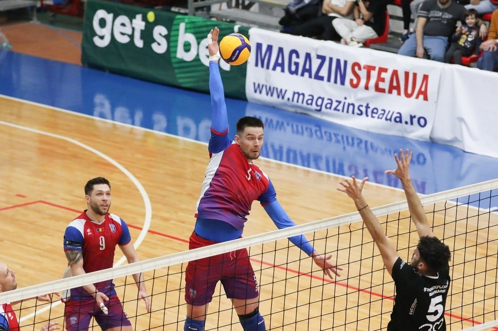

Încerc să am mai multe teorii legate de această situație pentru că dacă m-aș rezuma la prima care-mi vine minte, textul acesta ar putea să pară insultător la adresa celor în cauză.

Dar nu e vina mea.

E vina lui Freud, care a vehiculat sub diverse forme teoria cucului mic ca explicație pentru incapacitatea oamenilor de-a fi suficient de fair încât să recunoască atunci când o situație îi avantajează de-o manieră incorectă.

Sigur, poți spune că Freud este depășit, mai ales că o parte din susținerile sale chiar sunt exagerate, iar altele sunt prea supărătoare pentru sensibilitatea celor care favorizează corectitudinea politică în defavoarea adevărului.

Prin urmare, oricând te pot ajuta să te refugiezi în zonele moderne ale psihologiei pop. De exemplu, la modă este ideea de traumă, care explică de-o manieră trist-confortabilă o grămadă de lucruri legate de felul în care sunt oamenii.

Și le oferă multora pretexte pentru a nu mai face niciun efort în prezent de vreme ce trecutul lor a fost populat cu o grămadă de evenimente traumatice. Unele pe bune, altele doar simple sfidări la adresa celor care au suferit cu adevărat.

În fine, chiar dacă nu pare, eu discut aici despre erori de arbitraj și despre cum reacționează oamenii de fotbal ale căror echipe beneficiază de acestea.

Toți, cu foarte puține excepții.

## Am o veste proastă pentru toată lumea, inclusiv pentru o parte a suporterilor CFR Cluj - Balaj e cel mai dotat conducător de club

Adică, psihanalitic vorbind, e singurul care pare să fie măcar mulțumit cu ceea ce natura i-a oferit de vreme ce nu are absolut nicio problemă în a recunoaște când CFR Cluj e beneficiara unor erori de arbitraj.

Probabil că omul are  suficient respect de sine încât să nu simtă nevoia de-a sfida evidențele. Uneori, merge chiar mai departe de atât și ia în calcul ca echipa sa să fi fost avantajată inclusiv în situații în care există dubii majore că asta s-ar fi întâmplat.

Sau poate Balaj ține mai mult la trecutul său de arbitru decât la prezentul său de conducător al unui club aflat în lupta pentru titlu. Altfel, nu ar exista nicio altă explicație.

Omul spune pe bune, de fiecare dată, ce se vede în arbitrajul din Liga 1. Și când vine de erori care-l avantajează, și când vine vorba de situații care-i avantajează pe alții. Am văzut că [Mihai Stoica i-a ironizat reacția](https://www.gsp.ro/fotbal/liga-1/mihai-stoica-replica-balaj-rotaru-fcsb-dinamo-781354.html), doar că greșește.

Adică, e ca și cum un cumpărător de pilule pentru mărit dimensiunea supremă i-ar reproșa unui actor faimos din filmele pentru adulți că nu prestează așa cum trebuie.

Penibil de-a dreptul.

Stoica este după părerea mea cel mai bun conducător de club, dar nu are niciun talent în a spune adevărul când adevărul nu-i convine.

## Am însă și o veste bună pentru ipocriți: e OK să bați câmpii când vine vorba de arbitraje

Cei care nu recunosc erorile de arbitraj care-i avantajează își permit să sfideze realitatea dintr-un motiv destul de simplu - societatea în care trăim nu mai sancționează ipocrizia.

Sau când totuși o face, o sancționează de-o manieră blândă. Așa că cei care mint pe față scapă ușor, plătesc un preț mult prea mic ca să fie afectați. Unii au deja tot felul de mecanisme de autoapărare suficient de dezvoltate încât faptul că sunt ironizați trece pe lângă ei precum țânțarul pe lângă căruță.

Popular, au o piele groasă și asta e un motiv de laudă, nu de rușine.

Adică, echivalează nesimțirea cu o formă de tărie psihică.

În plus, de ce să nu bați câmpii la TV și să susții că ceea ce se vede nu este ceea ce se vede de vreme ce oricum ai în spate hoarde de suporteri care aleg să fie orbi în fața realității?

Oameni care se ghidează reflex după principiul "dacă e bine pentru echipa mea, atunci e adevărat. Iar dacă e rău, atunci e fals".

Cu astfel de filosofii de tratare a realității, orice om de fotbal are liniștea necesară să abereze la infinit. 

Și nu doar liniște, dar și susținere. 

Vorba lui Mihai Stoica în contextul disputei cu Balaj pe seama realității:

>  "Avem replici la orice".

## Ce se va întâmpla în continuare în ceea ce privește arbitrajele din Liga 1

În mare, nu se va întâmpla nimic spectaculos.

Adică cei care s-au ocupat și până acum cu sfidarea adevărului vor aplica în continuare metoda Marcel Lică. 

Nu știi metoda Marcel Lică?

Nicio problemă, ți-o explic.

Acum foarte mulți ani, pe când Ovidiu Ioanițoaia modera Recursul Etapei la Antena 1, iar eu aveam onoarea să-i fiu producător, s-a întâmplat o chestiune care inclusiv pentru vremurile tâlhăriilor supreme în arbitraj a părut ceva super odios.

Mai exact, era vorba despre marcarea unui gol din ofsaid de către o echipă la un meci arbitrat la centru de arbitrul constănțean Marcel Lică. Deci el era la centru, eroarea de arbitraj o făcuse, desigur, tușierul.

Ofsaidul nu doar că era clar, dar trăiam cu toții situația ideală în care camerele, din toate pozițiile, evidențiau acel ofsaid uriaș mai ales prin claritatea sa. 

Și totuși, Marcel Lică a simțit nevoia să intre în direct ca să comenteze faza.

Și cum a comentat-o?

A zis că nu e ofsaid.

Argumentul său?

Că nu poate fi forțat să spună că e ofsaid, că e dreptul lui să spună că nu este.

Am văzut multe de-a lungul deceniilor în care am urmărit emisiuni de analiză fotbalistică, dar și astăzi consider că acel moment a fost uluitor prin absurditatea sa. 

În zilele noastre, lucrurile nu s-au schimbat dramatic. Oamenii din fotbal găsesc de nenumărate ori prilejul să-ncerce să-l concureze pe Marcel Lică, uneori, ce-i drept destul de rar, reușind să se apropie chiar de performanța acestuia.

Prin urmare, așteaptă-te în continuare să apară astfel de erori și așteapă-te în continuare ca cei care ar trebui să le recunoască măcar atunci când sunt evidente să simuleze că nu văd ceea ce văd. 

De ce?

Am spus mai sus - freudian vorbind, au cucul mic. 
