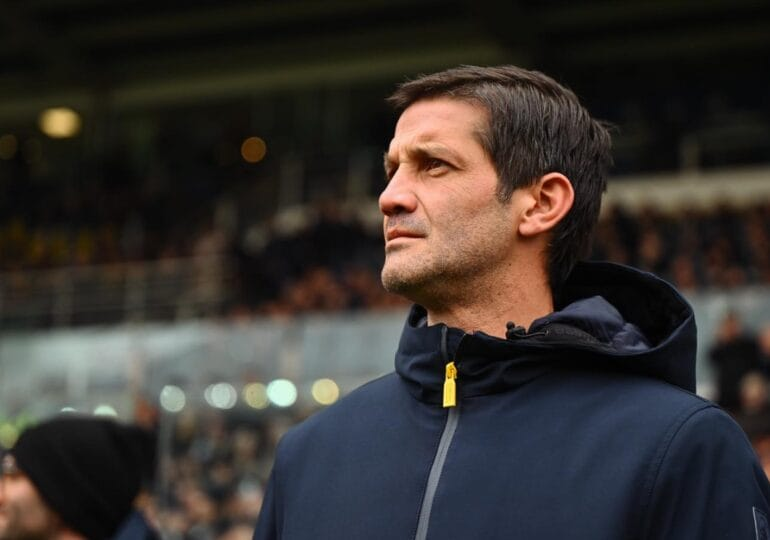

Italienii se amuză că un antrenor care a fost refuzat de Cosenza a ajuns să fie dorit de Inter.

Același Chivu a fost într-un fel refuzat și de Dan Șucu ca variantă pentru Rapid. Spun “într-un fel” pentru că nu știm nimic din partea vreuneia dintre părți legat de cum au decurs discuțiile.

Am auzit doar variante de exterior, care susțin ori că [Șucu a fost șocat de discuția cu Chivu](https://iamsport.ro/fotbal/superliga/chivu-a-plecat-uluit-de-la-negocierile-cu-dan-sucu-nu-ti-vine-sa-crezi-ca-poate-sa-existe-asa-ceva-va-inchinati-frate-id28261.html), ori că Chivu a fost șocat de discuția cu Șucu.

Dar să mergem pe ideea că Rapid l-a refuzat pe Chivu...

## Teoria mea legată de antrenorii pentru echipele cu pretenții

Una dintre obsesiile mele super confirmate de realitate spune cam așa - orice echipă cu pretenții ar trebui să-și minimalizeze riscul de eșec prin numirea unui antrenor care a demonstrat deja că poate obține rezultate.

Când ești echipă mare local sau la nivel european, exact asta faci - numești un antrenor care să fi confirmat anterior pentru că-n felul aceasta scazi probabilitatea de-a rata.

Când nu faci asta și numești antrenor sub nivelul obiectivului, riști enorm.

Evident, riscul există și dacă-l pui pe Guardiola, doar că dacă pui pe cineva care nu a confirmat în trecut, acest risc de eșec devine foarte mare.

Dar există și excepții - adică antrenori care n-au confirmat anterior la nivel înalt vin și obțin rezultate cu o echipă mare.

Totuși, sunt excepții.

Acum, oricine poate să-mi dea o grămadă de exemple de “excepții” ca să contrazică teoria mea.

Doar că teoria mea conține o notă de subsol...

## Când un club mare își poate permite numi un antrenor care n-a confirmat la nivel înalt 

Poți numi la o echipă mare un antrenor care nu a confirmat deja la nivel înalt dacă-l cunoști foarte bine pe respectivul antrenor ca să-i poți evalua corect valoarea.

Ce-nseamnă asta mai exact?

Nu înseamnă că ești prieten cu respectivul antrenor, că v-ați făcut concedii împreună sau că ați discutat pe WhatsApp despre cât de slab e fostul antrenor.

Înseamnă că ai în club oameni foarte buni în meseria lor (director sportiv sau președinte) astfel încât aceștia să aibă capacitatea de-a înțelege calitățile și defectele respectivului antrenor fără experiență la nivel înalt.

Astfel încât să nu fie un pariu, ci o alegere logică.

Chiar și pentru astfel de oameni din executivul unui club poate fi dificil să evalueze corect anumiți antrenori care nu au fost expuși la fotbalul de nivel înalt, așa că situația ideală este atunci când găsești un astfel de antrenor în interior - la echipa a doua sau la tineret sau la vreo echipă satelit etc.

În felul acesta, cel care ia decizia știe nu doar cum să evalueze un antrenor, dar l-a avut cumva la dispoziție pentru această evaluare.

## Parma și-a permis să riște, iar Inter știe ce face. Rapid risc aiurea

Inter nu l-a numit pe Chivu doar pentru că a salvat-o pe Parma, ci pentru că oamenii de acolo au și avut ocazia să-l evalueze parțial în perioada în care a antrenat echipa sub 19 ani a clubului.

Da, a contat faptul că s-a descurcat în Serie A, dar nu ar fi fost suficient. Cum, se pare, n-a fost suficient nici faptul că Chivu a câștigat titlul la Primavera. A contat, dar nu cât să fie numit principal la prima echipă.

Ce vreau eu să evidențiez este că cei de la Inter au putut risca știind ce aduc la echipă pe când Dan Șucu avea două mari probleme - nici nu avea la Rapid oamenii care să-l poată evalua pe Chivu, dar chiar dacă i-ar fi avut, ar fi fost foarte dificil să o facă de vreme ce nu l-au putut urmări așa cum l-au urmărit cei de la Inter atâția ani.

Acum, Parma de ce a riscat de vreme ce nici ei nu au avut acces la atât de multe informații despre Chivu cum a avut Inter?

În primul rând, teoria mea se aplică în cazul echipelor mari, iar Parma, deși este clubul meu favorit din Serie A, nu face parte din grupul Inter, Milan, Juventus, Roma...

Deci ei pot risca ceva mai mult.

Își pot permite asta.

În plus, spre deosebire de Rapid, cred că ei au avut oameni care să evalueze potențialul lui Chivu și cred că la discuțiile cu acesta au avut mai multe informații decât a avut Șucu la discuțiile sale sau de cât a avut Angelescu în trecutul ceva mai îndepărtat când la rândul său a vrut să-l aducă pe Chivu.

Acum, pentru că aduc un director sportiv italian, oarecum amuzant pentru că vine chiar de la Parma,  Rapid va fi un club mai puternic în ceea ce privește capacitatea de-a evalua corect antrenorii pe care-i numește.

Cu precizarea că această capacitate doar scade riscul eșecului, nu-l elimină complet.

Chivu la Inter rămâne un risc, doar că e unul mai mic decât ar fi fost Chivu la Rapid.
