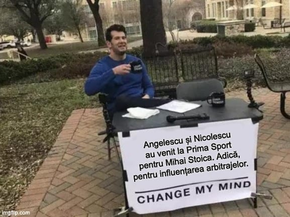

Mă confrunt cu o situație dificilă - cei de la Prima Sport mi-au furat posibilitatea de-a-nfiera cu același elan prezența lui Mihai Stoica în emisiunile lor sub un pretext corect - [e un analist sub acoperire care nu poate și nici nu vrea să fie obiectiv](https://www.cameravar.ro/televiziuni-sport-analisti-liga1/).

Asta deși, așa cum am recunoscut, aparițiile sale sunt în mod real de maxim interes pentru mine.

În fine, oamenii de acolo au creat un soi de echilibru neașteptat - au semnat contract de colaborare și cu Andrei Nicolescu (președinte Dinamo), și cu Victor Angelescu (Rapid).

Prin urmare, măcar au argumentul solid că oferă astfel posibilitatea celor 3 mari echipe bucureștene să-și apere interesele.

Desigur, ideea are și o componentă real amuzantă - spre deosebire de Mihai Stoica, cei doi noi colaboratori sunt acționari ai cluburilor pe care le reprezintă și oameni care nu au sub nicio formă o miză financiară personală în această poveste.

Adică, deși sunt convins că Prima Sport îi plătește, cei doi au absolut tot interesul să vină în emisiuni și să-ncerce să facă ceea ce face cu real talent Stoica, așa că probabil ar face-o și fără bani.

## Ce face Mihai Stoica la Prima Sport și ar vrea să facă la rândul lor Nicolescu și Angelescu

Foarte pe scurt, Mihai Stoica face în principal două lucruri prin intermediul emisiunilor moderate de Dan Udrea și Silviu Tudor Samuilă:

1. **încearcă să asigure arbitraje favorabile FCSB**
2. **apără în general cauza clubului inclusiv în relație cu patronul și oferă satisfacții fanilor FCSB în disputele cu fanii rivalelor**

În privința arbitrajelor, lucrurile sunt simple - discursul lui Mihai Stoica are rolul de-a se asigura că niciun arbitru care greșește flagrant sau moderat sau oricum altfel în defavoarea FCSB să nu scape de acuzele sale.

Adică, pe limbaj fotbalistic, "pune presiune".

De asemenea, se asigură că orice situație de arbitraj favorabilă FCSB va fi încadrată în categoria eroare omenească sau chiar în categoria “Silviu, deci tu refuzi să vezi ce este clar!”.

Da, [atât Samuilă, cât și Udrea au obiceiul de-a vedea realitatea](https://www.cameravar.ro/cei-mai-buni-moderatori-liga-1/) și de-a-i produce izbucniri nervoase lui Mihai Stoica.

În fine, presa preia ce spune Stoica în emisiuni pentru că nu e doar o voce importantă a clubul care produce cel mai mare interese mediatic, dar Stoica are, așa cum spuneam, un talent real de-a se face interesant.

Apoi, din presă, mesajele lui Stoica ajung la tot felul de publicuri. Nu doar la fanii FCSB, ci și la arbitrii din Liga 1, la oficialii CCA. Și dacă Stoica își face bine treaba, așa cum și-a făcut-o sezonul trecut din plin, efectele vorbelor sale se pot vedea inclusiv în decizii luate de “dușmanii” Hațegan sau Colțescu.

De exemplu, dacă Sebastian Colțescu avea ceva cu FCSB, îl elimina la meciul cu Petrolul pe Stoian, care la acel galben faultează cu talpa foarte sus, fără intenția sau posibilitatea de-a juca balonul, care era chiar departe de intervenția sa.

Sau Hațegan vedea penalty-ul clar neacordat Rapidului la finalul sezonului trecut la pumnul dat de Târnovanu lui Burmaz.

Nu contează însă, Stoica știe care-s sensibilitățile lui Colțescu și a văzut ce a obținut depe urma contestării lui Hațegan, așa că va continua să pună presiune pe ei preventiv, [așa cum a făcut-o deja cu primul după meciul cu Petrolul.](https://www.gsp.ro/fotbal/liga-1/mihai-stoica-critici-sebastian-coltescu-petrolul-ploiesti-fcsb-824562.html)

În privința “apărării cauzei FCSB”, lucrurile sunt ceva mai difuze. Adică, pe de o parte, în ciuda faptului că Mihai Stoica are astăzi un control mai mare asupra propriilor porniri comparativ cu trecutul, el trăiește încă într-un soi de tensiune vizibilă dacă urmărești cu atenție aparițiile sale.

Normal, eu speculez pe baza unor percepții care sunt subiective și mă pot înșela. Dar așa văd eu, că în continuare trăiește un uriaș consum nervos în legătură cu tot ce se întâmplă la club și că-l stresează inclusiv stresori la care a fost mai expus ca nimeni altul - ex. meciurile din Liga 1 sau cupele europene.

Iar emisiunile îi permit să dea drumul la supapă, de cele mai multe ori de-o manieră elegantă. Prin intermediul emisiunii, el își satisface inclusiv plăcerea histrionică de-a da peste nas altora, de-a se bucura de propriile capacități în ochii tuturor, dar și interesul evident de-a-ncerca să păstreze problemele de natură mediatică departe de club.

Adică, omoară pe cât posibil orice subiect care ar putea dăuna echipei, grupului de acolo, antrenorilor etc. Și desigur, prin intermediul emisiunii, îi protejează public, pe cât posibil, pe aceștia de Becali. Adică, dă nuanțe calme deciziilor impulsive ale patronului.

De asemenea, mi se pare că a reușit să obțină mult inclusiv în relație cu Mircea Lucescu, care pare să-ncerce să nu supere cu ceva FCSB ca să nu-și complice mandatul la echipa națională.

Da, cred că Mihai Stoica este atât de sofisticat în tot ceea ce face. 

Sigur, nu-l văd plănuind doar mutări de anticipare ca la șah, dar inteligența îi permite să ia și decizii rapide, în funcție de cum decurg lucrurile.

## Pot Nicolescu și Angelescu să obțină ce obține Mihai Stoica din colaborarea cu Prima Sport?

Deși i-am luat cumva la pachet, Andrei Nicolescu și Victor Angelescu sunt destul de diferiți.

De exemplu, Nicolescu este mult mai pasionat de apariții TV decât Angelescu. Adică, deși amândoi ajung să facă declarații des în presă, doar dinamovistul îmi pare bucuros să aibă cuvântul.

Angelescu e genul de “ciudat” fără prezență pe rețelele sociale care se remarcă printr-o atitudine super cerebrală atunci când ajunge să vorbească în public.

Nu face o miză din a da bine, ci face o miză din a închide subiecte care nu-i convin, de-a fi atent la orice nuanță din discursul său și chiar de-a profita pe cât posibil de situațiile în care poate să spună mai puțin decât ar spune alții.

Momentele în care Angelescu vorbește mult sunt, cel mai probabil, momente în care vorbește tocmai pentru că subiectul vorbelor sale duce discuția departe de vreo chestiune care nu-i convine.

Dincolo însă de plăcerea lui Andrei Nicolescu de-a vorbi cu [aplombul enervant al avocaților de business](https://iamsport.ro/editorial/de-ce-se-exprima-andrei-nicolescu-asa-cum-se-exprima-cele-3-mari-ghinioane-id7927.html) și de încercarea lui Victor Angelescu de-a face o miză din manipularea majorității interacțiunilor cu media, întrebarea este dacă ei pot să obțină pentru cluburile lor ce obține Mihai Stoica din colaborarea cu Prima Sport.

Iar răspunsul meu este simplu - parțial, vor obține.

Iar acest “parțial” înseamnă mult mai mult decât ar fi putut obține în trecut prin intervenții telefonice la diverse emisiuni, chiar cu audiență mai mare, cum sunt cele de la Digi Sport.

Cred că succesul lor va fi limitat pe termen lung de un singur aspect - cei doi reprezintă cluburi importante, dar cu audiență inferioară FCSB. Prin urmare, apetența cu care presa va prelua ceea ce spun ei în emisiuni va fi va fi una mai mică decât în cazul echipei lui Mihai Stoica.

Dar în privințele importante, categoric vocea lor va fi mai mult decât auzită. Mai ales dacă vor avea abilitatea să-și îmbrace mesajele "neinteresante" de-o manieră care să vâneze rivalitatea cu FCSB.

De exemplu, faptul că te lauzi că ai făcut progrese mari la academia proprie nu va fi o știre majoră, dar va deveni dacă faci efortul de-a o formula de o manieră memesciană:

> “Eram inclusiv în spatele celor de la FCSB, nu doar în spatele celor de la Farul, dar i-am depășit și am redus mult ecartul față de clubul lui Hagi”.

Asta cu “ecartul” am pus-o pentru domnul Nicolescu, pentru că dânsul pare îndrăgostit de termeni real sau aparent sofisticați.

În fine, cred că dincolo de miza legată de influențarea arbitrajelor, privință în care Dinamo și Rapid au avut enorm de suferit sezonul trecut, cei doi par într-o mai mare măsură dornici să obțină o apreciere din partea propriilor suporteri ca urmare a faptului că-și apără cluburile.

De altfel, un reproș constant al fanilor Rapidului la adresa conducerii clubului a fost exact această lipsă din media a șefilor în situații care necesitau mai mult decât un comunicat de presă.

Dar miza arbitrajului sunt convins că rămâne marea miză a acestor mișcări pentru Dinamo și Rapid.

## Cât de talentați pentru TV sunt Nicolescu și Angelescu

Ai putea crede că la TV trebuie să vorbești mult ca să faci treabă.

E o credință falsă care se vântură prin tot felul de domenii, inclusiv cel al vânzării, unde se crede că cei mai buni vânzători sunt cei buni de gură.

E fals.

Așa cum în vânzări cei mai buni vânzători sunt cei care știu să vândă, nu neapărat cei care vorbesc mult, și la TV cei mai buni sunt cei care știu ce să spună (care e o formă de vânzare de idei), nu cei care vorbesc mult.

Spun asta pentru că din ceea ce am remarcat mai sus ar putea să se-nțeleagă că Victor Angelescu, un nepasionat de expunere publică majoră, ar avea vreun handicap.

Nici pe departe, Angelescu are o inteligență remarcabilă pentru oricine a avut răbdarea să-i urmărească aparițiile TV. Nu are neapărat o experiență în a gestiona subiecte dificile - de exemplu, i-a luat foarte mult să închidă subiectul Săpunaru de-o manieră acceptabilă pentru interesele clubului.

Dar strict vorbind de capacitea sa intelectuală de-a se adapat jocului, nu va avea probleme sub nicio formă. Mai degrabă, cred că Andrei Nicolescu ar putea să aibă unele dificultăți nu din rațiuni care țin de inteligență, ci poate de rațiuni care țin de prețiozitatea sa.

Nu o spun cu răutate, o spun din postura unuia care face la rândul său uneori eroarea de-a se da deștept inutil. 

## Prima mare miză pentru Prima Sport

Sunt multe mize de mare interes jurnalistic în jurul acestor contracte pe care Prima Sport le-a semnat cu cei 3 reprezentanți ai marilor echipe bucureștene.

Cea mai la îndemână ar putea să pară prezența în același timp în studio a lui Mihai Stoica și a oricare dintre Nicolescu sau Angelescu, mai ales înainte sau după derby-uri.

Eu mai văd o miză - întâlnirea în studio a lui Victor Angelescu și Andrei Nicolescu având în vedere faptul că cei doi s-au despărțit de-o manieră dureroasă pentru cel de-al doilea, care are la rândul său un merit prea rar recunoscut în ceea ce privește salvarea Rapidului de la dispariție.

Dar dincolo de ceea ce mie mi se pare interesant de văzut, trebuie să recunosc încă o dată că ceea ce au reușit să facă cei de la Prima Sport prin această mutare este real impresionant.

Adică, deși nu mai pare o de mare importanță pentru prea mulți, pur jurnalistic cei de acolo au reușit să echilibreze lucrurile de-o manieră dificilă, dar elegantă.

Nu e o situație perfectă, dar este o situație net mai bună decât era înainte. 

Plus că [situațiile perfecte din perspectiva obiectivității](https://www.cameravar.ro/interese-case-de-pariuri-presa-sportiva/) se produc doar atunci când sunt eu prezent în emisiuni, așa că n-are rost să mai insist pe acest subiect.
