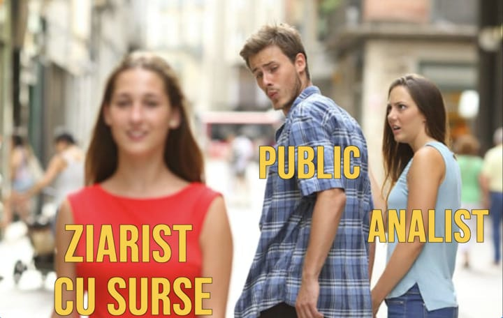

Câteva precizări înainte de orice.

Desigur, e vorba despre presa dedicată fotbalului românesc, nu de presa sportivă în general. Titlul e doar o formă ticăloasă de a ne da rotunzi în fața celorlalte nișe de jurnalism sportiv.

A doua precizare pentru esteți, nu pentru isteți - exprimarea din titlul este intenționată. E ca un omagiu adus stilului comunicațional al domnului Becali, cel care n-a forțat vreodată ziariștii să se dea peste cap pentru a obține informații de la domnia sa.

În plus, titlul “are mai forță” așa.

Apropo de domnul Becali, dacă-ți lăcrimează ochii de la citit, [**ai aici și varianta video a acestui text**](https://youtu.be/tt2Qr1TmqKg). 

## La ce ziariști cu surse mă refer în continuare

Mă refer la cei care aproape că trăiesc pentru plăcerea de-a obține informații din lumea fotbalului. Unele ajung să fie publicate pentru că prezintă interes, altele nu-s publicate pentru că produc satisfacție doar celui care le culege.

De asemenea, nu mă refer la ziariști care prin statutul lor ar putea obține zilnic tot felul de informații. Nu pentru că-s pasionați de asta, ci pentru că sursele ar fi măgulite de multe ori să fie abordate de respectivii.

De exemplu, Radu Naum.

Deși e faimos în breaslă că-și pregătește emisiunile cu o determinarea și o meticulozitate extreme, din fericire pentru el Radu pare genul care-n afara vieții de redacție mai are și o altă viață.

Prin urmare, cel mai probabil, preferă să citească acele 3-4 cărți săptămânal cu care e posibil să dubleaze volumul de lectură în breaslă în loc să afle cine de la Sepsi i-a zis lui Niczuly că ar trebui să mai renunțe și el la bani, că și colegii săi au renunțat prin această retrogradare.

Deci elimin măcar parțial din poveste ziariștii care pot doar când vor și-i las doar pe cei care și dacă n-ar vrea, tot nu se pot abține să afle lucruri.

Foarte important însă, e vorba de ziariști care există pentru publicul larg, au notorietate - adică scriu undeva, vorbesc undeva despre ceea ce au aflat. Deci nu voi eroiza ziariști admirabili, care au super surse, dar a căror muncă nu e glorificată de publicațiile la care lucrează.  

În fine, nu am luat calcul ziariști care au surse bune în general, dar care sunt super specializați pe o echipă - de exemplu, Cătălin Mureșanu când vine vorba de Dinamo.

## Cel care află mereu ceva, chiar cu riscul de-a afla greșit - Decebal Rădulescu

Decebal are un merit dublu - pe de o parte chiar află lucruri spectaculoase, pe de altă parte nu se lasă doborât când ceea ce a aflat și spune public se infirmă la fel de spectaculos.

Altul în locul lui ar deveni inhibat măcar parțial, dar Decebal e Decebal, ceea ce este mai mult decât valoros pentru presa noastră.

Știu, fanilor FCSB nu le place simpatia lui pentru Rapid, dar când tragi linie, Decebal face un serviciu publicului prin faptul că aduce în prim plan lucruri despre care în presa sportivă începe să se discute din ce în ce mai rar.

Că avem relații bune cu clubul cutare, că ne taie accesul la informații, că au mulți suporteri și se supără lumea, că bla-bla, bla-blum.

Așa cum spuneam, informațiile sale nu sunt mereu în acord cu realitatea, dar partea faină este că tot ceea ce spune el spectaculos este imediat verificat.

## Cel care-și complică grav viața profesională pentru public - Remus Răureanu

Glumesc, Remus este genul care și-ar complica viața din orice rațiune care-i este la îndemână, publicul fiind în acest caz doar un pretext.

Povestea relației sale cu Marius Șumudică, relație de tip ziarist - sursă, este una spectaculoasă din tot felul de motive. Principalul însă ține de capacitatea lui Remus de-a păstra interacțiunea cu acesta păstrându-și standardele etice.

Pe românește, a obținut multe de la Șumudică fără să devină PR-ul acestuia, așa cum se-ntâmplă de multe ori când ai de-a face cu personaje din fotbal cu tendințe acaparatoare.

Și nu mă refer doar la faptul că Remus Răureanu a ajuns să plece de la Fanatik după ce a publicat lucruri care nu i-au convenit lui Șumudică și după ce Horia Ivanovici a decis să rezolve cererile lui Șumudică de-o manieră parțial ofensatoare pentru pretențiile lui Remus.

Mă refer că de-a lungul “colaborării”, ceea ce Remus a spus și a scris n-a trădat niciun moment tendința de-a-l favoriza pe Șumudică.

Repet, asta nu este ușor.

O pot confirma o grămadă de ziariști care au devenit BFF cu diverși oameni din fotbal și nu pot trece peste asta mai ales în momentele în care acestora li se face câte vreo nedreptate reală sau imaginară.

## Liderul din unele momente - Emanuel Roșu

Cel mai impresionant lucru la Emanuel Roșu este cât de mult și-a dezvoltat rețeau de a “informatori” în condițiile în care are probabil cel puțin vreo 10 ani în minus de presă comparativ cu Cristi Coste.

Din ce-mi dau seama, Emanuel a capturat o grămadă de oameni mai noi în fotbal - un director sportiv proaspăt apărut, un impresar fără cine știe ce portofoliu, un investitor de pe la liga a 2-a, un fotbalist tânăr care abia acum începe să joace etc.

Deși sursele sale nu sunt mereu nume mari ale fotbalului, calitatea informațiilor pe care Emanuel le obține și le publică pe site-ul Digi Sport și pe [pagina sa de Facebook](https://www.facebook.com/emanuelmrosu) este una foarte ridicată.

Asemeni lui Remus, și Emanuel Roșu face parte din categoria ziariștilor care nu fac PR surselor, ceea ce nu e neapărat un merit, ci mai degrabă o chestie absolut firească.

## Liderul absolut - Cristi Coste

Cristi Coste este un monstru al informațiilor spectaculoase și nespectaculoase.

Normal, noi ajungem să aflăm doar ceea ce este spectaculos din ceea culege el, dar dacă stai vreodată de vorbă cu el suficient de mult, poate să toarne peste tine un șuvoi de alte informații care prezintă interes doar pentru cei din breaslă, ca formă de orientare în realitatea nevăzută a fotbalului.

Foarte, foarte bun ziarist din acest punct de vedere.

În fine, când Horia Ivanovici spune “noi am aflat la Fanatik care sunt detaliile contractului lui X” sau “din informațiile Fanatik, Y va semna în după amiaza asta cu Steaua”, există o probabilitate importantă ca-n acel moment Fanatik-ul să fie Cristi Coste.

Atenție, Ivanovici însuși află o grămadă de lucruri pentru că din perspectiva forței de-a face oameni importanți din fotbal să vorbească, doar Ovidiu Ioanițoaia a fost la un nivel mai înalt decât el.

Dar Coste obține ceea ce obține printr-un amestec de experiență, abilitate jurnalistică și oftica sănătoasă specifică celui care vrea să fie cel mai bun pe zona asta.
