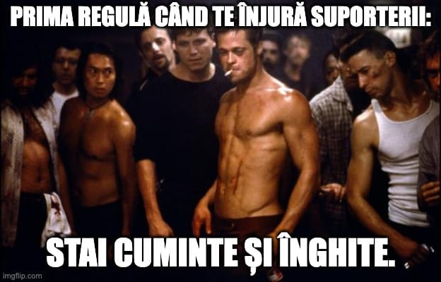

Poți vedea [o variantă video a acestui text aici.](https://youtu.be/kJz96NZG9MA)

Niciun jucător n-ar trebui să-și ceară scuze pentru reacțiile pe care le are ca urmare a faptului că suporterii l-au înjurat.

Asta e părerea mea.

Iacob a considerat altceva sau clubul Rapid a reușit să-l convingă să facă asta, iar acum fundașul nu doar că a fost zburat din Giulești, dar și-a călcat pe inimă și și-a cerut scuze fără nuanțe pentru incidentul de la finalul înfrângerii cu Craiova (1-2) din aprilie 2024.

Despre ce nuanțe este vorba?

Imediat îți explic...

## Chiar nu mai avea Rapid nevoie de Paul Iacob?

Strict fotbalistic, Iacob mi se pare peste Blazek, fundaș central pe care Rapid l-a păstrat în lotul acestui sezon. Posibil să dorească să scape și de el, dar i-au acordat prioritate.

De asemenea, Iacob nu mi se pare clar sub Ciobotariu și Pașcanu. Posibil să fie, posibil să nu fie. Mai degrabă este cel puțin la același nivel cu ei. Pe Kramer nu l-am văzut suficient, dar atât cât l-am văzut, înclin să cred că-i peste ceilalți.

În fine, Iacob este fundaș central de picior stâng, adică ceea ce Rapid nu are decât dacă începe să-l folosească pe Bădescu. Acum, pentru o echipă cu dificultăți destul de evidente când vine vorba de jocul pozițional, un fundaș central de picior stâng cu tehnica de pasare a lui Iacob este ceva ce merită să ai, nu ceva ce merită să dai la Oțelul.

## Cum ar fi trebuit Iacob să-și ceară scuze

În primul rând, Iacob ar fi trebuit să ceară o conferință de presă la momentul respectiv, nu să accepte un comunicat de presă din partea clubului.

Astfel, avea ocazia să nuanțeze scuzele pe care a ajuns să și le ceară ca urmare a faptului că a sărit la bătaie în interacțiunea cu un suporter al Rapidului la finalul acelui meci pierdut cu Craiova.

Concret, scuzele sale ar fi trebuit să includă precizarea că sunt adresate exclusiv fanilor care nu l-au înjurat pe el și pe colegii săi.

N-are absolut nicio logică să-ți ceri scuze că ai înjurat sau ai vrut să lovești un individ care te-njură. Sigur, trăim într-o societate care face eforturi să elimine violența inclusiv prin eforturi aberante, care anulează personalitatea oamenilor și-i obligă aproape să aibă atitudini total aberante, precum ideea aceasta de-a fi amabil și curtenitor cu unul care te agresează.

Dar dacă Iacob voia să iasă bine, chiar foarte bine din toată povestea, trebuia să facă mai mult decât ar fi făcut absolut orice individ speriat în locul său - să spună clar că regretă faptul că oameni de bun simț au asistat la un incident nedorit, dar că nu regretă că a încercat să-și apere onoarea.

Deși patronilor nu le-ar fi convenit absolut deloc o astfel de ieșire în cadrul unei conferințe de presă și poate ar fi dorit în continuare să-l elimine, Iacob și-ar fi câștigat respectul multora, dar mai ales singurul respect care contează - al său.

## De ce fanii care înjură fotbaliștii și apoi cer respect trebuie contrați public

Ca să nu existe discuții de genul “tu nu știi ce-nseamnă să fii ultras”, o spun eu din start - categoric nu știu ce-nseamnă să fiu ultras.

Sunt suporterul clasic din Provincie care când era copil venea de două ori pe campionat la București să-și vadă echipa favorită și consideram evenimentul ca fiind cel mai important lucru din anul respectiv.

N-am stat vreodată în peluză și n-am simțit vreodată că sacrific ceva pentru că vin la meci.

Pe de altă parte, cred că fanii care își înjură jucătorii la final de meci și produc scene isterice cu tricouri trase de pe aceștia sunt niște disperați după imagine și după control.

Adică văd o glorie aparte în faptul că trag la răspundere jucătorii care nu se ridică la nivelul pe care-l așteapă ei sau care nu respectă clubul cum ar dori ei s-o facă și sunt dornici mereu să aibă control cât mai mare asupra a ceea ce se întâmplă la echipă.

Unii și reușesc - vezi cazurile Petrolul, Rapid, Dinamo, CSA Steaua etc.

Deși e dreptul lor să fie oricât de nemulțumiți și să aibă ce criterii doresc ei să judece jucătorii, cred că e absolut esențial ca presa să condamne genul acesta de agresiuni. Atenție, nu spun ca suporterii să fie urmăriți în tribună și arestați c-au huiduit sau înjurat.

Spun că presa nu trebuie să tacă de-o manieră aproape complice când se întâmplă astfel de lucruri sub pretextul că oamenii respectivi fac sacrificii pentru că însoțesc echipele prin țară sau că vin pe stadion în condiții atmosferice dificile etc.

Dacă ești suporter, e normal să susții echipa.

Dacă vrei respect pentru asta, susține-o, nu o înjura / agresa.
