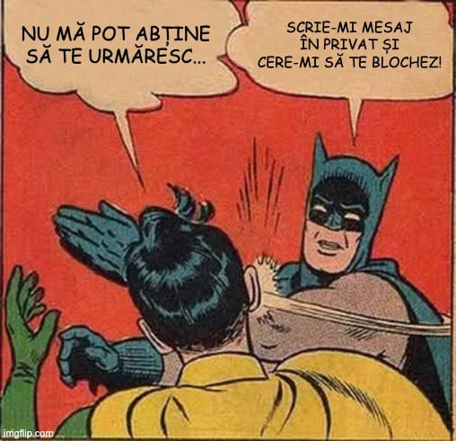

De ceva vreme, observ cum oameni care au în mod evident o părere foarte proastă despre mine nu se pot abține totuși să mă urmărească în continuare pe Facebook și, foarte probabil, peste tot pe unde mai apar - site-uri, emisiuni TV etc.

Nu mă pricep la chestiuni de genul acesta ca să pot spune dacă e vorba de o simplă compulsie sau de o adevărată adicție (consumă în ciuda faptului că asta le face rău), dar e clar că ceva nu e bine cu respectivii.

Unora le spun în comentarii că dacă ar avea un pic de mândrie, nu s-ar complace să piardă timp prețios cu unul de nivelul meu, dar evident că oamenii respectivi nu pot pur și simplu să renunțe la drogul Beldie.

De asta, fac un apel către toți cei care trăiesc această dramă să-mi scrie un mesaj în privat și să-mi ceară să-i blochez.

## De ce e important să-mi ceri să te blochez

Am contul acesta de Facebook din anul 2010, dar nu am blocat decât <s>8</s> 9 oameni în tot acest timp, ceea ce este infim raportat la popularitatea mea și mai ales la subiectul pe care-l tratez în principal - fotbalul din Liga 1.

De ce am blocat atât de puțini oameni?

În general, pentru că trebuie să demonstrezi că ești super prost ca să te pot bloca. 

Sau să înjuri în mod repetat pe cineva care nu se poate apăra. Nu pentru că sunt un apărător al celor slabi, ci pentru că-s atât de egoist încât vreau ca inclusiv înjurăturile să se-nvârtă tot în jurul meu.

Apoi, procedura mea clasică de-a bloca pe cineva este extrem de complicată, procesul putând dura cât obținerea unei licențe Pro pentru că poate cuprinde nu mai puțin de 7 pași:

1. **întâi îl anunț pe nătăfleț că a luat-o razna**
2. **apoi îl anunț că are câteva ore la dispoziție să-și verse eventualele frustrări înainte de-a-l bloca**
3. **apoi îi dau șansa să uit de el, ceea ce e foarte ușor în caz că se abține câteva zile de la a comenta**
4. **apoi am rețineri în caz că respectivul mă-njură corect gramatical**
5. **apoi mă gândesc dacă vinovatul a spus ceva aiurea despre Florin Tănase**
6. **apoi verific dacă respectivul a spus ceva aiurea despre Dan Petrescu**
7. **apoi mă iau cu altele și, de obicei, uit.**

De asta, nu e suficientă prostia ca să blochez pe cineva, respectivul trebuie să fie și insistent.

Dar pentru cazul în care simți că nu te poți dezlipi de ceea ce postez pe Facebook, pot face o excepție. Scrie-mi în privat și cere-mi să te blochez - promit să o fac, chiar dacă va fi o chestiune dureroasă pentru mine.

Voi încerca să supraviețuiesc acestui eveniment aproape tragic.

## Confuzia cu “feedback-ul de la cititori” - de fapt, părerea ta nu contează

Printre cei care nu se pot abține să urmărească ce postez se află și unii care simt nevoia să-mi dea tot felul de indicații editoriale.

Sunt cei care-mi reproșează că am scris prea mult despre o echipă și prea puțin despre alta.

Sau care-mi reproșează că nu am scris și despre cutare fază când echipa lor favorită a avut de suferit, în schimb am scris despre cutare fază care arată că alții sunt mai victime.

Sau care-n general încearcă să-mi indice cum ar trebui să fac lucrurile.

E o pierdere de vreme să faci asta - sigur mă pricep mult mai bine la ceea ce fac decât oricine simte nevoia să-mi dea indicații pe Facebook legat de cum ar trebui să fac lucrurile.

Prin urmare, am un mesaj simplu din acest punct de vedere - părerea ta nu contează și nu va conta vreodată în ceea ce privește alegerile mele editoriale. Mereu voi scrie doar despre ce-mi place mie sau despre ceea ce mi se pare mie interesant.

Tot ce poți face tu este să consumi ceea ce produc eu sau să mă ignori. 

Dacă ai vrea să mă ignori, dar nu ai suficient respect de sine încât să te oprești din a mai consuma ceea ce ofer eu, scrie-mi în privat și cere-mi să te blochez.

Voi face asta pentru tine.

## Confuzia celor care mă acuză că țin 3-5 echipe diferite

Acești indivizi sunt preferații mei pentru că îmi fac un uriaș serviciu - produc confuzie suplimentară în legătură cu un subiect foarte interesant - [cu ce echipă ține Beldie](https://www.youtube.com/shorts/9v6KoC91IWs).

Astfel, apar situații comice în care în comentariile aceleiași postări sunt acuzat că țin cu echipe care-s rivale. Îți dai seama cât de penibile sunt acele scene?

Dacă nu, nu-ți face griji. 

Nu toată lumea are simțul umorului.

În fine, trebuie să recunosc că nici eu nu ușurez misiunea oamenilor - de exemplu, am obiceiul să văd de pe stadion cam toate meciurile jucate acasă de echipele bucureștene, așa că cei care mă văd la fața locului își imaginează că sunt fanul echipei lor.

Niciodată n-aș face însă eroarea de-a spune cu cine țin sau n-aș confirma acuzele unora sau altora legat de acest aspect. Dacă aș face-o, toate eforturile mele în a fi obiectiv s-ar destrăma în fața celor care sunt ei înșiși incapabili să fie obiectivi și cred că toată lumea e la fel ca ei.

Apropo, există ceva chiar mai amuzant decât respectivele acuze - faptul că unii sunt siguri că ei știu de fapt cu cine țin. Că n-au nevoie să le confirm eu ca să știe...  Ori pentru că le-a zis cineva de încredere, ori pentru că se pricep ei...

După cum observi, se repetă o idee - problema e la tine, nu la mine. 

Prin urmare, dacă ai o problemă, scrie-mi în privat și cere-mi să te blochez. 

Voi face asta pentru tine ca să te protejez de toate aceste trăiri confuze.

## Singura formă de respect pe care o am pentru tine

Trăim într-o societate în care minciuni plăcute sunt șoptite continuu la urechile fraierilor. 

Uite ce face Facebook, consideră că toți avem aici o relație de prietenie.

Nu știu cum ești tu, dar eu am foarte puțini prieteni și mereu voi avea foarte puțini prieteni datorită firii mele. Atenție, “datorită”, nu “din cauza”. Prin urmare, nu vei vedea din partea mea dulcegării de influencer pervers sau de ziarist care anunță public cât de mult își apreciază cititorii / urmăritorii. 

Normal, mă-ncântă faptul că reușim să discutăm despre lucruri care ne pasionează pe amândoi - ex. fotbalul din Liga 1 - **și am respect real pentru cei care au capacitatea de-a-și exprima articulat ideile indiferent dacă-s asemănătoare cu ale mele sau nu.**

Dar acesta e un respect pe care acei oameni și-l câștigă.

Prin urmare, singurul respect gratuit pe care-l ofer celor care urmăresc ceea ce scriu / spun este faptul că-mi dau silința să fiu obiectiv.

Doar atât, dar te asigur că e suficient.
