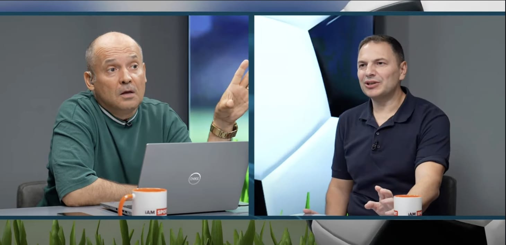

Am avut o experiență aparte ieri ca invitat la [emisiunea lui Banciu de la i AM Sport](https://www.youtube.com/watch?v=khhGXhdUfrA). Pe de o parte, pentru că omul chiar n-are nevoie de invitat ca să facă ceea ce face, așa că nu e prea ușor să aduci ceva-n plus.

Iar pe de alta, pentru că în comentariile postării de pe YouTube apar o grămadă de aprecieri din categoria “credeam că Beldie e un fraier, dar nu e”.

Da, chiar așa spune cineva la un moment dat.

Desigur, e scuzabil, gusturile oamenilor se șlefuiesc cu timpul și vrând-nevrând, ajung să aprecieze valoarea.

Acum, cât se poate de serios, în comentariile de pe chatul de live apar diverse aprecieri care se leagă de un subiect mai vechi care mă privește. De exemplu, unii speculează că nu apar în emisiunea lui Ștucan de dimineață pentru că acesta ar avea ceva cu mine sau chiar am fi certați.

Iar asta se-nrudește cu credința exprimată de diverși pe Facebook că la Digi Sport nu apar în emisiunile de seară pentru că n-am loc de alții care ar fi mai slabi decât mine, dar mai bine ancorați în relație cu moderatorii și postul.

Prin urmare, am să explic cum stau lucrurile.

1\. Nu sunt certat cu Ștucan, dar...
------------------------------------

Nu am fost vreodată certat cu Ștucan și nici nu cred că vom fi pentru că amândoi părem să avem capacitatea de-a ne supăra fără să ajungem să ne și certăm.

Am fost invitat acum aproape un an la emisiunea lui și apoi nu am mai fost din rațiuni care-mi par obiective - ei au o serie de invitați permanenți pe care-i rotesc și cu care emisiunea respectivă a ajuns la o audiență excelentă.

De ce l-ai aduce pe Beldie, care în [acea apariție alături de Miță Iosif](https://www.youtube.com/watch?v=mIiEXoeS2WE.ro) ți-a adus vreo 5.000 de vizualizări, când cu Prunea, Decebal Rădulescu, Alexandru David, Adrian Florea, Remus Răureanu și Daniel Stanciu faci audiențe de 5-10 ori mai mari?

Nu mai vorbesc că strict din perspectiva notorietății sunt sub absolut toți cei menționați. OK, sunt mai arătos decât ei, dar nu poți să te duci într-o zonă de asta a superficialului și să aduci invitați doar pentru că arată bine.

2\. Nu sunt certat cu Vali Moraru, dar...
-----------------------------------------

Nu am cum să fiu certat cu Vali Moraru pentru că nici măcar nu am avut vreodată o interacțiune cu acesta care să poată duce la o ceartă. În rest, oricât de morocănos am ajunge vreodată să ne salutăm, nu poți să faci o scenă de pe urma acestui aspect.

Apoi, dacă ai observat, invitații lui Vali sunt de asemenea personaje cu mult mai multă notorietate decât mine sau asociați cu lumea fotbalului de-o manieră net superioară. Eu am jucat la juniorii Olimpiei Rm. Sărat, Ilie Dumitrescu a jucat...

Iar Vali îl are deja în categoria ziariști de sport pe Remus Răureanu, care fără absolut nicio ironie este super bun în ceea ce face.

Deci?

Deci nimic.

La Radu Naum am fost de câteva ori, când nu era Cristi Geambașu prin zonă. În rest, e Cristi și e zona lui. În locul cui să mă aduci? A lui Stelea, de departe printre cei mai buni / echilibrați analiști? În locul lui Vochin? În locul lui Decebal?

În locul lui Pancu, la ora actuală cel mai bun analist pe "fotbal concret" în opinia mea?

Radu Drăguț mă invită în rarele momente în care are emisiune de zi. M-a invitat în mod repetat deși au tot fost situații în care-l refuzam din tot felul de motive obiective. Recunosc, sunt impresionat de atitudinea lui.

Plus că l-am refuzat la un moment dat în privința emisiunii de noapte, cea cu pariurile. Nu pentru că era târziu, ci pentru că dacă există un ziarist în presa sportivă care [poate produce anti-imagine pariurilor](https://www.cameravar.ro/cancerul-presei-sportive-casele-de-pariuri/), acela eu sunt.

3\. Nu sunt certat cu Filoti, dar e posibil să fie el certat cu mine
--------------------------------------------------------------------

Glumesc, Filoti nu mă invită din același motiv - are o grămadă de invitați la dispoziție din care se aleagă.

Sigur, m-am gândit că-n trecut mă mai invita, iar după [ce am scris acest text](https://www.cameravar.ro/dan-filoti/), nu m-a mai invitat vreodată. Dar ăsta e un calcul meschin pe care doar cineva cu suflet mic ca mine ar putea să-l facă. Filoti este un monument de relaxare, n-ar face el de astea.

Dar e mai bine cumva pentru că cei care mă acuză că-s rapidist ar zice că ajung la emisiunea lui Dan din rațiuni incorecte.

Plus că suntem cumva alocați fiecare unui moderator. Adică, eu și Drejan cred că suntem alocați clar lui Viorel Grigoroiu din moment ce el s-a zbătut să ne obțină la un moment dat contractele.

Deci inclusiv de asta eu sunt invitat de dimineață de week-end și nu de prime time.

Ceea ce, desigur, mă oftică de-o manieră sănătoasă - mă uit la unele emisiuni și constat cu maximă obiectivitate:

> “Mda, sunt clar mai bun decât ăsta!”

Pe de altă parte, la emisiuni e ca la fotbal - așa cum un antrenor nu ține pe bancă fotbaliștii care-l ajută să câștige meciurile, nici moderatorii nu ocolesc invitații care produc audiență.

Diferența apare când vine vorba de patroni.

Dacă la fotbal aceștia se implică, aici lucrurile sunt clar diferite - în ciuda valorii mele deosebite, nu știe nici naiba din conducerea Digi Sport cine-i Beldie. Că dacă ar ști, s-ar oripila că-mi plătesc atât de mulți bani pentru atât de puține apariții.

Și ori ar cere să fiu invitat în fiecare zi, ori m-ar da afară.

4\. Nu sunt certat cu Dan Udrea, dar...
---------------------------------------

Dar n-am contract cu Prima Sport.

Ceea ce e destul de ciudat pentru că atunci când făceam emisiuni la sport.ro, [eram acuzat că-s pila lui Costi Mocanu](https://www.cameravar.ro/plecare-beldie-sport-ro/). Îmi pare rău, Costi, dar eu nu pot fi pilos dacă tu nu-ți îndeplinești la rândul tău rolul.

Dincolo de asta, am puterea să recunosc că-n acest moment, Prima chiar stă excelent la capitolul invitați. Plus că la ei ziariștii sunt din intern, Grădinescu și Cosmescu, care de asemenea sunt nu buni, ci foarte buni pe zona aceasta.

Prin urmare, în condițiile acestea, voi fi nevoit să devin pila altcuiva.

Dacă nu-s certat cu nimeni, atunci care-i concluzia?
----------------------------------------------------

Mda, nu voiam să ajung aici.

Concluzia este că-s foarte bun mai ales în opinia mea.

Care opinie este desigur obiectivă.

Deci nu-mi rămâne decât să constat că e pierderea lor, dar să recunosc că nu există ceva împotriva mea. Nici măcar Superbet, care are o experiență aparte [când vine vorba de-a influența soarta ziariștilor de sport](https://www.cameravar.ro/concluzii-inchidere-gazeta-sporturilor/), nu m-a atins vreodată cu ceva.

**Niciodată, absolut niciodată n-am fost sabotat profesional, dezavantajat sau alte prostii de genul acesta.**

Pur și simplu, uneori, ceilalți nu se pricep la Beldie.

Ceea ce trist pentru că, așa cum aș zice chiar eu despre mine de-o manieră șumudiciană, Beldie se pricepe la fotbalul din Liga 1.