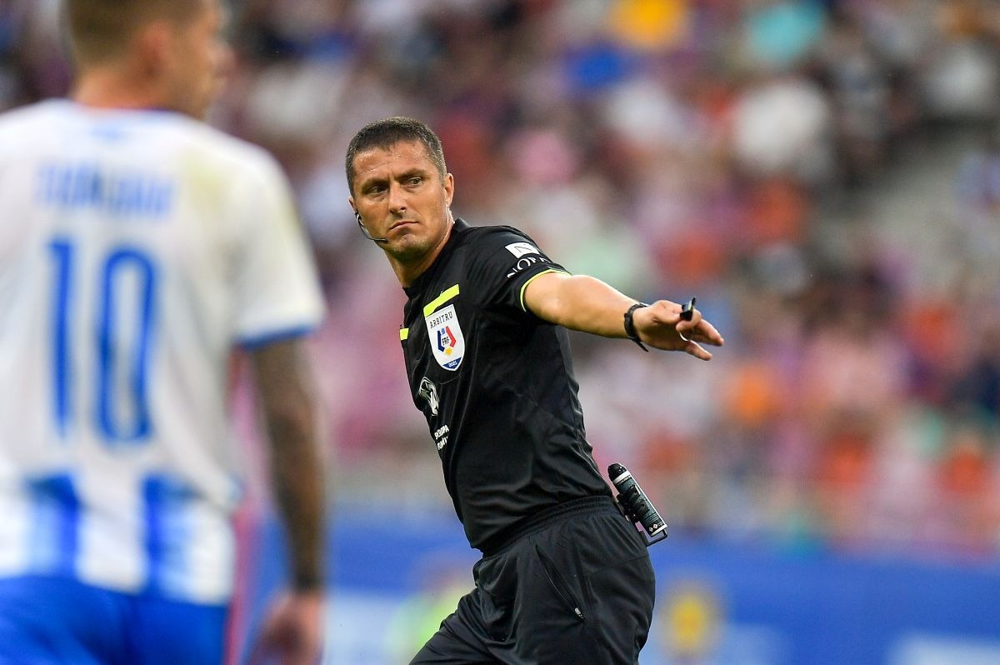

Oltenii se plâng că Dinamo a egalat și a contat în finalul jocului mai ales pentru că Bancu a fost eliminat într-o fază în care arbitrul Cojocaru ar fi trebuit să-l elimine și pe Armstrong, de la oaspeți.

Și o fac de-o manieră agresivă în ton și chiar în limbaj [prin intermediul acționarului majoritar, Mihai Rotaru.](https://www.gsp.ro/fotbal/liga-1/universitatea-craiova-dinamo-superliga-mihai-rotaru-847133.html)

Poate că Dinamo ar fi pus presiune pe gazde oricum în finalul meciului, poate nu. Sunt însă convins că Rădoi și ai lui ar fi vrut preferat să vadă ce putea echipa lui Kopic să facă în 10 la 10, nu în superioritate numerică.

## Singura explicație ar fi că arbitrul Adrian Cojocaru e incredibil de slab

Dar dincolo de aceste gânduri, ceva rămâne real problematic - Cojocaru a luat decizia de-a-l elimina doar pe Bancu în ciuda faptului că a fost la monitorul VAR și a văzut faza așa cum am văzut-o cu toții reluată iar și iar la TV.

Deci a sfidat realitatea rezumându-se la eliminarea căpitanului Craiovei când [Armstrong trebuia la rândul său eliminat](https://www.youtube.com/watch?v=4k3_1nW1Df4) pentru o agresiune absolut evidentă - piciorul acestuia se-nfige în corpul lui Bancu într-o aparentă încercare de-a se ridica de la sol ca adversarul să-i simtă crampoanele de-o manieră real dureroasă.

Inclusiv în toiul jocului, un fotbalist care nu se află în cădere, ci vrea să se ridice, are suficient control încât nu doar să-ncerce să pună picioarele pe sol ca să se ridice, dar categoric nu imprimă mișcării acea zvâcnire care indică în mod clar care i-a fost intenția - de-a lovi.

Pentru un arbitru arbitru, să sesizeze tot ce spun eu aici este ceva ce nu implică vreun efort în fața monitorului VAR. Chiar și cei care n-au jucat fotbal și par uneori robotici în aplicarea regulamentului știu că a te ridica nevinovat cu crampoanele apăsate pe adversar este un fals absolut. Nu așa se petrec lucrurile când nu simți unde este celălalt jucător sau nu-l vezi sau alte scuze de gen.

Armstrong l-a tratat pe căpitanul oltenilor ca pe o coajă de banană pe care merită să aluneci de dragul unei distracții violente.

În condițiile acestea, ce putea fi în mintea lui Cojocaru?

Nimic explicabil.

Mai ales că nu face parte din categoria arbitrilor slabi, care nu sunt capabili să vadă evidențele. Și nici a celor timorați de ceea ce au de făcut pe teren. Ar fi stat în picioare varianta asta dacă proceda invers și-l elimina doar pe scoțian sub presiunea faptului că arbitra la Craiova.

Dar nimic din asta nu stă în picioare.

Omul a văzut ce am văzut cu toții, așa că nu reușesc sub nicio formă să găsesc o explicație pentru decizia sa. Este ca-n fazele pe care le-au trăit cu penalty-urile cei de la Rapid - unde, de data aceasta, arbitrii VAR au văzut de asemenea situațiile respective și totuși au considerat că e OK să nu cheme centralul orb în direct. 

Deci?

A fost rău intenționat așa cum cred cei de la Craiova?

Dacă era rău intenționat, nu o făcea astfel încât să se facă efectiv de râs, ci se folosea de maniera generală în care arbitra, care manieră a fost aseară una echilibrată dacă dai deoparte situația aceasta incredibilă.

## Dinamo, prin Nicolescu, are o problemă de onoare în povestea de aseară

După părerea mea, Dinamo a fost anul trecut echipa cea mai dezvantajată de arbitri dintre cele cu pretenții. Peste cei de la Rapid, alți fraieri absoluți când vine vorba de arbitraje.

Doar că sezonul acesta, după ce iar începuseră cu ceva probleme, par să fi scăpat de mari probleme care să-i afecteze și i-au lăsat doar pe cei de la Rapid să fie protagoniștii unor situații pe care eu nu le-am mai văzut absolut niciodată - un număr incredibil de penalty-uri clare refuzate într-un număr infim de etape. 

În fine, când erau victime, cei de la Dinamo se plângeau pe bună dreptate. Și o făceau de o manieră mai mult decât civilizată raportat la ceea ce trăiau. Nicolescu însuși afirma că nu are absolut nicio bănuială legată de o eventuală imoralitate a arbitrilor.

Acum însă, când președintele lui Dinamo a avut în fața ochilor o situație de arbitraj în care Craiova a fost clar dezavantajată, se comportă ca un conducător de modă veche și încearcă să trateze toată situația ca pe ceva minor.

Nu este ceva minor.

Nimic din ceea ce se vede clar la VAR și e trecut cu vederea de arbitri nu este minor. 

Este furt de dreptate fotbalistică.

În plus, dacă aseară s-a întâmplat ceva cu premeditate (eu nu cred asta), n-a fost categoric ca să o ajute pe Dinamo, ci ca s-o împiedice pe Craiova. 
