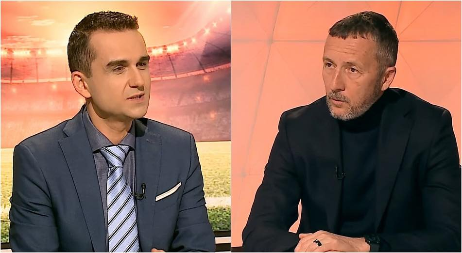

Probabil știi deja povestea - cu ocazia încercării FCSB de-a-l transfera pe Mario Tudose de la FC Argeș, [Becali a afirmat într-un dialog în direct cu Dan Udrea](https://www.facebook.com/watch/?ref=saved&v=1484928842827697) că Mihai Stoica ar fi aranjat cu acesta să facă un interviu cu tatăl fotbalistului.

Ideea ar fi fost ca-n acel interviu, tatăl lui Tudose să arate că jucătorul nu mai vrea să stea la Pitești, ca să ușureze astfel plecare fotbalistului fără proteste din partea fanilor.

Care fani sunt masă electorală pentru omul cu decizia finală de la FC Argeș, primarul Gentea.

Concluzia afirmațiilor lui Becali a fost că Dan Udrea s-ar fi folosit de postura de ziarist ca să servească intereselor cluburilor impliate. Dar mai ales intereselor FCSB pentru că Mihai Stoica ar fi fost cel care a inițiat demersul.

Pe scurt, sună urât.

Mai pe lung, am și eu câte ceva de spus.

Înainte însă de orice, fac câteva precizări simple - nu am o relație apropiată cu Dan Udrea. Am fost colegi la ProSport / Gazeta Sporturilor, iar ulterior am discutat de câteva ori pe subiecte legate de fotbal și atât. Îl respect ca ziarist, ceea ce dacă lucrezi în domeniu este o chestiune absolut firească - Udrea este un ziarist foarte bun.

Este însă și un ziarist corect?

De ce Udrea are de pierdut în povestea asta indiferent ce ar face
-----------------------------------------------------------------

Publicul care consumă presă sportivă are-n general opinii foarte clare despre fiecare dintre ziariștii cu expunere. Deși aceste opinii se pot schimba uneori, ceea ce pare constant este lipsa de dubiu în părerile respectiv.

Deci mulți dintre cei care aveau o părere bună despre Dan Udrea probabil că vor continua să țină cu FCSB și să aibă acea părere bună, iar cei care aveau o părere proastă probabil că vor continua să țină cu Rapid, Dinamo sau Craiova și-și vor menține părerea respectivă.

Adică, echipa cu care ții e posibil să fie [un filtru major de judecare a ziariștilor](https://www.cameravar.ro/cum-afli-cu-cine-tin-comentatorii/).

Prin urmare, întâmplarea cu Dan Udrea poate doar să radicalizeze părerile celor care oricum aveau o impresie negativă legată de acesta și cel mult să-l victimizeze în ochii celor care oricum aveau o părere bună despre el.

Din informațiile mele care sunt mai mult de rădulescianul 30% corecte, Golazo / Prima / Dan Udrea n-au avut o reacție și pentru că ar fi însemnat să explice ceea ce e destul de greu de explicat - cum interacționează ziariștii cu sursele lor.

Totuși, după părerea mea, Dan Udrea ar fi trebuit să facă acest exercițiu chiar dacă ar fi fost într-o măsură destul de mare inutil.

De ce nu cred că Dan Udrea a participat la o schemă de favorizare a FCSB
------------------------------------------------------------------------

A participa la o schemă de favorizare jurnalistică a FCSB, adică a fi PR-ul clubului lui Becali, înseamnă să fii sunat de Mihai Stoica și să ți se ceară să scrii ce vrea Mihai Stoica să scrii.

Ceea ce, din discuția Udrea - Becali, pare că s-a-ncercat.

Totuși, ceea ce nu știe publicul larg este că Mihai Stoica nu le cere ziariștilor să dea o anume știre sau să facă un anume material.

Niciunul dintre ziariștii cu care am vorbit înainte să scriu acest text și care fac parte din categoria celor care au colaborat ani de zile cu acesta sau chiar au avut relații de “prietenie” cu Mihai Stoica nu a confirmat ideea că vreodată Stoica le-a cerut astfel de favoruri.

Mai mult, Stoica este mai degrabă un cenzor de informații decât un dezvoltator de informații - obișnuiește să-ncerce să interzică apariția de informații din medii pe care el le controlează - de exemplu, dacă te invită în cantonament să faci un interviu cu Pintilii, poate să aibă pretenția ca operatorul să nu filmeze un incident care apare întâmplător pe terenul de antrenament în timp ce echipa de ziariști se-ndreaptă spre locul interviului.

În fine, în relație cu ziariștii, Stoica obișnuiește să trimită mesaje, nu să sune. Și acele mesaje sunt de obicei nesfârșite negări ale informațiilor pe care site-urile / televiziunile le publică. Adică, îți dă un link cu o știre de pe site-ul la care lucrezi și-ți spune:

> “Asta e o prostie. Nu am negociat vreodată cu David Luiz. Întreabă la CFR”.

De ce ar fi schimbat brusc maniera de lucru pentru transferul lui Tudose și i-ar fi cerut lui Udrea să facă un interviu cu tatăl fotbalistului?

Cât de prieten este Udrea cu Mihai Stoica?
------------------------------------------

Habar n-am.

Pot să speculez pe baza a ceea ce văd în emisiuni.

Udrea i se adresează mereu cu “domnul Stoica” și au existat suficiente momente în emisiuni în care cei doi s-au contrazis în chestiuni enervante pentru Mihai Stoica - ex. faze de arbitraj. Moderatorii care-s prietenii invitaților dincolo de firesc nu produc creșteri repetate de tensiune acestora.

Dar asta ar putea fi o aparență, nu?

Prin urmare, îți voi spune cum se desfășoară lucrurile dincolo de orice aparență - în general, ziariștii și conducătorii de club stau de vorbă în pauzele de publicitate ale emisiunilor despre subiecte care prezintă interes pentru cele două părți.

Oficialii din fotbal le spun ziariștilor de obicei lucruri care ar putea să-i avantajeze pe ei - de exemplu, un antrenor poate ponegri un jucător cu care are un conflict sau un jucător poate vorbi despre experiența pe care a avut-o la un club care nu l-a plătit. Lucruri pe care în direct poate că nu le-ar spune.

Dacă cineva ar filma acele pauze publicitare ([chestie care s-a mai întâmplat](https://www.cameravar.ro/dreptatea-lui-piturca/)), concluzia ar fi uneori că ziariștii sunt pe mână cu respectivii oficiali din fotbal.

Dar realitatea este că ziariștii sunt, în general, pe mână cu interesul lor de-a afla informații pe care ulterior să le publice sau măcar informații care să-i ajute să obțină alte informații demne de publicat.

Unii ziariști duc acest tip de interacțiune și dincolo de pauzele publicitare, așa că ajung să se sune / mesegiuiaiscă cu oamenii din fotbal pentru a afla ce-i interesează. La fel, oamenii din fotbal pot suna ziariști ca să le dezvăluie diverse informații.

În astfel de situații, dacă interesul ziaristului pentru respectiva informație se sărută cu interesul omului de fotbal pentru a da respectiva informație, atunci se cheamă că respectivii sunt blat sau că ziaristul și-a făcut meseria?

Modul în care o știre ajunge pe un site nu este întotdeauna atât de imaculat pe cât ar dori-o tratatele de jurnalism. În spatele știrii pot sta discuții care deși nu incriminează în vreun fel jurnaliștii, nu i-ar face să pară monumente de independență jurnalistică în fața publicului.

Dacă Udrea era un valet FCSB, asta se vedea în munca sa de zi cu zi
-------------------------------------------------------------------

Transferul lui Tudose la FCSB a fost subiectul acelor zile, e absolut firesc ca Udrea să fi profitat de oportunitatea de-a face un interviu cu tatăl fotbalistului nu ca să-i facă un favor lui Mihai Stoica și să ajungă să fie expus de Becali, ci ca să-și facă meseria - adică să aducă în prim plan ceva ce publicul dorea să știe.

Faptul că FCSB și-a dezvoltat o adevărată strategie în jurul respectivului interviu nu înseamnă că Udrea a devenit brusc peste noapte un valet al FCSB dintr-un ziarist cu verticalitate.

Mai mult, ce trebuie să ții minte este că a fi un ziarist vândut profesional nu se vede dintr-un incident de genul acesta, ci din felul în care ziaristul respectiv își face munca.

Lipsa de caracter nu apare în momente izolate, ci într-o grămadă de momente care se-nghesuie în viața de zi cu zi a respectivului ziarist. Munca lui Udrea este super vizibilă, ai fi sesizat că e ceva în neregulă cu el de foarte multă vreme, nu era nevoie să vină Becali să spună ce a spus.

Ce cred că s-a întâmplat
------------------------

După părerea mea, Udrea a profitat de posibilitatea de-a face acel interviu cu tatăl lui Tudose așa cum ar fi încercat să profite orice ziarist în locul său.

Nimeni nu are de unde să știe exact cum a decurs discuția dintre părți în afara celor care au participat la ea. Nu m-aș lua după Becali pentru că deși omul este sincer de obicei, e posibil ca cineva să i se fi lăduat - “am aranjat cu Udrea să ne ajute!”.

Asta în condițiile în care ditamai [Ringier nu a putut aranja cu Udrea](https://romania.europalibera.org/a/libertatea-gsp-demitere-redactor-sef-ringier/32621412.html?ref=cameravar.ro) să-i ajute să rămână redactor șef la Gazeta Sporturilor când l-au dat afară pe Țepelin înduioșați de suferința Superbet.

Adică, Udrea a putut atunci să arate caracter, iar acum uite că din dragoste pentru FCSB n-a mai putut. De asta eu zic să avem ceva rezerver legat de cum au fost lucrurile, nu să le judecăm doar prin prisma simpatiior sau antipatiilor față de personajele implicate.

Există asemănări între cazurile Udrea și Filoti?
------------------------------------------------

Unii fani FCSB au remarcat că Udrea este acuzat de subordonare profesională față de echipa lor, în timp ce Dan Filoti, care a apărut ca martor al Rapidului în procesele de la TAS contra unor foști jucători, ar fi fost cauționat de presă.

Fals.

Filoti a fost într-o mai mare măsură expus de colegii săi de breaslă - adică au existat materiale de presă care au oferit informații despre situația respectivă. În cazul Udrea știu doar de discuțiile scurte din emisiunile lui Ștucan.

De asemenea, la Dan Filoti, lucrurile îmi sunt parțial neclare. Înțeleg că el a fost chemat acolo ca martor cu relevanță în sensul că putea spune cum au stat lucrurile la nivel de percepție legat de Rapid.

Și mai înțeleg că mărturia sa l-a ajutat pe Ionuț Stancu, nu l-a sabotat tocmai pentru că a confirmat că Rapidul de azi este la nivel de percepție publică echipa continuatoare.

Dincolo de asta, marele deserviciu de imagine mi se pare modul în care avocatul Rapidului s-a referit la Dan Filoti - “[l-am folosit și în alte procese](https://www.gsp.ro/fotbal/liga-1/moderator-digi-sport-dan-filoti-martor-rapid-tas-depunctare-ionut-stancu-craiova-drepturi-tv-liga-1-835245.html?ref=cameravar.ro)” - ceea ce este lipsit de decență. Nu cred că așa i s-au adresat lui Filoti când l-au rugat să vină să depună mărturie.

În fine, avea ce căuta acolo?

Habar n-am.

Pot spune însă că dacă el a spus adevărul în ceea ce a declarat ca martor, atunci nu văd de ce ar trebui să-i fie rușine.

Mai mult, aș vrea să evidențiez ceva ce prea puțini fani FCSB reușesc să vadă în emisiunile rapidistului Filoti - nu s-a făcut vreodată de râs încercând să spună că albul e negru sau negrul e alb doar ca să apere cauza echipei pe care mărturisit public că o simpatizează.