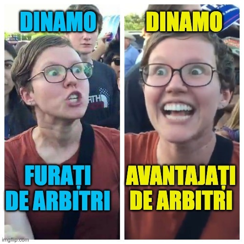

În mod ciudat, unii dintre fanii lui Dinamo se comportă brusc precum fanii unor echipe care tratează gafele favorabile ale arbitrilor ca pe ceva ce li se cuvine...

Asta deși sezonul trecut au fost echipa cea mai dezavantajată dintre formațiile cu pretenții, deci știu ce-nseamnă ca altul să se bucure de nedreptatea pe care o suferi.

De multă vreme n-am mai văzut o asemenea sfidare a realității precum cea manifestată de dinamoviști în povestea deciziei lui Adrian Cojocaru de-a-l elimina doar pe Bancu în urma acelei dispute violente cu Armstrong.

[Am vorbit despre asta în acest video.](https://www.youtube.com/watch?v=X4mu6gb27MI)