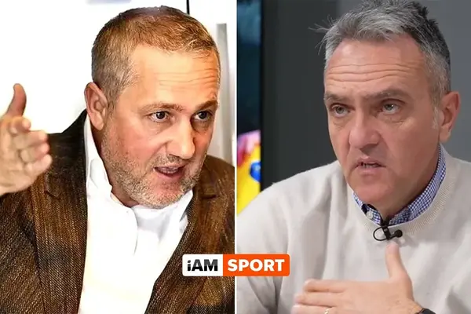

Probabil știi deja întâmplarea - Decebal Rădulescu a afirmat că stadionul se umple la Craiova și datorită faptului că ar exista un efort politic la nivel de județ ca oameni din satele din jurul orașului să fie aduși cu autocare la meci.

Gratuit.

Adică, o schemă pesedistă de ajutorare a echipei bazată pe relațiile lui Mihai Rotaru.

Afirmația l-a făcut pe patronul Craiovei să-și dorească să vorbească cu  Decebal pe această temă la telefon. Care Decebal ori n-a văzut apelurile, ori n-a dorit să-i răspundă. 

Astfel că, firesc, Mihai Rotaru i-a scris pe WhatsApp.

Până aici, nimic neobișnuit. 

Problema este cu conținutul acestor mesaje. Rotaru l-a amenințat  pe ziarist [că vine după el și l-a numit lache, homosexual, pedofil](https://iamsport.ro/fotbal/diverse/mesaje-scandaloase-date-de-patronul-craiovei-mihai-rotaru-jurnalistului-decebal-radulescu-dupa-emisiune-vin-dup-tine-ba-l-id39370.html).

## Era rost de multe click-uri și de audiență, dar...

Strict pe partea economică, cum îi place domnului Becali să spună, orice site de sport ar fi făcut audiență dacă prezenta informația. 

Dar nimeni n-a scris / spus nimic. 

Mai mult, Vali Moraru l-a avut pe Mihai Rotaru prin telefon și nimic din poveste n-a apărut în discuția lor. Ceea ce mă face să cred că Vali chiar n-a avut habar pentru că este exact tipul de situație în care ori nu mai discută cu respectivul, ori dacă discută, automat că aduce subiectul în discuție. 

La fel, nicăieri prin alte părți, inclusiv în zone în care “derapajele” reale sau semi-imaginare sunt sancțioante - Gazeta Sporturilor și Golazo, nimeni n-a rostit o vorbă pe tema aceasta. 

Cred că-n afară de [textul meu de pe iAM Sport](https://iamsport.ro/editorial/titlul-craiovei-lui-rotaru-in-anul-caderii-craiovei-lui-mititelu-stefan-beldie-stie-de-ce-universitatea-e-disperata-sa-devina-campioana-asa-se-justifica-si-reactia-deplorabila-la-adresa-lui-radulescu-id39542.html) și de emisiunea lui Ștucan, informația n-a fost comentată pe nicăieri în presa de sport.

## Cele două teorii care ar justifica tăcerea presei de sport în cazul Mihai Rotaru - Decebal Rădulescu

Am două teorii. 

Una este foarte ușor de luat în calcul - Rotaru are relații bune  cu o serie de ziariști influenți, i-a cultivat, cum spunea Costin Ștucan, iar aceștia îi întorc favorul în situația de față.

Deși poate fi vorba inclusiv de așa ceva, nu cred suficient în varianta aceasta. 

Sau nu cred doar în varianta aceasta.

De exemplu, cine poate să-l “cultive” pe Vali Moraru? 

Cu cine nu s-a contrat în emisiunile sale? 

OK, pot fi ziariști care în mod normal ar fi scris ceva sau ar fi deschis gura pe tema aceasta, dar care au preferat alte teme în cazul de față poate și pentru că or avea o “relație bună” cu Mihai Rotaru.

Eu cred mai mult însă în a doua teorie - o parte importantă a colegilor de breaslă au o părere proastă sau foarte proastă despre Decebla Rădulescu, iar acum au avut un soi de satisfacție că lucrurile au ieșit așa.

O parte din această părere poate fi justificată prin argumente din categoria:

“face afirmații în mod repetat nu s-au confirmat” 

sau 

“vine nepregătit prin emisiuni” 

sau 

“e rupt de fapt de fenomen, ajunge să fie surprins de ce se discută în emisiuni” 

etc. 

Apoi, vin argumentele rușinoase, care nu vor fi rostite vreodată public și care nu sunt formulate clar nici chiar în mintea celor care apelează la ele. Dar dacă ar face vreodată efortul de-a-și duce gândurile mai spre capăt, acestea ar fi din categoria “Bică e rapidist, iar eu sunt...”. 

Astfel, cel mai probabil, lipsa de reacție a breslei este produsă de un amestec între toate cele menționate mai sus. Ceea ce ne face desigur de râs pentru că nu e vorba de-a-l apăra pe Decebal din rațiuni de simpatie / respect, ci de-a avea reacție după ce un ziarist a fost amenințat de-o manieră violentă de un personaj din fotbal. 

## De ce povestea cu “erau o discuție privată” nu ține

Posibil ca prin mintea unora să treacă și gândul că ceea ce i-a scris Rotaru lui Decebal reprezintă o discuție privată, prin urmare, e incorect că acesta a făcut-o publică.

Da, e posibil ca unii oameni să fie proști chiar dacă lucrează în presă. Ziariștii sunt precum instalatorii - unii mai buni, alții îți fac inundație.

Când discuți cu un ziarist pentru prima dată și vrei ca discuția să rămână privată, atunci îi precizezi asta. Sau, dacă ziaristul are bun simț și concluzionează că ce tu îi spui face parte din categoria “vreau să știi, dar nu de la mine”, te asigură el că discuția e privată. 

Altfel, nu e privată pentru că motivul pentru care-l suni este tocmai statutul său de ziarist. Dacă n-ar fi fost ziarist, nu simțeai nevoia să discuți cu el.

Când discuți cu un ziarist pe termen mediu și lung, cum ar spune  Hagi, atunci nu mai este nevoie să spui că discuția este privată pentru că se presupune asta ca urmare a istoricului relației dintre voi.

În fine, când suni un ziarist ca să-l ameninți și să-l faci în fel și chip, nimic nu mai este privat indiferent de cum au decurs lucrurile până atunci. Astfel de reacții nu mai au legătură cu relația dintre ziarist și cel care produce amenințarea, au legătură cu relația dintre cineva care amenință și cineva care a fost amenințat. 

Decebal Rădulescu nu a greșit cu nimic că a făcut publice acele mesaje, singurii care-și pot pune problema legat de cum au procedat sunt colegii de breaslă care au văzut situația și au tăcut. 

## “Decebal Rădulescu și-o merita...”

Asta a fost ideea care a apărut în comentariile de la postarea pe care am făcut-o pe această temă pe Facebook. Explicația celor care văd lucrurile așa este că Decebal Rădulescu a mințit în cazul de față sau că a repetat un subiect pe care [Mihai Rotaru îl mai contestase o dată acum câteva luni](https://www.prosport.ro/fotbal-intern/superliga/asa-a-fost-scandalul-dintre-mihai-rotaru-si-decebal-radulescu-in-direct-la-tv-rapidist-frustrat-a-mintit-19884507).

Plus că ar fi tot spus lucruri neadevărate de-a lungul timpului ca să atace diverse echipe pe care nu le-ar suporta pentru că-i rapidist. 

Asta intrând însă în evident conflict cu faptul că inclusiv cei de la Rapid nu-l suportă.

Dar ce importanță poate avea logica în chestiuni emoționale?

Niciodată nu voi convinge oameni care cred că e OK să ai o astfel de reacție că de fapt n-ar fi OK.

Respectivii văd lucrurile de-o manieră care-i face incompatibili cu dezbaterea, chiar dacă dezbaterea este oricum lipsită de sens într-un astfel de caz. 

Ce poate fi de dezbătut?

Chiar dacă Decebal ar vehicula o informație greșită în mod repetat, reacția lui Mihai Rotaru a fost disproporționată. E ca atunci când cineva îți spune “băi, tu ești ăla care a plecat de la restaurant fără să plătești”, iar tu scoți pistolul și-i tragi ăluia 3 gloanțe-n cap.

Pare o scenă cool pentru niște minți nedezvoltate și prăjite zilnic în lumea rețelelor sociale, dar este exact genul de situație care se poate produce foarte ușor ca urmare a conflictului dintre un ziarist și cei care sunt nemulțumiți de faptul că ziaristul nu le susură ceea ce ar vrea să audă.

De altfel, susținerea pe care o primește Rotaru pentru reacția sa este un simbol a ceea ce mulți simt c-ar vrea să le facă celor ca Decebal și, din păcate, nu pot. 

Sau n-au avut încă ocazia.