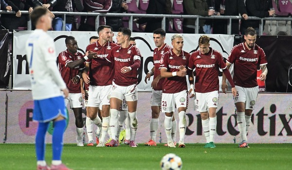

Cel mai amuzant lucru legat de Rapid după aceste prime 12 etape ține de faptul că multora li se pare că n-ar merita poziția pe care se află în clasament.

Sunt lideri și e posibil să rămână în această postură chiar și după ultimele meciuri care se vor juca azi și mâine, ceea ce e cumva neobișnuit pentru ei având în vedere parcursul din ultimii ani.

În fine, am văzut aseară la Prima Sport repetarea unei observații care ține în mare măsură de realitate - că Rapid nu joacă meciuri întregi în sensul că nu are un nivel ridicat pe parcursul unei partide întregi.

## Rapid are și meciuri "întregi" 

Ideea a fost rostită direct atât de Herea, cât și indirect de Marius Baciu. Desigur, au vehiculat-o și alții, inclusiv eu, care vin totuși cu precizarea că-n aceste etape au existat totuși două partide complete - cel mai bun meci al lor, victoria cu UTA, dar și victoria cu Botoșani, care de asemenea a însemnat un meci în care adversarii n-au contat decât absolut întâmplător.

În rest, actualul lider a reușit inclusiv ciudățenii din categoria “două reprize total diferite”, cum a fost pentru ei meciul de la Galați, la finalul căruia, portarul Dur-Bozoancă a remarcat - “după pauză, zici c-a apărut Barcelona”. 

Dar per total, nu au avut meciuri pe care să le fi câștigat fără să merite să câștige. Eventual, au jucat cel mult prost când adversararul a jucat foarte prost - vezi meciul cu Petrolul sau au avut repede avantaj și au profitat de acest aspect - vezi meciurile cu FC Argeș sau cu Miercurea Ciuc. 

În rest, au pierdut fără să merite să piardă cu Sibiul sau au făcut egal cu Oțelul sau U Cluj, partide în care au avut penalty-uri nedate. Foarte clar în jocul cu Oțelul sau discutabil în meciul cu ardelenii. De altfel, ei avut 6 penalty-uri clare nedate în primele 8 etape, un lucru pe care nu l-am văzut niciodată în niciun campionat pe care l-am urmărit în istoria pasiunii mele pentru fotbal. 

Normal, celelalte două penalty-uri pe care cei de la Rapid le-au reclamat sunt luate la mișto de fanii altor echipe pe bună dreptate. Desigur, aceeași fani care n-ar avea vreo problemă să susțină că respectivele lovituri de pedeapsă sunt corect acordate în caz c-ar fi-n favoarea echipelor pe care le susțin. Chestie care are legătură cu ipocrizia clasică a multora dintre cei care văd fotbalul oricum, numai prin prisma realității care nu le convine nu. 

## Ce joacă Rapid

Rapid nu joacă spectaculos decât în rare momente sau mai degrabă datorită unor realizări individuale - apropo, excepționale cele 3 preluări ale lui Petrila în meciul de aseară cu Farul. Nu vezi așa ceva în Liga 1 și găsești rar chiar și-n campionate de top.

Inclusiv la nivel de consistență, așa cum spuneam mai sus, au niște variații care categoric nu-s specifice unei viitoare campioane. 

Dar echipa lui Gâlcă pare decentă când vine vorba de-a profita de două mari atuuri. Unul care ține de ei - faptul că au un lot destul de omogen și un antrenor OK, dar și ceva ce ține de adversari - forma slabă a unor adversare tradiționale - FCSB, CFR Cluj, Petrolul, chiar și Farul. 

Acum, te poți gândi că ceilalți își vor reveni și că atunci Rapid va cădea din frunte pe locurile clasice în ultimele sezoane. Undeva la limita dintre play out și play off. 

Posibil, n-am de unde să știu cum va fi viitorul. 

Dar nu văd asta și probabil. 

De exemplu, așa mediocri în evoluții cum au fost, Rapid a bătut clar marile revelații ale acestui sezon - FC Argeș, Botoșani și UTA. Nu s-a descurcat cine știe ce cu FCSB și CFR Cluj, doar că egalul cu acestea e ca o victorie având în vedere diferența de puncte dintre giuleșteni și ele. 

În rest, au probleme mai ales când adversarul se apără supra aglomerat, deci când sunt nevoiți să-și dezvăluie limitele în cazul atacurilor poziționale. De asemenea, dacă Petrila și chiar Dobre întâlnesc adverari cu viteză foarte bună precum au fost Antwi, respectiv Kevin Ciobotaru de la Sibiu, iarăși lucrurile par să se complice pentru ei.

Probabil și de asta Gâlcă a tot cerut un mijlocaș central ofensiv, ca să aibă un element suplimentar care să conteze ofensiv major când adverarul se supraaglomerează sau are viteză ridicată în benzi. 
  
## În ce privință stă Rapidul prost

După părerea mea,  Rapid stă slab la un capitol care pare important pentru club - promovarea jucătorilor tineri. Concret, ei au în lot fotbaliști tineri pentru care s-au plătit sume foarte mari pentru nivelul Ligii 1, dar progresul acestora este mărunt.

De jucat, au jucat cam toți - Vulturar, Rareș Pop, El Sawy, Gabriel Gheorghe și Bădescu, dar doar Borza se află la un nivel la care antrenorul nu simte că riscă atunci când îl bagă în teren. 

Acum, e destul de greu pentru un fotbalist să-și crească nivelul doar prin antrenamente sau cu puține minute în meciuri oficiale. De asta, aici apare o contradicție între ce investiții a făcut Rapid în acești jucători și cum arată concret efortul staff-ului de-a-i face oameni de bază. 

Așa că mă-ntreb - are Gâlcă o susținere clară legată de acest aspect sau tot ce contează sunt rezultatele sportive și atât?

Habar n-am.

Unii vor spune că Gâlcă avea rețineri mari să promoveze tineri și la Craiova, iar asta a contat într-o anume măsură în decizia clubului de-a renunța la el. Categoric nu a fost ceva primordial, dar a fost suficient de iritant pentru cei de acolo cât să-i facă acest reproș lui Gâlcă. 

Alții vor spune că Rapid a avut rezultate atât de proaste în totți acești ani de după promovare, încât prioritate este să prindă o cupă europeană, nu să dea 5 jucători la naționala de tineret. 

## De ce a avut Bădescu probleme aseară

Și apropo de tineri și de evoluția criticată a lui Bădescu de aseară - Bogdan Cosmescu a remarcat că dacă Gâlcă nu-l scotea, Rapid era nu doar egalată, dar ar fi pierdut și meciul. 

Da, Bădescu a avut dificultăți majore în repriza secundă de la faza golului Farului și până la scoaterea sa de pe teren. Asta a  fost evident. Dar cum jucase Bădescu până atunci?

De la fața locului, am văzut o evoluție absolut firească - un jucător fără ritm de joc pentru că n-a avut minute sezonul acesta s-a confruntat cu fotbaliști a căror calitate principală este să scoată om din joc în duel unul contra unul - Vână sau Grigoryan.

Și-n unele momente, asta s-a văzut clar.

În altele, care sunt mai greu de reținut în contextul general, Bădescu s-a descurcat chiar excelent mai ales datorită unor calități fizice evidente și a unei tehnici individuale parcă peste medie. 

Dacă ar juca, ar ajunge probabil rapid la un nivel mai mult decât decent. 

Dar va juca?

Întreb pentru că unul dintre păcatele majore ale cluburilor cu nume din Liga 1 este că se entuziasmează când văd tineri talentați în curtea altor echipe.

Și-ncep să saliveze după aceștia sau chiar să plătească sume importante ca să-i aibă.

Iar după ce-i au, nu-i mai folosesc.

Și după ce nu-i mai folosesc, încep să saliveze după alți tineri talentați de pe la alte echipe...

Și tot așa.

Ce vreau să spun?

Vreau să spun că diferența dintre Kevin Ciubotaru de la Sibiu și Bădescu de la Rapid este că primul joacă la echipa sa și are ocazia să fie pregătit pentru un duel cu Dobre, iar cel de-al doilea intră din an în Paște la Rapid și asta se poate vedea.