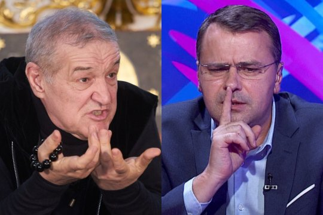

[Ideile de aici le găsești și în acest video.](https://youtu.be/_5EofjUFQtE)

Aceasta este cea mai populară formulă de salut din presa sportivă și probabil a doua cea mai populară formulă de salut din fotbalul românesc după cea cu Uniunea Europeană.

Am văzut că de-a lungul timpului, o grămadă de urmăritori de emisiuni de analiză fotbalistică și-au manifestat dezgustul față de insistența cu care diverse posturi de televiziune sau site-uri îl “promovează” pe finanțatorul FCSB, Gigi Becali.

## Ce-nseamnă de fapt promovarea lui Becali

În sine, termenul de promovare implică o acuză la adresa ziariștilor din partea celor care-l rostesc. Adică, Becali ar ajunge să vorbească la TV pentru că cei care îl sună de fapt încearcă să-i facă un favor pe nervii telespectatorilor îngrețoșați de aparițiile acestuia.

Asta e fals dintr-un capăt în altul.

Singura intenție a celor care-l sună pe Becali este să crească audiența emisiunilor pe care le moderează. Asta pentru că Becali poate oripila un anume volum de public, dar stârnește un interes major pentru o uriașă masă de urmăritori interesați de ce se întâmplă cu FCSB.

Majoritatea celor interesați sunt fani ai actualei campioane, dar Becali prezintă interes inclusiv pentru cei care susțin alte echipe. Unii doar pentru a-și alimenta dezgustul despre care vorbeam mai sus, alții doar pentru a se distra pe seama patronului FCSB și, în fine, unii care pur și simplu vor să vadă ce se mai întâmplă acolo pentru că echipa lor se luptă cu FCSB.

Prin urmare, publicul pe care-l atrage Becali este extrem de numeros.

Și, evident, asta se vede în cifrele de audiență pe care emisiunile respective le obțin când reușesc să-l bage pe Becali în direct prin telefon.

Dacă Becali n-ar stârni interesul pe care-l stârnește și televiziunile ar fi insistat să-l bage în seamă, atunci era vorba despre promovare - PR - publicitate etc. 

Dar stârnește acest interes neîncetat de când a apărut în fotbalul nostru și, probabil, îl va stârni până când nu va mai fi...

Glumesc, am o veste proastă pentru tine în caz că te oftică Becali - anticipez că vor exista trimiteri la el și după ce nu va mai fi în lumea aceasta fotbalistică sau chiar pe lumea aceasta.

## De ce nu e treaba presei să ferească publicul de nocivitatea lui Becali

Printre cei care reclamă prezența lui Becali la TV sunt și unii care insistă asupra unui aspect onorabil, dar care nu are în realitate treabă cu meseria de ziarist așa cum își închipuie ei c-ar avea.

Concret, oamenii respectivi spun că ziariștii fac un rău social prin supra expunerea mediatică a lui Becali. Un fel de “oamenii se uită și ajung să aibă modele nocive. Inclusiv copiii!”.

Da, emoționant, mai ales când în discuție sunt introduși copiii. 

Doar că presa, nu are are ca sarcină să educe pe cineva. Pentru minori, sarcina educării este a familiei în principal și a școlii pe alocuri. Nu doresc nimănui copii educați în primul rând de școală. Pentru adulți, sarcina educării suplimentare cade în grija individului respectiv.

Când auzi ziariști care vorbesc despre cum educă ei publicul, aceia de fapt nu sunt ziariști. Sunt activiști pentru diverse cauze - politice, sociale etc. Oricine se dă ziarist fiind în realitate activist reprezintă un cancer pentru trupul aproape onorabil al presei. 

Desigur, fără să aibă asta ca misiune, presa poate să educe publicul indirect mai ales când își face corect meseria și-l informează. Informațiile reale au inclusiv un rol educativ pentru că-i ajută pe oameni să facă un lucru extraordinar - să gândească pentru ei. 

## Care este atunci rolul presei sportive în relație cu publicul

Una dintre misiunile de bază pentru presă este să informeze. Cu cât informația este mai clară și mai lipsită de elemente de fals, cu atât mai bine. Uneori, în ciuda bunei credințe a ziaristului, o informație poate să se dovedească falsă. 

Uneori pentru că informația chiar e falsă, alteori pentru că nu toți cei care consumă presă înțeleg “jocul” pe care-l face aceasta. De exemplu, Emanuel Roșu, faimos pentru postările sale legate de transferuri, poate avea o informație conform căreia Dinamo studiază / negociază aducerea lui Nsimba. 

Și o publică. 

Apoi, Nsimba ajunge la Craiova.

O parte a publicului îl acuză pe ziarist că a mințit. 

Aici nu mai e vina ziaristului, care n-a făcut altceva decât să publice o informație care era adevărată - Dinamo a fost interesată de Nsimba, dar cei de la Craiova au fost mai convingători și fotbalistul a ajuns în Bănie.

Singura vină este a acelei părți a publicului care ajunge să consume presă fără să aibă o relație suficient de sănătoasă și cu logica. 

În timp, e posibil ca măcar o parte dintre cei cu un ușor analfabetism funcțional să înțeleagă ce citesc și presa să fie astfel indirect vehicul de educare. Alții însă nu o vor face și se vor radicaliza în credința lor că presa minte. 

Ceea ce, desigur, uneori este adevărat.

Ticăloși există și-n presă, nu doar în rândul consumatorilor de presă. 

##  Care este rolul presei în relație Becali

Pur teoretic, presa de sport n-are niciun alt rol în relație cu Becali decât cel pe care-l observi deja - să expună tot ce spune  / face acesta în relație cu echipa pe care o patronează.

Care echipă, îți reamintesc, este de departe cea mai stârnitoare de interes din fotbalul mondial pentru români.

Sună nașpa dacă nu-ți place Becali, dar acesta-i adevărul. Iar printre rolurile presei este inclusiv acela de-a prezenta adevărul inclusiv atunci când acel adevăr irită publicul.

Chiar aș zice că rolul de-a prezenta adevărul în condițiile în care adevărul este neplăcut e o misiune primordială a jurnalismului. 

Altfel, consumatorii de presă ajung să trăiască ceea ce au trăit cu ocazia pandemiei, când o parte generoasă a ziariștilor s-au făcut de râs și și-au trădat cu multă râvnă onoarea jurnalistică. 

Desigur, n-a fost vorba de presa sportivă care, la nivelul României, este [cea mai performantă și mai onestă formă de presă](https://www.cameravar.ro/suprematia-presei-sportive/). Atenție, citește ce am scris ca să nu crezi c-am spus că e perfectă. Am spus că e cea mai bună și cea mai onorabilă de departe, fără absolut nicio discuție.

Deci presa de sport mereu va avea datoria de-a-ncerca să respecte interesul publicului pentru acțiunile unui individ care hotărăște la propriu în direct soarta celei mai populare echipe din România.

Desigur, tot din rândurile ziariștilor trebuie să vină și cei care comentează critic ceea ce face Becali așa cum comentează critic ce face orice personaj din fotbal. Doar că opinia / analiza / comentariile reprezintă doar o parte a ceea ce produce presa. Altă parte va fi mereu simpla expunere a ceea ce Becali spune. Uneori, ca urmare a unor întrebări bune, alteori ca urmare a unor întrebări penibile. Nu de alta, dar ziariștii sunt exact ca cei care le urmăresc munca - unii buni, alții mai puțin buni. 

## Presa face mulți bani de pe urma lui Becali și asta este foarte bine

În mod de-a dreptul fericit, datoria presei de sport de-a-l expune pe Becali ca punct de uriaș interes pentru public se împletește fericit cu profitul economic pe care presa “comericială” îl obține.

Da, Becali ne dă o grămadă de bani ca urmare a faptului că-i mediatizăm vorbele și faptele. 

Dar nu e vorba de mult vehiculata [șpagă-n bani sau chiar în brânză](https://www.cameravar.ro/spaga-presa-sportiva/) pe care ar primi-o ziariștii, ci de modelul clasic de funcționare a televiziunilor / site-urilor - produci conținut jurnalistic, acest conținut atrage o audiență pe care advertiserii (cei care-și fac reclamă la TV / site-uri) doresc să o atingă cu mesajele lor publicitare contra unor sume de bani.

Ei, banii vin de la cei advertiseri, de la acele companii care cumpără reclamă pentru a fi expusă ca Becali unor audiențe.

Și e foarte bine ca lucrurile să se petreacă așa pentru că presa de sport rămâne astfel în zona de-a servi interesul publicului său în loc să ajungă precum alte tipuri de presă, unde cel care apare ajunge chiar să plătească real ca să apară - vezi presa politică, vezi presa economică, vezi presa agricolă, vezi tot felul de alte niște unde jurnalismul e o glumă care face de râs inclusiv pe cei care-și dau silința să fie corecți.

Prin urmare, nu te alarma când îl vezi pe Becali la TV sau supra expus pe site-urile de sport, alarmează-te când afli că presa a încasat bani de la Guvern chipurile să reziste dificultăților economice produse de pandemie. 

Aia e problema, nu că face Becali echipa în direct la Digi sau la Prima.