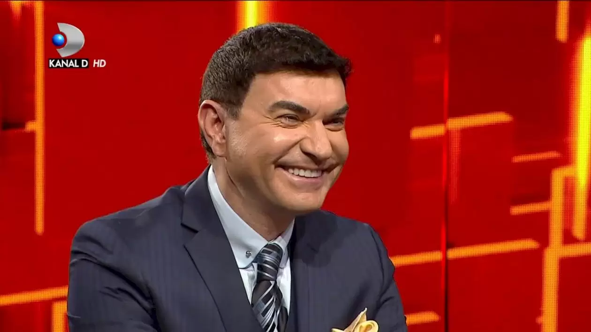

Imaginează-ți următoarea scenă...

Ești la întâlnire cu o fată care-ți place foarte mult. 

E singura femeie cu care vrei să ai de-a face, nu te interesează niciuna alta, iar lucrurile între voi sunt de-a dreptul extraordinare. 

Discuția curge de la sine, timpul trece fără să simți, mâncarea are gust, chelnerii au maniere, muzica e bună.

Totul este la superlativ mai ales datorită felului în care te simți în compania ei.

Râdeți, glumiți, îi luați la mișto pe fanii FCSB sau ai Rapidului sau ai lui Dinamo sau ai Craiovei sau ai oricărei echipe doriți voi...

La un moment dat, absolut în firea lucrurilor, sunteți pe punctul de-a vă săruta. 

Unora poate să li se pară ceva banal, dar tu știi că e preludiul pentru ce va urma.

Ei, chiar în acea clipă, o voce puternică strigă:

“Hei, tu.., Stai așa! Domnu’, domnu’...”.

Starea de beatitudine dispare și-n câmpul tău vizual apare un haidamac îmbrăcat strident însoțit de niște fete balcâze. 

Poate exagerez, n-or fi chiar urâte. 

Sunt urâte în comparație cu fata care-ți place ție. 

Prin comparație, urâte zdravăn.

N-am folosit întâmplător acest arhaism - “balcâze”. 

## Chiar ai ieșit la întâlnire cu o panaramă?!

În fine, ea se retrage pe scaunul ei, tu te retragi de deasupra mesei, peste care te aplecaseși ca un nătăfleț mult prea dornic să o sărute și te întorci să afli ce vor arătarea și arătările.

Imediat, începi să afli: 

> **Haidamacul:** Domnu’, de obicei, calitatea costă. Dar aici o primiți moca cu o condiție mică”.

> **Tu:** Ce calitate? Unde?

Omul arată cu o eleganță mocofanică spre tipa din fața ta.

Nu înțelegi, așa că degetul omului se apropie de ea și o împunge cu grija unui măcelar care face loc în galantar unei bucăți de carne ceva mai arătoase.

Brusc, te trec toate apele și gândești neașteptat de logic:

> “Doamne, e prostituată! Iar ăsta e peștele ei!”.

Pardon, nu poți gândi așa, s-ar ofensa unii ziariști de la Gazeta Sporturilor care luptă pentru justiție socială. Trebuie să-i spui “sex worker” sau “artistă” sau alte denumiri care fac orice curvă să fie onorabilă, așa cum de altfel și merită.

Iar peștelui îi poți spune impresar sau manager sau admin de cont only fans.

Deci?

Deci te conformezi și îți modifici gândul cum se modifică ecranul telefonului când scrollezi tâmp pe Instagram:

> “Probabil este o fată care a suferit mult și a fost nevoită să se refugieze fără prejudecăți în lumea artiștilor sexuali de pe Only Fans. Iar haidamacul este procesatorul ei de plăți care-mi amintește că trebuie să plătesc”.

Din păcate, ai gândit totul cu voce tare. 

Sau poate haidamacul e alimentat cu tot felul de date despre tine și-ți citește gândurile.

Așa că-ți spune cu voce mai tare decât un titlu care conține sintagma “Soc!”:

> “Nu, domnu’, stați liniștit. Domnișoara e în regulă. Adică, dacă dumneavoastră vă place, cine sunt eu să discut gusturile oamenilor? Doar că pentru a avea acces la domnișoară, trebuie să petreceți timp și cu colegele ei”.

## Găuri în prezervativ și alte bucurii

Normal, ceri detalii cu o voce șușotită, dar haidamacul îți explică simplu că nu e niciun secret. Și-ți arată că la restul meselor, situația este cam la fel.

Fiecare îndrăgostit are în față o parteneră de dating. 

Iar în picioare, lângă, tot felul de arătări. Unele de-a dreptul insistente pentru că trag de cei aflați pe scaune de-o manieră agresivă.

Din când în când, câte una pare să se lovească de un zid invizibil și cade lată. Se ridică însă cu ochii vineți și-ncearcă din nou, dar ajunge rapid la sol... 

Haidamacul râde gros: 

> “Ad block... uBlock Origin... Sau Ad Guard bine setat!”.

Nu știi ce vorbește și vrei să te lămurești.

Așa că omul îți explică:

> “Aici nu e ca în locurile în care plătești abonamente... Dacă e moca, nu poți să fii selectiv. Adică, poți alege cu ce fată ai o relație mai profundă, dar trebuie să acorzi atenție și celorlalte colege ale ei că și ele muncește, și ele au fost pregătite de consum de niște băieți care își fac cinstit meseria. 

> Normal, poți încerca să driblezi, să folosești tot felul de metode de protecție, dar nu merită. Până la urmă, tot reușim să-ți găurim prezervativul și va trebui să... știi tu... cu astea care nu-ți plac. Cel mai sănătos este să accepți situația, nu vreau să procedez [ca-n scena aia cu Cristinth!](https://www.youtube.com/watch?v=t4bYSWPIetA)".

## Despre ce-ți vorbesc aici?

Evident, vorbesc despre interacțiunea mea cu site-urile de sport. 

Pe de o parte, am interes inclusiv profesional să citesc informațiile publicate de colegii mei de breaslă, iar pe de altă parte, am o rezistență majoră să consum ceea ce nu vreau să consum.

Ca să fiu mai clar - citesc presa sportivă pentru a fi la curent cu informațiile legate de fotbalul nostru - Liga 1, Liga 2 și echipa națională. Acestea sunt partenerele mele de dating, care după standardele generale, nu sunt neapărat cele mai frumoase fete. De aici și remarca haidamacului că dacă mie-mi plac, el nu se bagă.

Abia apoi vin campionatele externe. 

Restul sporturilor? 

Absolut întâmplător. 

Nu fac eforturi speciale să fiu la curent cu ce se întâmplă în celelalte discipline și ajung să știu câte ceva la un nivel oarecum decent datorită faptului că site-urile de sport intercalează informațiile din toate domeniile în fluxul lor principal de știri.

Plus datorită culturii mele generale excepționale care-mi permite să fiu nu doar cel mai arătos ziarist din România, dar și cel mai abil în a face conexiuni între diverse informații... 

Bla-bla, ai înțeles ideea. 

Altfel, de câte ori am fost invitat într-o emisiune și s-a întâmplat ca-n acel moment să se petreacă ceva important extra fotbal, am precizat întâi că nu-s “specialist” în sportul respectiv și abia apoi mi-am dat cu părerea folosind emfaza specifică celui care vorbește din afară.

## Eu: “Mă interesează ce zice Grozavu” / Site-urile de sport: “Cea mai sexy antrenoare...” sau “Au murit fără să aibă vreo șansă!”

În fine, problema este că deși am acest interes limitat, site-urile de sport fac eforturi consistente să mă expună și la ceea ce nu doresc sub nicio formă să fiu expus. Exact ca niște pești agresivi care te prind circulând printr-un cartier rău famat de prin filmele americane.

Cred că știi la ce mă refer.

În primul rând, e vorba despre toate acele cross-uri - informații pe care site-urile de sport le preiau de la așa zise site-uri cu care au o colaborare ori pentru că fac parte din același grup de presă, ori pentru că pur și simplu s-au înțeles să-și plimbe cititorii dintr-o parte în alta ca să aibă ulterior bani să plătească exagerat inclusiv ziariști nerecunoscători ca mine. 

Aceste cross-uri sunt uneori “legitime” - adică sunt alte informații din zona sportului provenite de la alte site-uri de gen.

Alteori însă, e vorba de informații din afara zonei sportului - cine a fost arestat, cine s-a aruncat de la etaj, câți au murit arși, ce a spus supraviețuitorul atacului care a îngrozit... Un amestec de informații zdravene la cap cu tot felul de mizerii absolute.

Eu le urăsc pe toate, legitime sau nelegitime, de o manieră lipsită de orice discriminare. 

OK, exagerez folosind un termen atât de tare, dar fiind online, nimeni nu disprețuiește moderat, toată lumea urăște intens. 

Desigur, am încercat să blochez “bucăți” de site-uri cu tot felul de extensii ale broswerelor pe care le folosec, am blocat scripturi, am făcut tot ce este necesar să dau cu clor pe site-urile de sport.

Aproape degeaba.

Așa că de câte ori vizitez un site de sport, aproape mereu mă simt ca și când întâlnesc o fată care-mi place, mă bag în vorbă cu ea și chiar când ajung pe punctul să orice, pac, apar balcâzele - adică informațiile care nu prezintă vreun interes pentru mine. 

Și se bagă insistent în seamă, strigă după mine, mă acuză că dacă nu stau înseamnă că [nu-s suficient de cititor pentru ele](https://www.cameravar.ro/gazeta-sporturilor-articole-femei-goale/) etc. 

## Arma mea secretă a fost contracarată

În condițiile acestea, am decis la un moment dat să recurg la o măsură aparent extremă, dar în realitate foarte sănătoasă. 

Am renunțat să mai vizitez direct site-urile de sport și am început să folosesc un intermediar bătrân de când netul ca să accesez totuși conținutul acestora.

Adică, un RSS reader.

Care RSS reader nu este altceva decât un fel de prezervativ digital în cazul de față - adică o aplicație care preia fluxul RSS al site-urilor și mi-l livrează într-o interfață simplă, fără distorsiuni de niciun fel. Deci fără gălăgia grafică a unora dintre site-urile de sport, fără reclame, fără trimiteri spre alte site-uri, fără informații despre sporturi / domenii care nu mă interesează.

Totul ordonat cronologic, totul ușor de parcurs.

Timpul petrecut în aplicație era probabil undeva la jumătate față de timpul petrecut în haosul multor pagini clasice. Așa e când îți place, termini un pic mai repede. 

Dar...

Dar s-a terminat parțial și cu această armă.

În momentul de față, doar gsp.ro are feed RSS pe categorii - adică dacă te interesează doar Liga 1, poți să te abonezi la feed-ul acestei secțiuni a site-ului și să primești în RSS reader doar știri despre Liga 1.

Ceea ce, te asigur, este o uriașă plăcere.

Citești doar ceea ce vrei să citești, ești ferit de toate acele cross-uri pe care site-urile le fac între ele, nu afli informații din domenii / categorii care nu te interesează.

Nu vreau să știu absolut nimic despre viitorul în dragoste al căpitanului naționalei feminine de handbal. Îi doresc tot binele așa cum doresc oricui trăiește pe fața pământului, doar că nu vreau să știu dacă dragostea ei se va împlini c-un flăcău sau cu o fată. 

E treaba ei și a celor interesați de poveste.

Mă mulțumesc cu interesele mele și atât. 

Dacă vreau ceva nou, caut eu, mulțumesc.

Problema este că restul site-urilor, inclusiv educatul Golazo, fac un mare pișu' pe ideea de RSS.

Unele pentru că nici măcar nu au tehnologia respectivă integrată.

Altele pentru că redirecționează fluxul de pe secțiuni în fluxul principal și degeaba te abonezi tu explicit la informații despre Liga 1, vei fi siluit vizual de tot felul de monștri precum:

> “Dopajul, parte din cariera lui Arnold - Celebrul actor și culturist vorbește despre utilizarea substanțelor interzise și avertizează: „Oamenii mor”.

N-am știut că mor, mă simt mai prost. 

Sau: 

> "Prezența Mihaelei Buzărnescu la o petrecere de Revelion a atras atenția tuturor! Anul 2025 a fost de coșmar pentru sportivă, cu un singur meci câștigat. FOTO".

N-am știut că a fost de coșmar, mă simt mai neempatic.