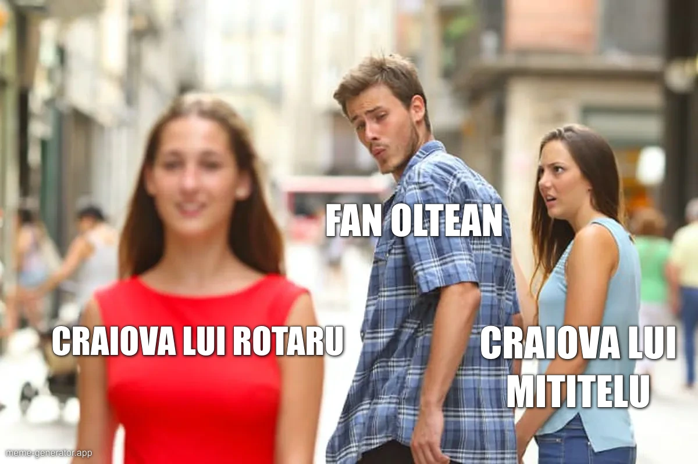

Atenție, nu spun că toți fanii unei echipe sunt așa, mă refer strict la o minoritate formată din indivizi care nu sunt interesați de realitate, ci doar să aibă dreptate spre gloria reală sau imaginară a echipei pe care o susțin.

Sau doar așa mi se pare mie c-ar sta lucrurile.

Deci e un top subiectiv, dar corect pentru că-n general eu am dreptate în absolut tot ceea ce spun / scriu. 

Acum, să fim serioși, această precizare legată de faptul că e doar părerea mea este absolut inutilă în fața ochilor celor despre care vorbesc. De altfel, una dintre caracteristicile de bază ale acestor fani ofensabili este tocmai capacitatea extraordinară de-a dribla orice contact cu faptele și a îmbărțișa exclusiv doar ceea ce le convine lor. 

## Locul 5 - FCSB

De ani buni, ironizez incapacitatea multor fani FCSB de-a face față oricăror situații în care cineva crede ceva "aiurea" despre echipa lor. 

Totuși, adevărul este că acei fani FCSB sunt comici doar când se plâng că presa sportivă și arbitrii i-ar persecuta. Echipa care e [cea mai favorizată în mod natural de arbitri](https://iamsport.ro/editorial/de-ce-fcsb-este-o-echipa-ajutata-in-mod-natural-de-arbitri-stefan-beldie-nu-se-fereste-comparatia-cu-rapid-la-lovituri-de-pedeapsa-e-cazul-absolut-extrem-id43836.html) are și unii dintre cei mai plângăcioși fani pe această temă. 

În rest, impactul lor este dat doar de volumul uriaș de smiorcăieli, nu de intensitatea smiorcăielilor. Cumva sunt obișnuiți să trăiască în mod constant cu tacticile terorist-jurnalistice din categoria "agită-i pentru vizualizări", ceea ce spune mai mult despre breasla mea decât despre bieții oameni.

Prin urmare, o spun fără absolut nicio ironie - acești fani FCSB sunt de multe ori aproape rezonabili prin comparație cu restul celor menționați în top.

## Locul 4 - U Cluj

Cred că e ceva legat de apartenența Clujului la regiunea istoric mai evoluată a țării noastre. Sigur, mai ales pentru că acolo a domnit un stăpân civilizator, mult diferit față de cel din Moldova sau Muntenia.

Dar asta contează mai puțin. 

Totuși, în ciuda acestui avans cultural, nu-nțeleg înflăcărarea cu care unii fani clujeni se revoltă când ironizez faptul că echipa lor e finanțată și din bani publici. 

Știu, știu, e doar o parte din buget, sub 30% din acesta. 

Câteva milioane, acolo, cât să iei fotbaliștii pe care alții nu și-i permit pentru că plătesc doar din banii lor, nu și din bani publici.

În fine, cum să te rabde inima să trăiești în leagănul civilizației europene din România, dar să aperi mizerii de natură socialist-comunistă cum este obligarea privaților de-a plăti pentru a fi concurați de echipele finanțate inclusiv din bani publici? 

Da, complicat. 

Posibil să aibă legătură și cu faptul că-n general societățile care ating un anume grad de civilizație și bună stare cu ajutorul capitalismului se-ndrăgostesc apoi de principiile sinistre ale socialismului. 

Sau poate bat câmpii și e vorba de chestiuni mai meschine, de genul "echipa mea e echipa mea, nimeni nu se pune cu ea". 

Altă rimă n-am găsit, dar ideea rămâne.

## Locul 3 - Rapid și Dinamo

Mi s-a părut foarte greu să decid cine e mai ușor de ofensat dintre fanii Rapidului și cei ai lui Dinamo. Într-un fel, e o bătălie între cei care cred destul de justificat istoric că au fost persecutați și cei care cred destul de justificat istoric că sunt [cei mai inteligenți fii ai peluzelor](https://www.prosport.ro/sport-life/special/coregrafia-doar-dinamo-bucuresti-explicata-de-un-sociolog-devenit-ultras-dinamovist-nici-primul-nici-ultimul-cal-troian-15575247).

Cu excepția momentului în care trebuie să forțeze o poartă deschisă...

În fine, victime și aroganți.

Această bucată de dreptate îi alimentează pe unii fani ai respectivelor echipe să aibă reacții de-a dreptul penibile - ex. vezi cu câtă insistență agresivă au încercat fanii lui Dinamo să-mi explice că Armstrong nu trebuia eliminat împreună cu Bancu la meciul din tur (Craiova - Dinamo 1-1).

N-am văzut absurditate mai mare în explicații, doar să nu accepte realitatea acelei situații. 

Sau vezi cu câtă furie s-au prăvălit asupra mea fanii Rapidului când în seara succesului lor istoric cu FCSB (4-0), le-am atras atenția că pierd din vedere exact ce a jucat Rapid în acel sezon până la acel meci și inclusiv ce a jucat Rapid în acel meci până la pauză. 

Plus că am insistat să spun că acea victorie, în opinia mea, doar readuce Craiova și CFR Cluj în lupta pentru primele locuri. 

Desigur, [am avut dreptate în absolut tot ceea ce am spus atunci](https://www.cameravar.ro/anticipare-declin-rapid/), dar nici măcar un fan al giuleștenilor n-a venit ulterior să-mi spună cât de penibil a putut fi în manifestărea sa elegantă. 

## Locul 2 - Oțelul Galați

Ca moldovean din Rm. Sărat, cred că-n general moldovenii privesc cu circumspecție orice se întâmplă în restul țării. 

Și-i înțeleg - au dat României cam cele mai mari personalități pe care le-am avut noi vreodată, iar restul României le-a dat înapoi Times New Roman și o bucată de autostradă. 

Prin urmare, n-am văzut sensibilitate mai mare când vine vorba de informații conform cărora jucători de la Oțelul ar putea pleca în alte părți, mai ales la echipe din București.

Zici că printre rânduri nu sunt informații legate de negocieri, ci afirmații din categoria "Brăila e peste Galațiul".

Dincolo de asta, la Galați mai este ceva - la un moment, ei au avut o echipă aparte în istoria fotbalului românesc - nu mă refer la cea care a învins-o pe Juventus cu golul râmniceanului Profir, nici la cea care a câștigat titlul cu Dorinel Munteanu pe bancă.

Mă refer la generația lui Vali Ștefan, Tănase, Tofan, Spirea, Haraga, Maleș... Apropo, toți șutau la poartă ca niște animale. N-a mai existat în istoria fotbalului nostru o echipă în care poate doar portarii nu erau foarte buni șuteuri. 

Și cred că acea echipă, care dacă dorea cu adevărat bătea pe absolut oricine, le-a indus ideea că de fapt ei sunt mult mai mult decât reușesc să fie în clasament, dar că forțe externe îi tot sabotează... 

De aici și reacțiile unora dintre fanii lor. 

Apropo, Rm. Sărat nu e în Moldova, dar e-n Buzău, deci... Hehehe. 

Nici Buzăul nu e-n Moldova, dar e atât de aproape încât ce rost are să te dai altceva decât ceea ce ești?

## 1. Craiova 

Cineva de la București are ceva cu ei. 

Pardon, absolut toată lumea din presa de la București are ceva cu Craiova.

Prin urmare, orice ar scrie cineva de la București de-o manieră critică, automat e o nouă dovadă că există interese ascunse împotriva echipei lor. Mai ales în contextul acesta în care au în mod evident cea mai valoroasă echipă dintre cele din față, deci șanse reale de-a câștiga titlul.

Ceea ce ar afecta profund presa de la București și-n general pe oricine nu e oltean și nu ține cu Craiova. Pentru că viața oamenilor din afara celei mai talentate regiuni fotbalistice a României se-mparte între două domenii egale - cât de mult urăsc ei Craiova și cât de mult nu o suportă.

În fine, mai există o nuanță interesantă observată absolut empiric la unii fani ai Craiovei - nu suportă gândul că vreunul dintre ai lor n-ar fi cel puțin cu două clase peste oricare de la ceilalți. 

O fi vreo moștenire de pe vremea în care așa ceva chiar putea fi spus - Craiova Maxima - sau poate doar clasica mândrie care-i face pe olteni să fie numărul 1 în tot și în toate - de la pus roșii în solarii la fraudat programul de pus roșii în solarii. 

Dincolo de asta, rămâne neschimbat faptul că migrarea multora dintre ei de la "echipa lui Mititelu" la "adevărata Universitatea Craiova" s-a făcut exclusiv pentru că nu le-a plăcut patronul. 

Dacă le plăcea, nu era nicio problemă. 

Atenție, nu că n-ar fi avut motive absolut întemeiate să nu le placă Adrian Mititelu, doar că e comic să dai nuanțe eroice unui fapt absolut banal care poate fi rezumat astfel:

"Mititelu ne omora zilnic nervii și ocazional echipa. Prin urmare, atunci când am avut oportunitatea de-a ne alătura unui proiect care se anunța serios, am fugit urlând că am fost păcăliți niște zeci de ani de Păunescu, Popeci, Arnăutu, Ilinca, Dinel Staicu, Nețoiu, Gheară și-ntr-un final, Mititelu. 

Credibil?

Nu.

Sănătos?

Da. 

Suntem cei mai buni?

Absolut.

Sunt toți ceilalți invidioși pe noi?

Fără discuție.

Plus că, chiar tu ai recunoscut că echipa este acolo unde-s suporterii". 