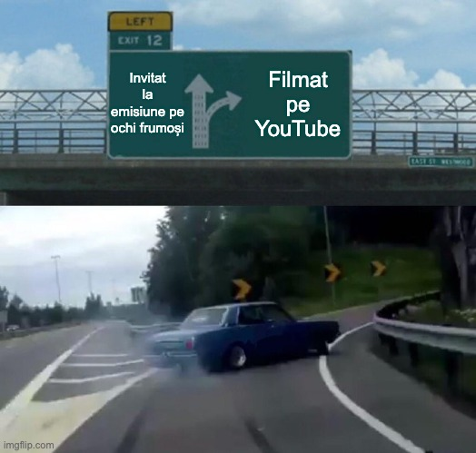

Uneori îmi propun la final de an niște [obiective oarecum ciudate](https://beldie.ro/cati-bani-am-dat-la-restaurant/).

Dar alteori îmi propun să fac lucruri care sunt logice de făcut.

De exemplu, pentru anul acesta mi-am propus să ajung ceva mai rar prin emisiunile în care se discută despre marea mea pasiune – fotbalul din Liga 1.

Chiar mult mai rar când vine vorba de anumite condiții.

## Mă apreciază mulți, dar doar Digi Sport mă plătește

La un moment dat, o luasem un pic razna.

Adică mergeam la prea multe emisiuni de-a lungul unei săptămâni. Ajunsesem să concurez, din perspectiva volumului de prezențe, cu Ilie Dumitrescu sau Florin Prunea.

Ceea ce nu era rău în sine, doar că spre deosebire de ei, eu eram plătit doar de Digi Sport pentru prestațiile mele.

Restul prezențelor pe la diverse emisiuni, de prin alte părți, erau simple invitații ocazionale de la colegi de breaslă care moderau producțiile respective.

Dar aceste invitații, chiar ocazionale, se acumulau în dreptul meu și rezultatul a fost că începusem să fac ceea ce nu era în regulă – să prestez pe ochi frumoși, în condițiile în care eu am o părere bună despre calitățile mele profesionale. Iar dacă ești bun în ceea ce faci, de ce ai presta gratis?

Sigur, asta sună ca replica lui Joker – If you are good at something, never do it for free – dar realitatea este că dacă chiar te pricepi la ceea ce faci, e firesc să ai pretenția să fii recompensat pentru ceea ce oferi.

Ceva nu se leagă aici...

## Posibil ca nu toți cei care-s buni să fie suficient de buni

Pe de o parte, evident că sunt bun în ceea ce fac, de vreme ce primeam, adunat, atât de multe invitații să merg în emisiunile în care se discută despre Liga 1.

Strict teoretic, nu dorește niciun moderator / producător să aducă-n platou pe cineva care are prestații slabe. Practic, mai sunt cazuri, dar din fericire nu intru în categoria piloșilor, care oricum sunt insignifianți ca volum.

Pe de altă parte, așa cum am mai spus, nu e obligatoriu ca părerea mea să fie și părerea altora. Adică eu pot să mă consider suficient de bun încât să am pretenția firească de a fi plătit, dar alții mă pot considera suficient de bun doar cât să fiu invitat, nu și plătit.

Adevărul este că paradoxul de mai sus l-am adus în discuție ca simplu exercițiu de logică.

De altfel, când am constatat că încalc evident un principiu pe care l-am tot respectat în ultimii 10 ani, legat de pretenția mea de a fi plătit pentru aparițiile repetate, am rezolvat rapid problema. Adică am spus celor care mă invitau să-mi facă un contract ca să mă plătească pentru prestațiile mele.

## Când am adus vorba de bani, aproape că au dispărut invitațiile

Desigur, în general, un moderator poate să aibă niște preferințe legate de cine să fie invitat.

Sau poate propune, la un moment dat, nume care să vină.

Sau poate cere, într-un context, chiar ca un invitat să nu mai fie chemat dacă i se pare că sabotează succesul emisiunii prin prestațiile sale.

Deciziile finale însă le iau, de obicei, oameni aflați pe un palier organizațional mai înalt, cum ar spune Andrei Nicolescu încercând să fie popular în limbaj.

Dar cum acei moderatori sau producători erau interfața mea de relaționare cu respectivele instituții media, le-am spus lor:

> „Dacă tot mă invitați, hai să-mi faceți un contract și să fiu plătit pentru prezențele mele.”

Oamenii au fost, evident, amabili.

Cam toți cu care am vorbit au spus același lucru:

> „Da, voi propune.”

Unii au adăugat ceea ce era de așteptat să adauge:

> „Nu știu cum stăm cu banii, să vedem ce zic oamenii.”

Și de atunci, asta a fost.

Cu două excepții, n-am mai primit invitații de la nimeni.

## Ce am făcut când am fost din nou invitat

Desigur, am refuzat invitațiile-excepție din rațiunea pe care am prezentat-o mai sus – era vorba să vin din nou pentru glorie și atât.

Nu, mulțumesc.

Cred că voi reuși să găsesc ce să fac cu cele câteva ore pe care le consumam cu astfel de ocazii. 

Și, dacă prin absurd nu găsesc, voi folosi timpul să scriu pe site-ul acesta sau să filmez pentru YouTube tot despre fotbalul nostru.

Recunosc însă că nu mă pot plânge nici de timpul pe care-l alocam documentării pentru emisiune. Mi-e și rușine să-i spun documentare, în condițiile în care să văd toate meciurile posibile și imposibile reprezintă prioritatea mea absolută când vine vorba de distracții.

Asta înseamnă că nu voi mai merge nicăieri fără să fiu plătit?

Nu.

Asta înseamnă doar că voi refuza situațiile în care sunt invitat, în mod repetat, la o emisiune fără să fiu plătit.