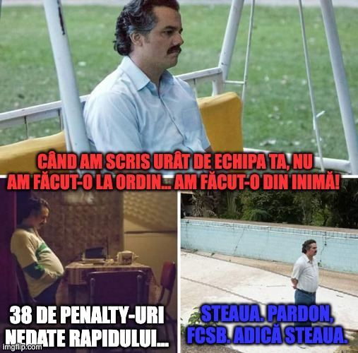

Adineauri am fost anunțat de cei de la iAM Sport că m-au dat afară.

Sigur, oamenii au avut întotdeauna cel mai înalt grad de politețe în interacțiunea cu mine, deci mi-au spus că fac niște modificări, reduc niște posturi (sau au zis costuri?) și că eu fac parte dintre cei care nu vor mai continua să scrie acele opinii pentru site.

Dar dincolo de această formă elegantă de a-mi proteja sentimentele, realitatea este că m-au dat afară.

De ce m-au dat afară?

Nu am întrebat.

Și nici nu sunt tentat să aflu amănunte într-o astfel de situație, pentru că pot bănui și singur.

Au fost invidioși că sunt un ziarist de opinie atât de bun, cu abordări originale, cu un simț speculativ ieșit din comun, cu un aspect fizic care...

Sau m-au dat afară pentru că ceea ce produc eu nu este suficient cât să mă țină în continuare în acel contract. Ceea ce mi se pare o chestiune sănătoasă pentru o redacție - de ce ai ține oameni care nu te ajută suficient cât să-și merite banii pe care îi plătești lună de lună?

## Cum a fost colaborarea cu iAM Sport

Exact așa cum au fost toate colaborările mele de după plecarea de la Gazeta Sporturilor.

Adică, excelentă.

Eu am scris, iar ei m-au plătit bine și la timp.

Mai mult, la fel ca peste tot unde am lucrat, niciunul dintre cei care conduc editorial site-ul nu a încercat să-mi influențeze în vreun fel ideile pe care le-am publicat.

**Prin urmare, foarte important**: dacă am spus ceva aiurea despre echipa ta, ceva care te-a scos din sărite sau chiar te-a oripilat, fii sigur că nu a fost ca urmare a vreunui ordin sau a vreunei intervenții.

Întotdeauna am făcut-o din inimă.

Da, în astfel de momente nu mă pot abține să nu fiu emoțional.

Serios, foarte în regulă oamenii.

## Ce voi face în continuare?

Absolut nimic diferit față de ce am făcut și până acum.

Strict legat de interacțiunea mea cu lumea presei sportive, voi avea în continuare contractul cu Digi Sport, unde sunt absolut convins că șefii zonei editoriale nu au habar de existența mea, motiv pentru care sunt de o grămadă de timp acolo. 

Altfel, dacă vor îndrăzni să mă întrebe de sănătate, voi fi nevoit să cer o renegociere împovărătoare pentru ei.

Serios vorbind, bănuiesc că voi primi oferte de colaborare din alte părți. Iar dacă nu voi primi, voi continua să scriu pe cameravar.ro și să public video pe canalul meu de YouTube.

Ceea ce oricum fac, indiferent de colaborările pe care le am.

## De ce am această aparentă relaxare într-un astfel de moment

Nu-ți imagina că tratez lucrurile senin pentru că sunt eu vreun spirit rebel.

De fapt, încă de la intrarea mea în presă am urmat aproape reflex învățăturile pe care le-am extras dintr-o discuție purtată de Ion Marin cu Ionuț Lupescu.

Se întâmpla acum mulți ani, înaintea unui meci în care echipele celor doi urmau să se întâlnească. Lupescu probabil că era la Bacău, Ion Marin cred că era la Farul.

Nu mai rețin, dar nici nu contează.

Ideea este că Ion Marin i-a zis lui Ionuț Lupescu așa:

>„Băi, Ioane, bine că ați venit voi, ăștia tineri, în antrenorat. Că voi nu depindeți de nimeni, n-are ce să vă facă vreun conducător cum le face ăstora ca noi... Voi puteți să vă faceți meseria cum trebuie”.

Și-n timp ce filosofam eu legat de importanța unei plase de siguranță financiare, echipa independentului Ionuț Lupescu a luat bătaie de la echipa legatului de glie Ion Marin. Probabil că Ion Marin și-a dorit mai mult victoria, nu știu.

Dar ideea a rămas - e bine să fii acoperit, mai ales dacă impresia ta despre cât de bun ești în ceea ce faci nu este automat și impresia altora.

Sigur, cei de la iAM Sport e posibil să fi renunțat la colaborarea cu mine și din rațiuni ceva mai complexe, dar n-aș suporta ideea că nu se învârte totul în jurul meu și ar fi ceva din categoria „așa e piața acum și se anunță vremuri grele”.

Deci nu s-a schimbat nimic, totul e la fel.